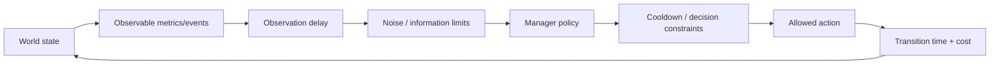

# ADR-0004 — Define A0/A1/A2 agency ownership boundaries

- **Status:** Proposed
- **Date:** 2026-10-07
- **Decision owners:** SOSE maintainers
- **Related PRD(s):** `PRD-0001`
- **Related TRD(s):** `TRD-0001`
- **Supersedes:** none
- **Superseded by:** none

## Context

SOSE organizational experiments compare behavior under different levels of agency.

The current verified implementation distinguishes:

- A0: fixed configured policy;
- A1: local adaptation within a fixed organizational structure.

The next planned level is A2, where management observes the system and chooses actions under delay/noise/cooldown/cost.

Without a strict ownership boundary, agency levels can become incomparable. For example, an A1 policy that silently rewrites nominal capacity, authority, demand, routing, or objectives would no longer represent local adaptation. An A2 controller that reads hidden engine state or directly mutates entities would bypass the observation/action problem it is meant to study.

The agency hierarchy therefore needs architectural semantics independent of any one domain.

## Decision

SOSE adopts the following agency ownership model for the 1.0 experiment platform.

## A0 — fixed policy / no adaptive agency

A0 executes the configured organizational mechanics without feedback-driven policy change.

A0 may contain stochastic behavior, queues, calendars, failures, routing, decisions, and preconfigured policies. These do not make it adaptive.

A0 cannot change its policy/structure in response to realized system state except where that behavior is already part of the fixed generating mechanism.

## A1 — local adaptation within a fixed structural envelope

A1 represents actor/local-process adaptation.

A1 may:

- choose among predeclared local strategies;
- alter effort/execution behavior within configured bounds;
- reprioritize local work within allowed policy;
- incur explicit adaptation time/cost;
- react to information locally available to the actor/process;
- change local execution efficiency when that mechanism is explicitly modeled.

A1 may not change the organizational structural envelope:

- domain topology/process ownership;
- nominal resource inventory/capacity definitions;
- authority model;
- demand-generating mechanism;
- global intervention catalog;
- organization objectives;
- persistence/runtime semantics.

If an apparent A1 behavior requires changing one of those boundaries, it belongs to A2 or to a different configured world.

A1 effects must be separately accounted in actor ledgers/agency-action evidence where applicable.

## A2 — managerial adaptive control

A2 represents management choosing from explicit organizational actions based on observations.

The canonical loop is:

A2 must operate through two explicit contracts:

### Observation contract

Defines what the manager can know.

It may include:

- selected metrics;
- events;
- lagged summaries;
- sampling frequency;
- observation delay;
- noise;
- missingness;
- aggregation.

A2 may not inspect hidden simulator state that is not exposed by this contract.

### Action contract

Defines what the manager is allowed to change.

Actions are explicit typed interventions or parameter/policy changes with:

- eligibility/preconditions;
- scope;
- transition time;
- transition cost;
- operating cost;
- cooldown;
- causal metadata.

A2 must not mutate persistent domain state outside ordinary domain commands/events or approved configuration/intervention transitions.

## A3 — institutional/objective change

A3 represents changes such as:

- objectives;
- institutional rules;
- incentive regimes;
- political power structures;
- creation/removal of authority systems;
- discovery/redefinition of the organization's problem itself.

A3 is outside the SOSE 1.0 experiment contract.

A future A3 design requires a new PRD/TRD and ADR because it changes the meaning of model identity and intervention comparability.

## Cross-level comparison rule

When comparing A0/A1/A2 for a world:

- exogenous domain parameters remain identical unless the compared effect is an explicit intervention;
- stochastic latent streams use explicit CRN grouping where a paired comparison is claimed;
- non-agency model mechanics must match;
- agency-specific costs/time/actions are reported separately;
- a change in structural identity must be represented as an explicit A2 intervention, not hidden inside agency code.

## Decision drivers

- preserve causal interpretability of agency comparisons;
- keep A1 distinct from structural management intervention;
- make A2 realistic under imperfect information;
- prevent hidden-state cheating;
- keep costs/transition effects visible;
- support the same agency semantics across domains.

## Consequences

### Positive

- A0/A1/A2 results have a stable interpretation;
- domain-specific policies can vary without redefining the agency hierarchy;
- A2 experiments can study managerial delay/noise and transition costs explicitly;
- CRN and structural comparison checks can enforce unconfounded comparisons;
- A3 remains a deliberate future research boundary.

### Negative / trade-offs

- some intuitive adaptive behaviors must be classified carefully;
- A2 requires additional observation/action infrastructure;
- domains must expose agency-capable policies/controllers through typed capability contracts containing configurable identifiers, schemas, defaults, bounds, and compatibility constraints;
- not every organization will support every agency level immediately.

### Constraints introduced

- agency level is part of canonical world identity;
- A1 cannot silently rewrite structural configuration;
- A2 cannot read unexposed hidden state;
- A2 actions must be explicit and auditable;
- transition costs/time and cooldown cannot be omitted when they are part of the modeled mechanism;
- comparisons that differ in non-agency mechanics are ineligible as pure agency effects;
- A3 is excluded from 1.0.

## Alternatives considered

### Treat agency as an arbitrary callback

Rejected because callbacks could inspect or mutate anything and destroy causal interpretation.

### Let A1 change any configured parameter

Rejected because local adaptation would become indistinguishable from management or a different world.

### Let A2 inspect complete engine state

Rejected because it unrealistically removes information delay/noise and makes managerial results optimistic by construction.

### Include A3 in the same hierarchy now

Rejected because objective/institution change affects model identity and requires a broader theory than the current intervention framework.

## Compatibility and migration

Current A0 behavior is compatible.

Current A1 backlog-triggered batching remains compatible because it changes local service behavior within a declared policy envelope and separately records adaptation time/cost; it does not rewrite the ModelSpec structural envelope during execution.

Existing domain scenarios/interventions are not automatically A2. They become A2 actions only when selected by a managerial controller through the observation/action contract.

## Verification

### A0/A1

- paired worlds differ only in agency configuration;
- A1 action/effect is within declared bounds;
- actor adaptation time/cost is conserved;
- no structural ModelSpec mutation occurs during A1 execution;
- CRN latents are preserved for declared paired comparisons.

### A2

Future conformance must verify:

- decisions depend only on observation-contract inputs;
- injected delay/noise changes manager information as configured;
- cooldown prevents illegal action frequency;
- actions belong to the allowed action catalog;
- transition time/cost is applied;
- action causation is auditable;
- restart/replay reproduces the same managerial decisions;
- changing hidden engine state without changing observations cannot affect the controller decision.

## References

- `docs/product/requirements/prd-0001-multidomain-synthetic-experiment-platform.md`
- `docs/technical/requirements/trd-0001-domain-neutral-reference-experiment-framework.md`
- `src/sose/organizational/agency.py`
- `src/sose/organizational/synthetic_a1.py`
- `docs/organizational/evidence/synthetic-a1-reference-v1/RESULT.md`

## Notes

A3 remains explicitly outside the 1.0 scope. Any substantive change to these ownership boundaries requires a superseding ADR after acceptance.
