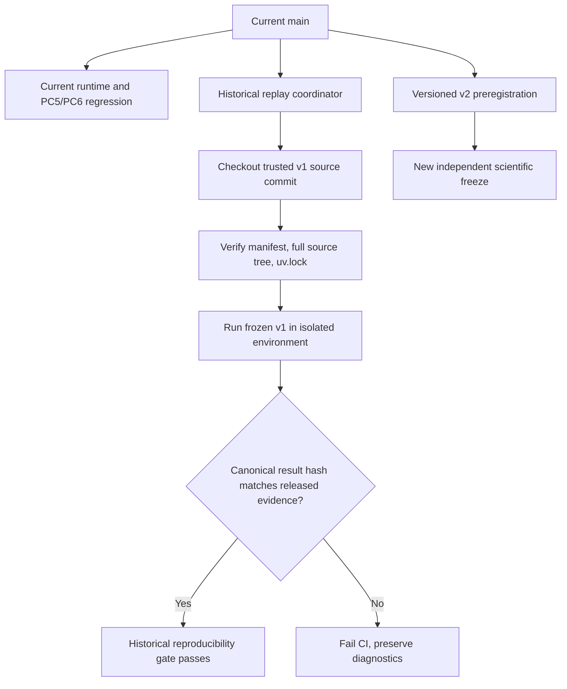

# ADR-0007 — Versioned scientific freezes and historical replay gates

- **Status:** Proposed — requires review and acceptance; does not supersede v1 freezes.
- **Date:** 2026-10-09
- **Related PRD/TRD:** PRD-0001, PRD-0003; TRD-0001, TRD-0003
- **Related ADR:** ADR-0002, ADR-0005, ADR-0006
- **Tracker:** [#397](https://github.com/brunolnetto/sose/issues/397)

## Context

Manufacturing, O2C and MRO v1 are officially executed synthetic experiments. Their frozen provenance includes exact code/manifest identities; in particular, O2C and MRO bind the entire `src/sose` Git tree (`eeae0590f0ab84230a2cabfecd5225111d777592`) and `uv.lock` Git blob (`5902ec2400ba5998f154831d080b1e5773da7413`). Manufacturing binds its **selected file inventory and SHA-256 entries**, including `src/sose/examples/process_manifest.py`, plus its trusted preregistration manifest Git blob. Unlike O2C/MRO, Manufacturing v1 did **not** preregister a complete `src/sose` tree or `uv.lock` Git-blob identity; these cannot be invented retrospectively. Its released execution-source SHA and recorded dependency-lock digest provide additional independently auditable provenance.

A subsequent attempted Warehouse Fulfillment PC6 maturity promotion modified the current source tree, causing five frozen-v1 tests to fail. This was **correct** fail-closed behavior, but an unconditional assertion that today's `HEAD` has the old source tree prevents all future valid software evolution.

The source freeze must remain immutable, while the *location of replay verification* can be decoupled from the evolving main development tree.

## Proposed decision

1. **Immutable protocol history.** Each official v1 manifest, released evidence archive, code-tree identity, environment lock, protocol/plan hashes and result hashes remain unchanged. Existing release tags retain their historical source commits.
2. **Development vs replay validation.** Current main CI executes current adapters and process-composition conformance. A separate **historical replay job** checks out the exact trusted frozen commit into an isolated worktree/environment, verifies the **domain-specific historical freeze** (selected file hashes and trusted preregistration anchor for Manufacturing; full source-tree and lockfile identities for O2C/MRO), executes the frozen experiment and compares canonical result hashes.
3. **Fail closed in official runners.** A v1 official runner refuses to run against any source tree or lockfile other than the frozen one. Never relax `verify_freeze` to accept a new `HEAD`.
4. **No implicit rewrite of science.** Any modification to intervention semantics, runtime, projection, eligible metric or DOE must be a new v2 preregistration/freeze, not an in-place edit to the v1 protocol or recorded outcomes.
5. **Repository test contract.** Tests of *historical frozen reproducibility* run in the frozen worktree, not the current head; current source tests ensure v1 metadata/release source references remain present and correctly documented. The separately isolated replay result becomes the authoritative anti-regression gate.
6. **Publication boundaries.** Historical release assets and SHA-256 sidecars are never overwritten. New experiments publish separate versions with their own provenance, and the comparison report states exactly which version produced each claim.

## Architecture

## Required tests before acceptance

- CI demonstrates **current main tree differs from frozen v1** without reclassifying the historical freeze as invalid.
- Isolated replay reconstructs all documented v1 result hashes (Manufacturing, O2C, MRO).
- Tampered **preregistered** anchors fail before any official world: selected source files and trusted manifest blob for Manufacturing; full runtime tree and `uv.lock` Git identity for O2C/MRO. The isolated replay also checks each canonical output file against independently recorded digests of the corresponding published v1 bundle, not just the newly computed result hash.
- Replay fails if one canonical output differs, even when count metrics match.
- Worker interruption, dependency unavailability and incomplete replay outputs preserve staging diagnostics and do not publish success.
- New v2 source changes do not silently mutate any v1 archive or scientific claim.

## Alternatives rejected

- Replacing the frozen source identity with HEAD: destroys preregistration integrity.
- Skipping freeze checks in tests: leaves no independent scientific gate.
- Blocking all future `src/sose` changes: makes an experiment library unmaintainable.
- Treating refactoring under a new HEAD as the same v1 experiment: risks post-hoc research decisions.

**Decision gate:** ADR remains **Proposed** until a TDD implementation with separate current-main and historical replay jobs passes. No source-tree migration or PC6 promotion is authorized solely by this document.
