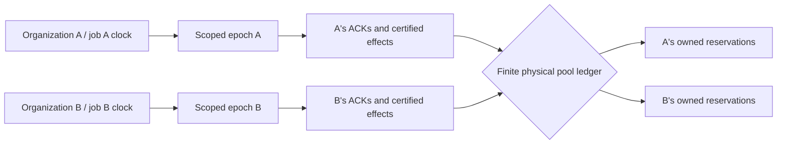

# PC6 — organization-scoped recurring recovery (experimental)

Status: **implementation increment; not a PC6 scientific acceptance certificate**. Related: issue #406.

## Constraint

A recurring recovery worker must re-create its next logical occurrence from durable
`SimulationJobState`, claim a lease associated with **its own job**, and work
only on causally attributed business state. A healthy organization must not be
fenced or logically fast-forwarded when another organization crashes and
reclaims its writer epoch.

The previous composition runner always called the PostgreSQL *namespace*
`claim_writer`. Every subsequent claim superseded every other job, regardless
of whether the jobs had shared resources. That lease is still the default for
older single-writer clients.

## Opt-in semantics

Configure `TradingCustomerRecoveryRunner(..., job_id=..., correlation_id=...,
scoped_writer=True)` with one durable `job_id` and owned `correlation_id`
per organization. For resource-mapped effects, explicitly configure the
immutable `resource_organizations` correlation-to-organization binding.

- `PostgresPersistence.claim_scoped_writer(job_id, owner_id, expected_epoch)`
  increments an **individual job** epoch. Its PostgreSQL advisory
  transaction lock is keyed by `(namespace, job_id)`, rather than the
  namespace singleton.
- Every fenced Engine UoW (including BoundaryService and an authoritative
  resource-intent admission) checks that same scope and epoch. A stale
  same-job worker cannot commit after a successor acquires the scope, but
  different jobs may hold valid epochs at the same time.
- Boundary claims, pending domain-intent selections, reconstructed outbound
  messages and certified-reservation release are filtered by the runner's
  owned correlation. Unmapped legacy behavior remains unchanged.
- `RecoverySchedule` derives each slot from that job's persisted
  `completed_batch_triggers` and resumes an unfinished active occurrence,
  using the original scheduled time even if the new worker observes it later.
- `IntentResourceCoordinator` retains the independently stored
  organization resource clock, durable wait intent, reservation owner,
  immutable causal link, and authoritative PostgreSQL physical pool ledger.
  Pool capacity contention is a distinct, legitimate **shared** serial
  boundary; job ownership is not.

## Exact qualification still required

Tests in this increment falsify namespace-wide job fencing, exercise
interrupted and recovered slots, check two simultaneously active workers
and verify that a PostgreSQL boundary ACK is claimed for only its owning
correlation.

**Not yet established**:

1. Full real-domain causal equivalence of continuously running vs killed /
   restarted recurring jobs, including their domain events, business
   certificates, sink checkpoints and durable resource receipts.
2. Actual process death, DB restart, network cutoff and lease takeover
   during each causal boundary (claim, ACK, admission, domain commit,
   certification, temporal release).
3. Mixed legacy SimPy resource requests and authoritative temporal
   reservations against the *same physical pool*.
4. Removal or justified narrowing of the remaining **global** PostgreSQL
   record-revision row and namespace boundary-history lock. These currently
   serialize short commits or boundary transactions despite job-scoped
   ownership; they should not be mistaken for a proven lock-free
   per-organization execution model.
5. A published deterministic canonical comparison of multiple organizations'
   durable clocks, immutable causal graphs, resource-instance history and
   business effect certificates.

Scientific issue #406 remains outstanding until these observable
acceptance conditions are satisfied. Existing frozen replay baselines must
stay unchanged.
