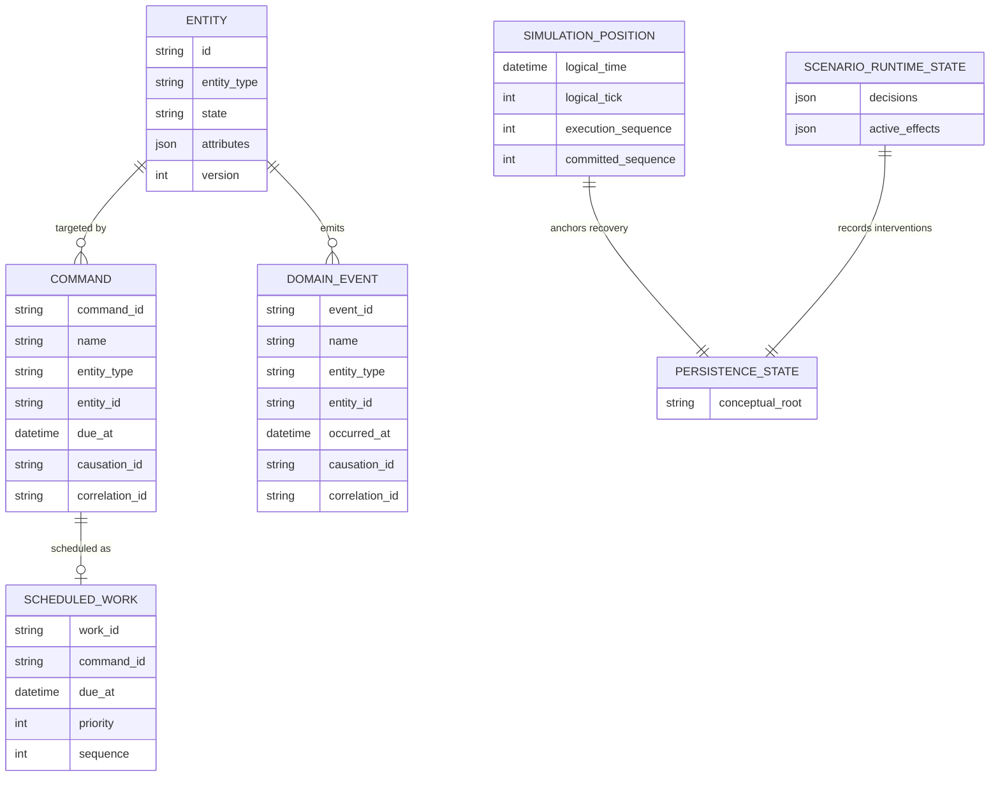
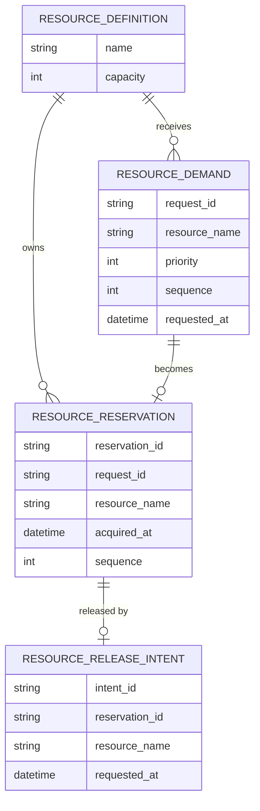
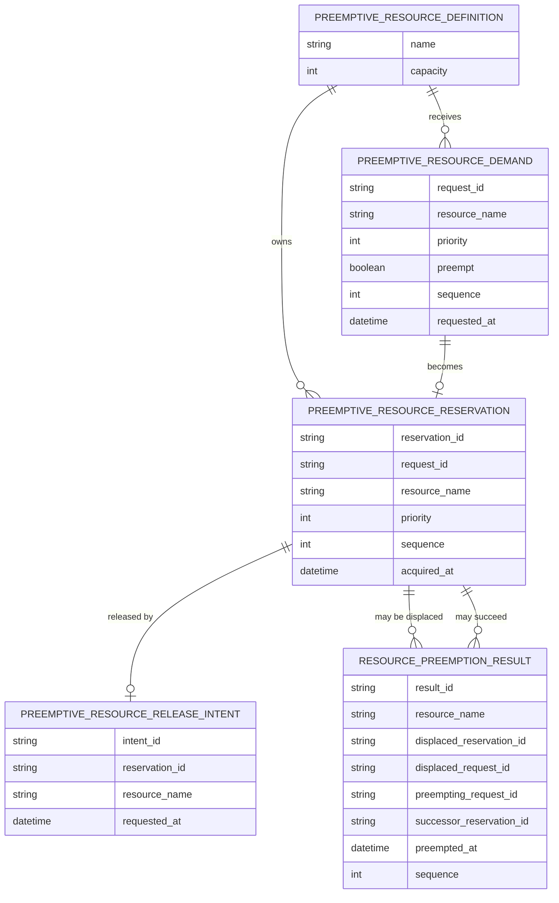
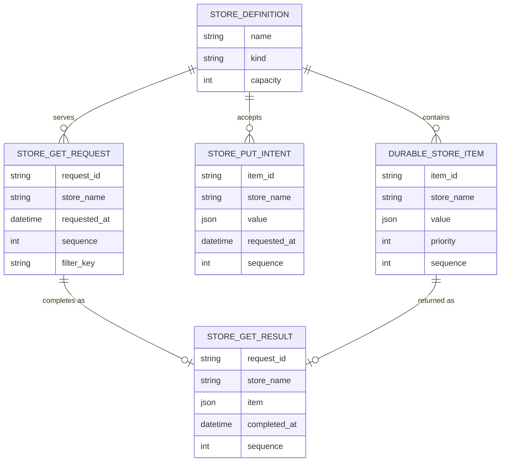
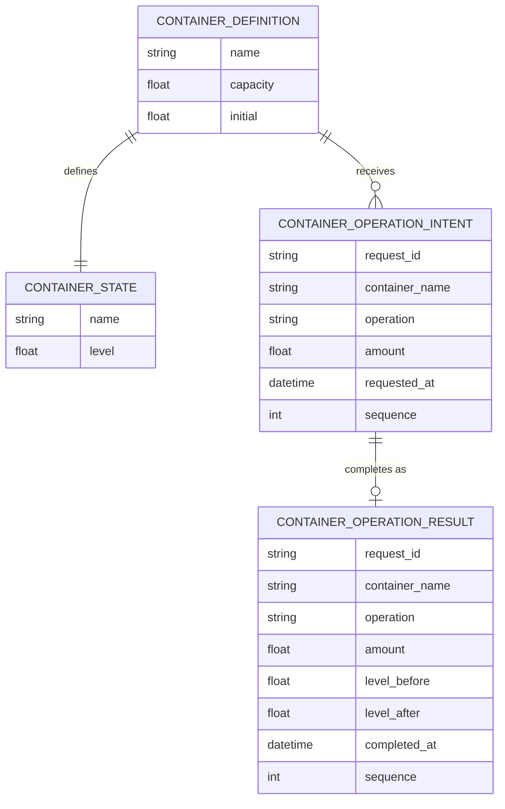

# SOSE Durable Persistence Model

This document describes the canonical **semantic persistence model** used by SOSE.

It is not a relational database schema. SOSE persistence adapters may store these
records differently. The relationships below are logical relationships encoded by
stable identifiers, names, and durable ownership rules.

Reference-domain specifications should reuse this vocabulary rather than redefining
runtime persistence concepts independently.

## 1. Core lifecycle and recovery model

The synthetic `PERSISTENCE_STATE` node is diagram-only. It represents the durable
snapshot owned by an adapter; it is not a runtime dataclass.

## 2. Resource persistence

### 2.1 Non-preemptive resources

A request is represented by a demand while pending and by a reservation after
acquisition. Backend-native request objects are not durable truth.

### 2.2 Preemptive resources

`ResourcePreemptionResult` is immutable evidence of displacement. Historical results
remain durable after the active reservation changes.

## 3. Store persistence

Store records represent discrete identity: lots, WIP objects, receipts, or other
individually meaningful items.

## 4. Container persistence

Containers represent quantitative balance. A domain may deliberately combine a Store
and a Container when it needs both discrete identity and aggregate quantity; such a
multi-representation operation must establish feasibility before partially executing
one side.

## 5. Persistence ownership boundary

The durable model owns semantic facts needed to reconstruct execution:

- entity lifecycle and attributes;
- commands and immutable domain events;
- future scheduled work;
- logical simulation position;
- scenario runtime state;
- resource demands, reservations, releases, and preemption evidence;
- Store definitions/items/intents/requests/results;
- Container definitions/state/intents/results.

The following remain ephemeral and reconstructible:

- SimPy environments;
- backend event/request objects;
- callbacks;
- process/generator continuations;
- backend queues;
- resource handles.

Reference-domain ERDs should show only the relevant subset of this model and explain
how domain entities interpret those durable records.
