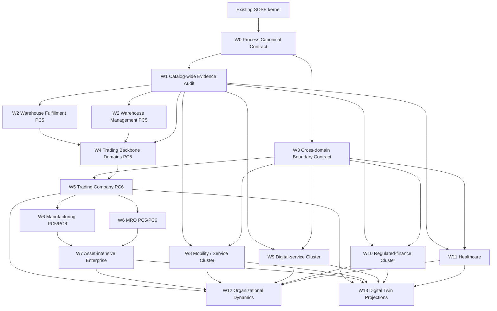
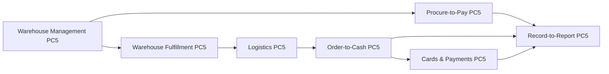
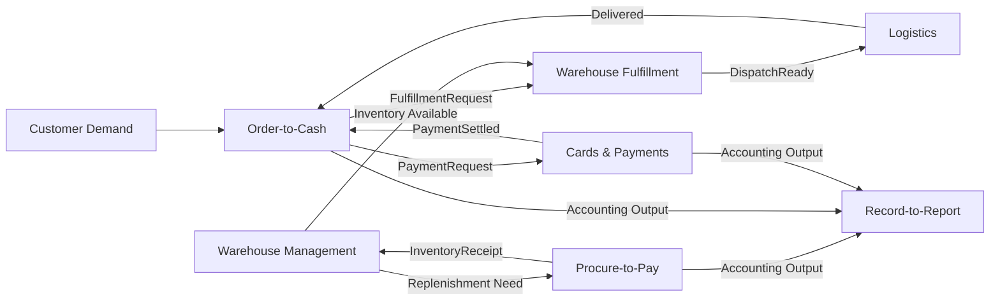
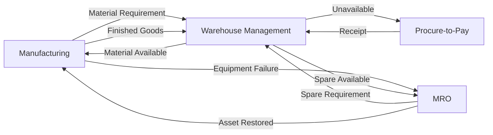

# Process Canonical Implementation Dependency Graph

## Purpose

This document fixes the implementation order for promoting SOSE business domains into complete and composable process canonicals.

The graph is a **development dependency graph**, not a runtime process diagram.

An edge means:

> the upstream capability must be sufficiently stable before the downstream implementation should be promoted.

## Development DAG



## W4 internal dependency order

The trading-company backbone should not be implemented as seven isolated promotions in arbitrary order.

Recommended sequence:



The arrows here express implementation leverage and intended ownership boundaries, not direct imports.

### Why Warehouse precedes P2P/O2C composition

P2P and O2C currently contain useful standalone inventory/fulfillment behavior. Before composed mode can be introduced, Warehouse ownership must be explicit enough that those domains can hand work off without mutating Warehouse-private state.

### Why R2R comes last in the PC5 backbone

R2R consumes accounting consequences from other processes. Its standalone close/reconciliation behavior can mature independently, but the useful cross-domain contract should be designed after P2P/O2C/Payments produce stable accounting outputs.

## Target runtime composition: trading company

This is the first intended PC6 composition.



## Target runtime composition: manufacturing + MRO



## Ownership rules for graph edges

Every cross-domain edge must preserve these rules:

1. **Producer owns its durable internal entity.**
2. **Consumer receives a contract payload, not a mutable entity reference.**
3. **Correlation and causation survive persistence/restart.**
4. **Consumption is idempotent.**
5. **Retries cannot duplicate business effects.**
6. **The same business fact has one durable owner.**
7. **A projection may combine domains but does not become a source of truth.**

## Standalone versus composed mode

Promotion to PC6 must not destroy standalone demonstrations.

Example for O2C:

```text
Standalone:
credit -> local fulfillment -> invoice -> receivable -> collection

Composed:
credit -> FulfillmentRequest
       -> wait FulfillmentCompleted
       -> invoice
       -> PaymentRequest
       -> wait PaymentSettled
```

Example for P2P:

```text
Standalone:
PO -> supplier lead time -> receive -> inspect -> stock -> consume

Composed:
PO -> supplier lead time -> receive -> inspect -> InventoryReceipt
Warehouse Management -> putaway -> StockAvailable
```

The composed adapter replaces local ownership at the boundary; it does not duplicate it.

## Promotion gates

A downstream wave may start design work early, but it should not be promoted/merged as the architectural reference until its dependency gate is satisfied.

| Downstream work | Required gate |
|---|---|
| Catalog-wide domain promotion | W0 merged |
| Warehouse reference promotion | W1 evidence audit available |
| Cross-domain implementation | W3 contract defined |
| Trading Company PC6 | W4 participating domains PC5 |
| Manufacturing/MRO integration | Trading backbone composition demonstrated |
| Organizational Dynamics domain experiments | At least one credible PC6 composition |
| Digital Twin reference UI | PC5 projection contract, preferably PC6 for multi-domain view |

## What is deliberately not a dependency

The following must not block process completion:

- a 3D UI;
- Organizational Dynamics;
- empirical calibration of human agency;
- a generic enterprise ontology;
- a universal process DSL;
- a generic business-object hierarchy.

These may emerge later from mature process evidence.

## Next graph transition

Current transition:

```text
Existing kernel
    -> W0 Process Canonical Contract
    -> W1 Catalog-wide Evidence Audit
```

No new business domain should be selected for deep promotion until W1 has converted the current catalog into an evidence-backed gap matrix.
