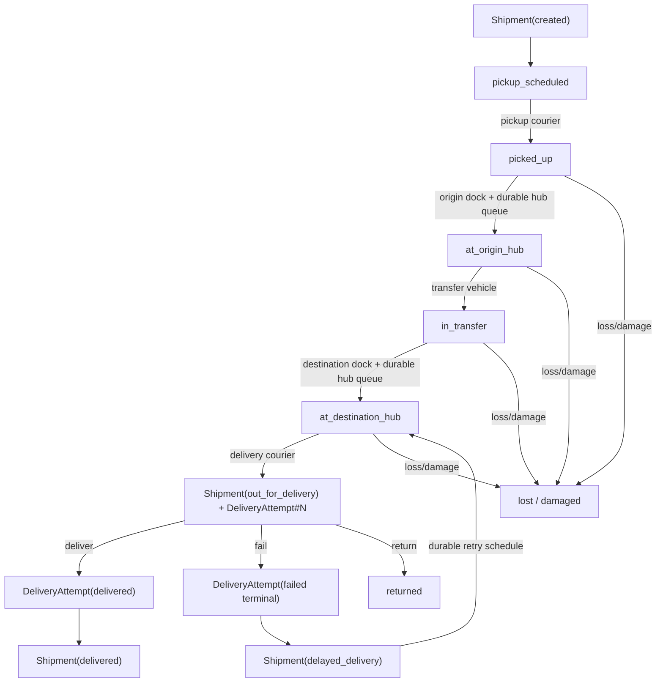

# Logistics & Transport Reference Domain Specification

## 1. Purpose and scope

This example models a shipment moving through pickup, origin-hub handling, line-haul
transfer, destination-hub handling, and last-mile delivery.

The domain is intentionally different from the existing inventory-centric examples:
its core pressure is physical-flow queueing, constrained transport capacity, scheduled
commitments, delivery failure/retry, and durable reconstruction.

Initial executable scope:

- Shipment and DeliveryAttempt durable entities;
- pickup scheduling lifecycle;
- origin and destination hub progression;
- transfer and last-mile lifecycle;
- explicit delay/resume;
- failed delivery and retry lifecycle;
- lost, damaged, and returned terminal outcomes;
- congestion, courier-capacity loss, and weather-delay scenarios.

Out of scope for this slice: route optimization, geospatial routing, customs, carrier
pricing, fleet maintenance, and multi-package consolidation.

## 2. Operational story

A Shipment starts in created. Pickup must be scheduled before collection. After pickup,
the shipment reaches the origin hub, transfers to the destination hub, and enters
last-mile delivery.

A DeliveryAttempt is a separate durable occurrence. Dispatch does not imply success:
the attempt may be delivered or fail. Failed attempts may be durably scheduled for
retry or exhausted.

Delay is explicit business state. Resume is deliberately contextual: orchestration
chooses whether the delayed shipment resumes pickup, transfer, or delivery. Lost,
damaged, and returned are terminal business outcomes and are never inferred merely
from disappearance from an ephemeral backend queue.

## 3. Domain entities

### 3.1 Shipment

Owns the end-to-end logistics lifecycle.

States: created, pickup_scheduled, picked_up, at_origin_hub, in_transfer,
at_destination_hub, out_for_delivery, phase-specific delayed states, delivered, lost,
damaged, returned.

Delay phase is durable in the StateChart itself: each resumable source state maps to a
distinct delayed state and `resume` returns only to that exact source phase.

It does not own backend queue objects, courier handles, dock request objects, callbacks,
or generator continuation state.

### 3.2 DeliveryAttempt

Represents one last-mile delivery occurrence rather than a mutable counter hidden in
Shipment.

States: pending, out_for_delivery, delivered, failed.

`failed` is terminal for that occurrence. A retry is not a transition that reuses the
failed entity; orchestration schedules creation of a new deterministic DeliveryAttempt
identity under the same shipment correlation.

## 4. Persistent data model / ERD

The relationships here are semantic, not physical SQL foreign-key declarations.

### 4.1 Business entities ERD

    Shipment 1 ---- 0..N DeliveryAttempt
             process correlation

The relationship is process-level correlation. The current Entity base model does not
require a persisted object reference from one entity to the other.

### 4.2 Durable operational ERD

Target durable relationships:

    Shipment / DeliveryAttempt
        -> Command -> ScheduledWork
        -> DomainEvent

    ResourceDefinition
        -> ResourceDemand -> ResourceReservation -> ResourceReleaseIntent

    StoreDefinition
        -> DurableStoreItem
        -> StorePutIntent
        -> StoreGetRequest -> StoreGetResult

    ScenarioRuntimeState
    SimulationPosition

Planned named objects for the full executable slice:

- Resources: pickup_courier, origin_dock, transfer_vehicle, destination_dock, delivery_courier;
- Stores: origin_hub_queue, destination_hub_queue;
- Scheduled work: pickup window, transfer departure, SLA deadline, retry;
- Scenario state and logical recovery position.

SimulationPosition remains the singleton logical recovery boundary. It is not connected
to Shipment through an invented business relationship.

### 4.3 Persistence ownership

| Business fact | Durable owner |
|---|---|
| shipment lifecycle | Shipment.state |
| delivery-attempt lifecycle | DeliveryAttempt.state |
| future pickup / retry / SLA | Command + ScheduledWork |
| dock/courier/vehicle demand | ResourceDemand |
| held capacity | ResourceReservation |
| interrupted release | ResourceReleaseIntent |
| hub queue identity/order | Store durable records |
| lifecycle history | DomainEvent |
| scenario intervention | ScenarioRuntimeState |
| logical recovery boundary | SimulationPosition |

## 5. StateCharts

### 5.1 Shipment StateChart

Nominal path:

    created
    -> pickup_scheduled
    -> picked_up
    -> at_origin_hub
    -> in_transfer
    -> at_destination_hub
    -> out_for_delivery
    -> delivered

Representative exception topology:

- each resumable phase has its own delayed state;
- `resume` returns only to the exact pre-delay phase;
- picked-up/transit/delivery states may terminate as lost or damaged;
- out_for_delivery may terminate as returned.

### 5.2 DeliveryAttempt StateChart

    pending
    -> out_for_delivery
       -> delivered
       -> failed

`delivered` and `failed` are terminal for one physical attempt. Only deliver and fail are
direct stochastic outcomes. Retry scheduling happens outside the failed attempt's
StateChart and creates a new correlated DeliveryAttempt.

## 6. Process specifications

### 6.1 Happy path

    Shipment(created)
    -> schedule pickup durably
    -> acquire pickup courier
    -> picked_up
    -> durable origin-hub queue progression
    -> acquire transfer capacity
    -> in_transfer
    -> durable destination-hub queue progression
    -> create DeliveryAttempt
    -> acquire delivery courier
    -> attempt delivered
    -> Shipment(delivered)

Lifecycle claims must follow durable operational evidence.

### 6.2 Sad path — hub congestion

A shipment reaches a hub while service capacity is constrained. Queue membership/order
must remain durable, no backend queue identity is persisted, and restart rebuilds the
ephemeral queue from Store/resource truth.

### 6.3 Sad path — failed delivery and retry

    DeliveryAttempt#1(pending)
    -> dispatch
    -> out_for_delivery
    -> fail
    -> failed (terminal)
    -> schedule retry durably
    -> create DeliveryAttempt#2(pending)
    -> dispatch
    -> out_for_delivery
    -> deliver
    -> delivered

A retry preserves DeliveryAttempt#1 as immutable failed business evidence and creates a
new deterministic occurrence identity for DeliveryAttempt#2.

### 6.4 Sad path — capacity loss

Courier/dock capacity may become unavailable through scenario state. The scenario does
not mutate Shipment state directly; orchestration interprets changed context and chooses
a legal wait/delay path.

### 6.5 Sad path — lost / damaged / returned

These outcomes are explicit durable terminal transitions. They must be represented by
entity state plus immutable event history, never by absence from a queue.

## 7. Commands and domain events

Shipment command vocabulary includes schedule_pickup, pickup, arrive_origin_hub,
dispatch_transfer, arrive_destination_hub, dispatch_delivery, deliver, delay,
resume, mark_lost, mark_damaged, and return_to_sender. The phase-specific delayed
state determines where `resume` returns.

DeliveryAttempt transition commands include dispatch, deliver, and fail. `dispatch` is
legal but excluded from direct probabilistic selection so courier-capacity orchestration
must authorize it. Retry scheduling is orchestration that creates a new correlated
DeliveryAttempt rather than mutating a failed attempt.

Successful transitions should emit immutable state-transition events under a stable
shipment correlation identity.

## 8. Invariants

LOG-01 — Explicit pickup scheduling: Shipment cannot become picked up directly from created.

LOG-02 — Durable hub waiting: hub waiting must be reconstructible from durable Store/resource truth.

LOG-03 — Capacity before movement: constrained capacity must exist before the corresponding physical movement is claimed.

LOG-04 — Attempt identity: a failed delivery occurrence is terminal and remains durable;
a retry uses a distinct deterministic DeliveryAttempt identity.

LOG-05 — Outcome gating: Shipment becomes delivered only after a delivery attempt durably delivers.

LOG-06 — Scenario discipline: scenarios alter context; they do not assign Shipment state directly.

LOG-07 — Terminal exception truth: lost, damaged, and returned are explicit durable outcomes.

LOG-08 — Restart equivalence: continuous and reconstructed executions converge at pickup wait, hub queue, transfer wait, failed-attempt/retry, and final-delivery boundaries.

## 9. Durable truth and ownership

Durable truth consists of entities, commands, events, schedules, resource demand/ownership,
Store queue records, scenario state, and logical simulation position.

Ephemeral truth includes SimPy Environment/Process/Event/Request objects, callbacks,
resource handles, native queues, and Python generators.

## 10. Restart semantics

Reference-grade restart gates will cover:

1. pickup scheduled but not executed;
2. queued at origin hub;
3. transfer capacity pending;
4. queued at destination hub;
5. delivery courier pending;
6. failed terminal attempt with creation of the next retry attempt scheduled;
7. delivered attempt before Shipment finalization.

Backend-native object identity is excluded from semantic equivalence.

## 11. Scenario specification

Hub congestion reduces effective hub-service capacity. Courier capacity loss makes the
courier prerequisite unavailable. Weather delay increases transfer-delay context.
None of these scenarios assigns business lifecycle state directly.

## 12. Example runs

Nominal:

    created -> pickup_scheduled -> picked_up -> at_origin_hub
    -> in_transfer -> at_destination_hub -> out_for_delivery -> delivered

Failed attempt then retry:

    Shipment(out_for_delivery) + DeliveryAttempt#1(out_for_delivery)
    -> DeliveryAttempt#1(failed terminal)
    -> durable retry schedule
    -> DeliveryAttempt#2(pending)
    -> dispatch -> deliver -> Shipment(delivered)

## 13. Executable evidence

| Specification area | Current implementation/evidence | Status |
|---|---|---|
| Shipment entity | entities.py | implemented |
| DeliveryAttempt entity | entities.py | implemented |
| Shipment StateChart | statecharts.py + topology test | implemented |
| DeliveryAttempt StateChart | statecharts.py + topology test | implemented |
| stochastic delivery outcome | TransitionPolicy + test | implemented |
| logistics scenarios | scenarios.py | implemented |
| durable pickup scheduling | `seed_reference` + scheduler execution | implemented |
| hub Store queues | `reconcile_origin_hub` / `reconcile_transfer` | implemented |
| constrained courier/dock/vehicle resources | durable Resource reconcilers + contention test | implemented |
| failed-attempt durable retry execution | `reconcile_delivery_failure` + distinct retry attempt | implemented |
| end-to-end happy path | `run_happy_path` + test | implemented |
| hub congestion sad path | durable transfer contention test | implemented |
| restart equivalence | failed-attempt/retry restart-equivalence test | implemented |

## Promotion decision

Current status: **Reference implementation**.

Promotion is based on executable evidence for durable pickup scheduling, hub queues,
capacity-gated movement, immutable failed-attempt history with durable retry, finite
scenario disruption/recovery, happy-path execution, contention, and restart equivalence.

## 14. Process-canonical audit

Current audited maturity: **PC4 — Durable**.

The completed audit credits the full PC0–PC4 chain. In particular, the failed-attempt
retry test executes both a continuous path and a rebuilt path and compares the complete
relevant durable snapshot: entities, events, schedules, simulation position, resources,
resource demands/releases, and Store state. Deterministic DeliveryAttempt creation is
also tested as idempotent, and the recurring SimulationJob hook advances the eligible
shipment flow from durable state.

The current specification also satisfies two PC5 documentary claims:

- `ERD` — sections 4.1–4.3 define business, operational, and ownership relationships;
- `STATECHART_DOCUMENTATION` — section 5 documents both executable entity lifecycles and exception topology.

The remaining PC5 gaps are exactly:

- `KPIS`;
- `PROCESS_DIAGRAM`;
- `PROJECTION_CONTRACT`;
- `CONFIGURATION_DOCUMENTATION`.

The textual flows in sections 6 and 12 are intentionally **not** credited as
`PROCESS_DIAGRAM`. The PC5 contract requires a normative end-to-end Mermaid process
diagram. Likewise, the existence of durable state and a configurable Pydantic model does
not by itself define a consumer projection contract or documented configuration
contract.

The next Logistics promotion work is therefore observability/documentation rather than
kernel or durability work: define process KPIs, add the Mermaid E2E process diagram,
formalize projection outputs, and document the supported configuration surface.

## 14. Normative end-to-end process diagram

The diagram is a business-process contract. Resource requests, Store operations,
ScheduledWork, and scenario context remain durable prerequisites rather than hidden
state assignments.

## 15. KPI contract

`logistics_kpis()` exposes read-only KPIs derived from durable Shipment truth and
immutable transition events under the reference shipment correlation.

| KPI | Type | Definition |
|---|---|---|
| `shipment_lead_time_seconds` | float or null | Shipment creation to a durable terminal outcome; null before a terminal state |
| `transition_count` | integer | correlated immutable state-transition event count |
| `delay_count` | integer | Shipment transitions into any phase-specific `delayed_*` state |
| `delivery_attempt_count` | integer | distinct DeliveryAttempt identities observed in correlated transition history |
| `failed_attempt_count` | integer | DeliveryAttempt transitions entering `failed` |
| `delivered_attempt_count` | integer | DeliveryAttempt transitions entering `delivered` |
| `delivered` | boolean | true only when durable Shipment state is `delivered` |

Failed-attempt history is preserved after eventual delivery; it is never reconstructed
from final Shipment state.

## 16. Projection contract

`logistics_projection()` is the canonical read-only projection of Shipment-level
durable truth.

| Field | Durable source |
|---|---|
| `shipment_id` | persisted Shipment identity |
| `shipment_state` | persisted Shipment state |
| `service_level` | Shipment attributes |
| `route` | Shipment attributes |
| `delivered` | Shipment state |
| `terminal_outcome` | one of `delivered`, `lost`, `damaged`, `returned`, otherwise null |
| `shipment_lead_time_seconds` | terminal Shipment timestamps; null before terminal outcome |

Projection rules:

1. projection is read-only and idempotent;
2. missing Shipment is an error rather than permission to fabricate one;
3. terminal outcome is explicit lifecycle state, not disappearance from a queue;
4. cycle time remains null until a durable terminal outcome exists;
5. DeliveryAttempt history stays in immutable events/KPIs rather than being collapsed
   into a mutable Shipment counter.

## 17. Configuration contract

The recurring Logistics reference uses `LogisticsConfig`.

| Field | Default | Constraint / operational meaning | Runtime mutable |
|---|---|---|---|
| `start_at` | reference `ORIGIN` | logical process start | no |
| `tick_step` | 1 hour | recurring logical step | yes |
| `random_seed` | 126 | deterministic stochastic root seed | yes |
| `service_level` | `standard` | Shipment service-level label | no |
| `route` | `origin-a:destination-b` | reference route identity | no |
| `resource_capacity` | 1 | capacity for reference courier/dock/vehicle resources, minimum 1 | no |
| `hub_queue_capacity` | 10 | capacity of each durable hub Store queue, minimum 1 | no |
| `pickup_delay` | 1 hour | positive delay before scheduled pickup | no |
| `auto_progress_shipment` | true | allow recurring reconciliation to progress legal stages | yes |

The runtime-mutable fields are exactly `tick_step`, `random_seed`, and
`auto_progress_shipment`.

Configuration does not bypass StateCharts, finite resource ownership, durable Store
queues, retry ScheduledWork, or scenario semantics.

## 18. PC5 promotion boundary

The observable contract consists of executable KPIs/projection plus the existing
persistent ERD and StateChart documentation, the normative Mermaid process diagram
above, and the explicit configuration contract.

This qualifies Logistics as **PC5 — Observable**. It does not make the domain
PC6-composable: ingress/egress contracts and cross-domain execution remain separate
evidence. It also does not authorize an official Organizational Dynamics experiment.
