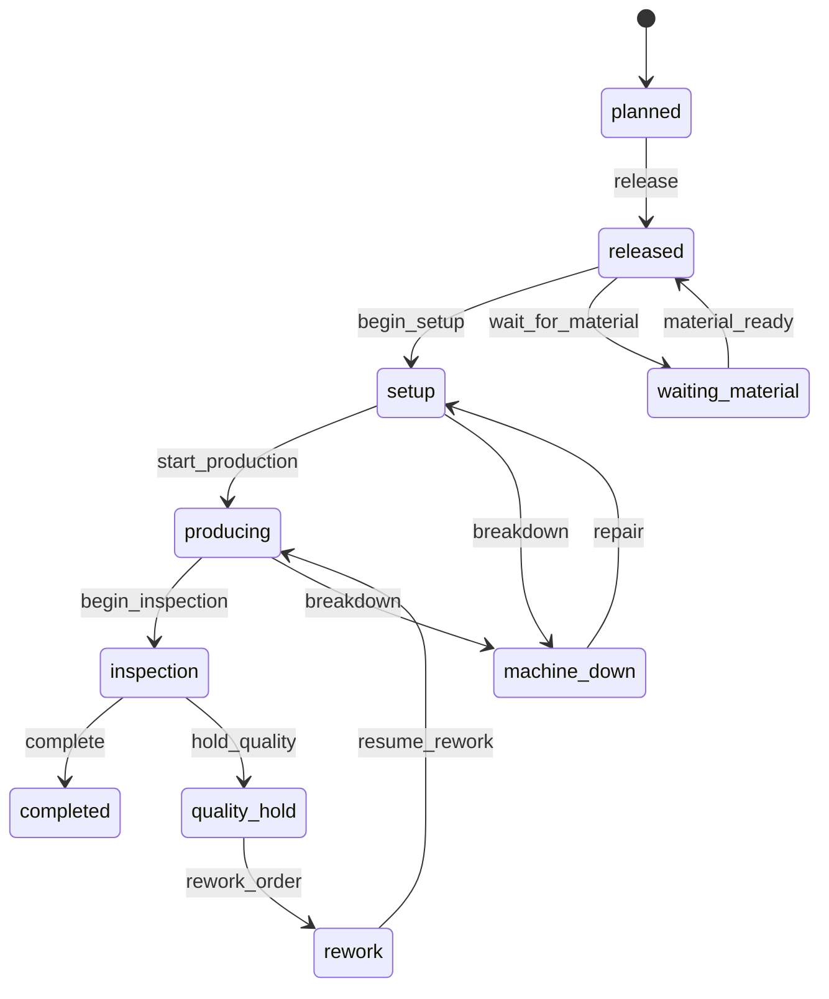
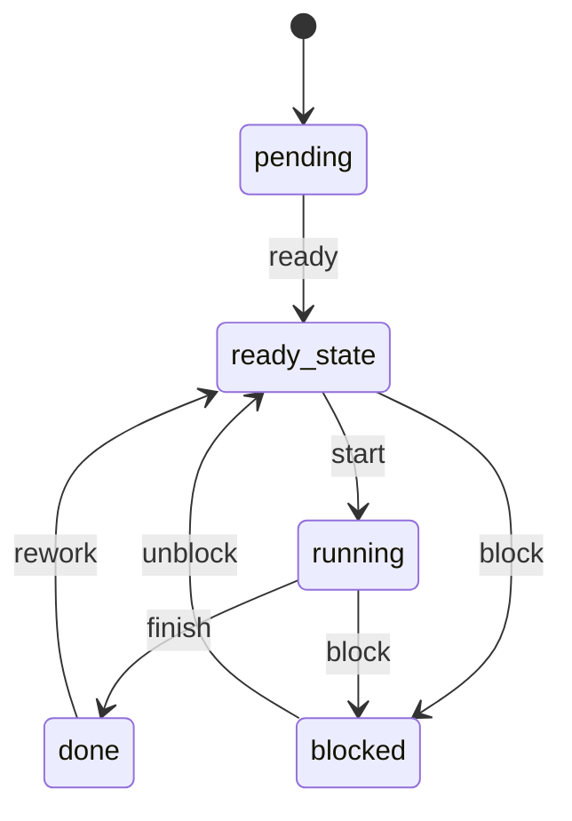

# Manufacturing domain model

## Entities

### ProductionOrder

Lifecycle:

### Operation

Represents the executable routing step associated with the production order.

Lifecycle:

## Commands

Production order commands:

- `release`
- `begin_setup`
- `start_production`
- `begin_inspection`
- `complete`
- `wait_for_material`
- `material_ready`
- `breakdown`
- `repair`
- `hold_quality`
- `rework`

Operation commands:

- `ready`
- `start`
- `finish`
- `block`
- `unblock`

## Invariants

1. setup requires a durable machine reservation and operator reservation;
2. production cannot start until material issue is durably complete;
3. completion cannot precede durable finished-goods output;
4. a machine breakdown must be visible in durable business state;
5. preemption must not erase the displaced production identity;
6. restart must not duplicate material issue, WIP, finished goods, or quality outcomes.
