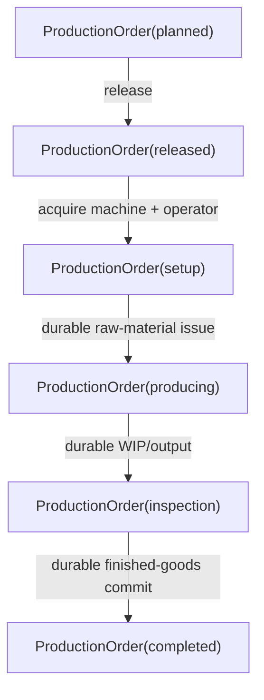

# Manufacturing flow

## Happy path

## Recovery boundaries

Restart equivalence must hold:

- after release while resources are queued;
- after machine acquisition but before operator acquisition;
- after material issue intent/result but before production transition;
- while production is displaced by a breakdown;
- after WIP output but before inspection/completion;
- after finished-goods commit but before the final lifecycle transition.
