# Manufacturing Reference Domain Specification

## 1. Purpose and scope

This example models a small discrete-manufacturing system in which a production
order consumes raw material, competes for machine and operator capacity, produces
work-in-progress (WIP), undergoes quality inspection, and either becomes finished
goods or enters an abnormal recovery path.

The example exists to demonstrate how SOSE represents operational truth across
normal execution, capacity constraints, shortages, breakdowns, rework, scenarios,
and process restart.

### In scope

- one `ProductionOrder`;
- one executable `Operation`;
- raw-material lot identity and quantity;
- one machine and one operator;
- material shortage and replenishment;
- WIP production;
- quality inspection;
- quality hold and rework;
- machine breakdown and emergency repair;
- finite scenario interventions;
- continuous-versus-restarted semantic equivalence.

### Outside the executable slice

- BOM explosion;
- multiple routing operations;
- setup matrices;
- finite-capacity production scheduling optimization;
- batch genealogy across multiple lots;
- costing;
- scrap accounting;
- multiple work centers.

## 2. Operational story

A production order is created for a quantity of finished product.

The order is first released. Before setup may begin, the system must durably hold
both a machine reservation and an operator reservation.

Raw material must then exist in inventory and be durably issued. Only after the
Store lot withdrawal and Container quantity withdrawal complete may the
`ProductionOrder` claim that production has started.

Production creates WIP. WIP is durable before the order enters inspection.

If inspection succeeds, the WIP is released to finished-goods inventory and the
order completes.

If inspection fails, the order enters `quality_hold`. The failed output remains
WIP and no finished-goods quantity is recognized. Rework returns the order to
production without issuing the original raw material a second time.

If the machine fails during setup or production, emergency repair preempts the
machine reservation. The business state becomes `machine_down`; the associated
operation becomes `blocked`. Production may resume only after repair releases
the emergency reservation and the production flow durably reacquires the machine.

## 3. Domain entities

### 3.1 ProductionOrder

**Responsibility**

Represents the business commitment to manufacture a product quantity and owns the
high-level production lifecycle.

**Relevant attributes**

- `sku`;
- `quantity`.

**Owns**

- production lifecycle state;
- whether the order is waiting for material;
- whether it is in setup, producing, under inspection, down, held for quality,
  in rework, completed, or cancelled.

**Does not own**

- machine availability;
- operator availability;
- raw-material balances;
- WIP identity;
- finished-goods balance;
- scenario activation state.

### 3.2 Operation

**Responsibility**

Represents the executable routing step performed for the production order.

**Relevant attributes**

- `work_center`;
- `quantity`.

**Owns**

- whether the operation is pending, ready, running, blocked, or done.

**Does not own**

- production-order business completion;
- inventory balances;
- machine or operator ownership.

## 4. Persistent data model / ERD

The diagrams in this section describe durable semantics, not a physical relational
schema. The reference flow creates one ProductionOrder and one Operation under the
same deterministic business correlation; the current entities do not persist a
foreign-key field between them.

### 4.1 Business entities ERD

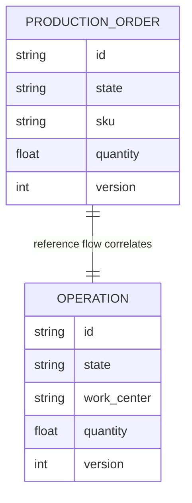

The one-to-one relationship above describes the current executable reference slice:
one production order and one routing operation participate in the same flow. It is
process correlation, not a persisted entity-to-entity foreign key.

### 4.2 Durable operational ERD

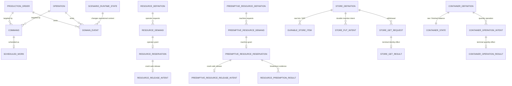

Relevant named durable objects are:

- Resource: `operator`;
- PreemptiveResource: `machine`;
- Stores: `raw_material_lots`, `wip_buffer`;
- Containers: `raw_material`, `finished_goods`;
- preemption evidence for machine breakdown/repair;
- commands, scheduled work, events, scenario state, and simulation position.

For raw material, Store and Container are complementary representations: lot identity
and aggregate quantity. Neither is a cache of the other. `SimulationPosition` is the
singleton logical recovery boundary for this flow; it is intentionally described here
rather than connected to a business entity by a fictitious foreign-key edge.

### 4.3 Persistence ownership

| Business fact | Durable owner |
|---|---|
| production-order lifecycle | `ProductionOrder.state` |
| routing-operation lifecycle | `Operation.state` |
| operator demand/ownership | `ResourceDemand` / `ResourceReservation` |
| machine demand/ownership | `PreemptiveResourceDemand` / `PreemptiveResourceReservation` |
| machine displacement | `ResourcePreemptionResult` |
| raw-material lot identity | Store `raw_material_lots` |
| raw-material quantity | Container `raw_material` |
| WIP identity | Store `wip_buffer` |
| released finished quantity | Container `finished_goods` |
| lifecycle history | `DomainEvent` |
| future lifecycle work | `Command` + `ScheduledWork` |
| scenario intervention state | `ScenarioRuntimeState` |
| logical recovery boundary | `SimulationPosition` |

The complete runtime vocabulary is documented in
[`docs/architecture/persistent-model.md`](../../architecture/persistent-model.md).

## 5. StateCharts

### 5.1 ProductionOrder StateChart

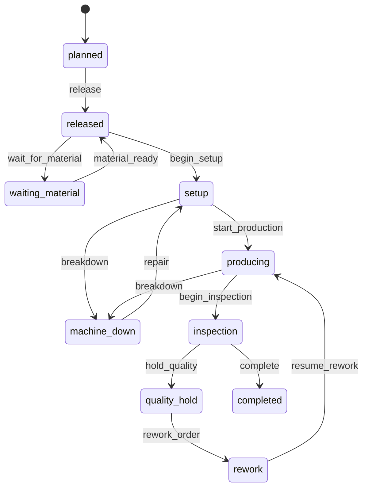

Cancellation is legal from `planned`, `released`, and `waiting_material`.

| Current state | Command | Operational precondition | Next state | Durable evidence required |
|---|---|---|---|---|
| `planned` | `release` | order exists and is eligible | `released` | command/event |
| `released` | `wait_for_material` | available material is insufficient | `waiting_material` | inventory state |
| `waiting_material` | `material_ready` | durable inventory is available | `released` | Store/Container state |
| `released` | `begin_setup` | machine + operator reservations exist | `setup` | durable reservations |
| `setup` | `start_production` | material issue completed | `producing` | Store GET + Container result |
| `setup` / `producing` | `breakdown` | emergency repair displaced production machine | `machine_down` | preemption result |
| `machine_down` | `repair` | repair released and production machine reacquired | `setup` | replacement reservation |
| `producing` | `begin_inspection` | WIP exists durably | `inspection` | WIP Store item/result |
| `inspection` | `hold_quality` | inspection failed | `quality_hold` | transition event |
| `quality_hold` | `rework_order` | rework authorized | `rework` | transition event |
| `rework` | `resume_rework` | held WIP will be reprocessed | `producing` | transition event |
| `inspection` | `complete` | WIP release and finished-goods commit completed | `completed` | Store GET + Container result |

### 5.2 Operation StateChart

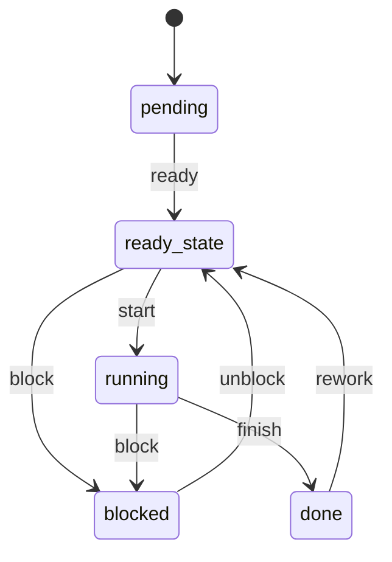

`block` is also legal from `ready_state`.

| Current state | Command | Meaning | Next state |
|---|---|---|---|
| `pending` | `ready` | routing step may be attempted | `ready_state` |
| `ready_state` | `start` | required capacity is held | `running` |
| `ready_state` / `running` | `block` | execution cannot proceed | `blocked` |
| `blocked` | `unblock` | execution constraint removed | `ready_state` |
| `running` | `finish` | processing pass ended | `done` |
| `done` | `rework` | another processing pass is required | `ready_state` |

## 6. Process specifications

### 6.1 Happy path

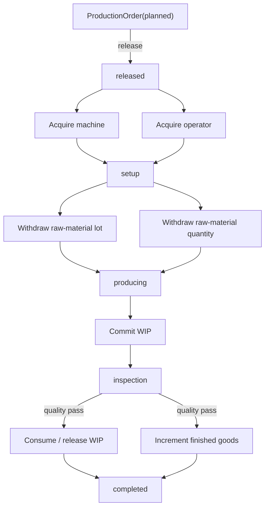

The business lifecycle always follows durable operational evidence. Resource
possession, inventory movement, WIP creation, and finished-goods release are not
side effects that happen after lifecycle claims; they gate those claims.

### 6.2 Sad path — material shortage

**Trigger**

Required raw material is unavailable.

**Expected behavior**

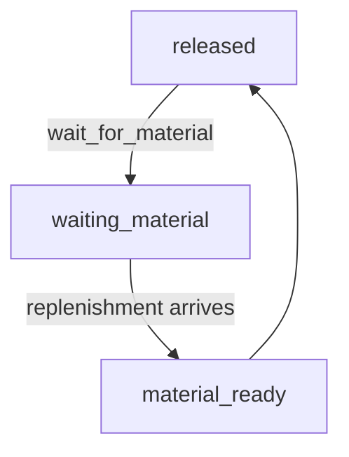

**Durable truth**

- order remains `waiting_material`;
- no partial material issue is presented as production;
- material inventory remains authoritative.

**Recovery**

Replenishment makes material durable; `material_ready` returns the order to
`released`, after which normal resource/setup gating applies.

### 6.3 Sad path — machine breakdown

**Trigger**

Emergency repair preempts the machine held by production.

**Expected behavior**

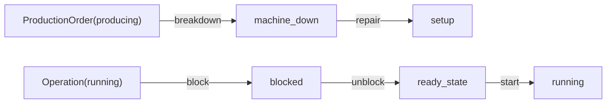

**Durable truth**

- `ResourcePreemptionResult` identifies displaced and preempting requests;
- `ProductionOrder.state == machine_down`;
- `Operation.state == blocked`.

**Recovery**

The emergency repair reservation is released. Production reacquires the machine
before `repair` may return the order to setup.

### 6.4 Sad path — quality failure and rework

**Trigger**

Inspection fails.

**Expected behavior**

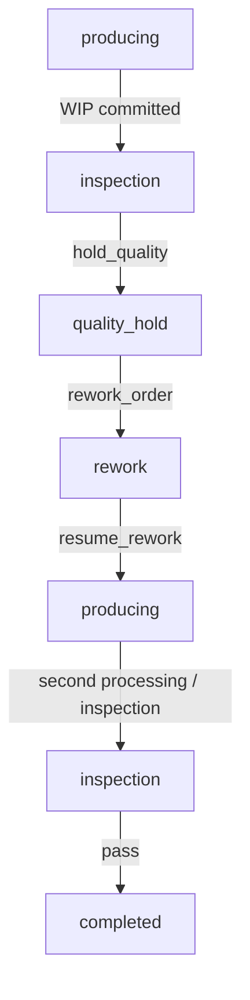

**Durable truth**

- failed output remains WIP;
- finished-goods quantity remains unchanged while held;
- original raw-material issue remains terminal and is not repeated.

**Recovery**

Rework reuses held WIP. A later successful inspection consumes/releases WIP and
only then commits finished goods.

### 6.5 External disruption — scenarios

Finite one-shot scenarios may represent:

- machine downtime;
- yield degradation;
- demand surge.

Scenario state changes operational context. It does not mutate StateChart topology
or bypass the durable business workflow.

## 7. Commands and domain events

| Command | Target | Meaning | Preconditions |
|---|---|---|---|
| `release` | ProductionOrder | authorize execution | planned order |
| `wait_for_material` | ProductionOrder | expose shortage | insufficient material |
| `material_ready` | ProductionOrder | shortage resolved | durable material exists |
| `begin_setup` | ProductionOrder | setup may begin | machine + operator held |
| `start_production` | ProductionOrder | processing may begin | material issue terminal |
| `breakdown` | ProductionOrder | machine unavailable | durable preemption |
| `repair` | ProductionOrder | return from downtime | machine reacquired |
| `begin_inspection` | ProductionOrder | produced WIP enters inspection | durable WIP |
| `hold_quality` | ProductionOrder | inspection failed | inspection state |
| `rework_order` | ProductionOrder | authorize rework | quality hold |
| `resume_rework` | ProductionOrder | reprocess held WIP | rework state |
| `complete` | ProductionOrder | close successful production | finished goods committed |
| `ready`, `start`, `block`, `unblock`, `finish`, `rework` | Operation | executable routing lifecycle | see Operation StateChart |

Successful lifecycle commands emit immutable `entity.state_transition` events.
The production flow uses a stable correlation identity so release, capacity,
material issue, breakdown, repair, inspection, and rework remain traceable as one
business process.

## 8. Invariants

**MFG-01 — Setup capacity**

A `ProductionOrder` cannot enter `setup` unless both machine and operator
reservations exist durably.

**MFG-02 — Material before production**

A `ProductionOrder` cannot enter `producing` until raw-material lot and quantity
withdrawals have completed durably.

**MFG-03 — Exactly-once material issue**

The original raw material may be issued at most once for the modeled production
cycle, including after breakdown or quality rework.

**MFG-04 — WIP before inspection**

Inspection may begin only after WIP exists durably.

**MFG-05 — Quality before finished goods**

Finished goods cannot be recognized before successful quality release.

**MFG-06 — Quality failure is inventory-neutral for finished goods**

A quality failure must leave output as WIP and must not increase finished-goods
inventory.

**MFG-07 — Rework reuses WIP**

Rework must reuse held WIP rather than reissue the original raw material.

**MFG-08 — Breakdown is business-visible**

A machine breakdown must remain visible in durable lifecycle state and durable
preemption evidence.

**MFG-09 — Capacity must be reacquired after repair**

Production cannot resume solely because repair finished; the machine reservation
must again belong to production.

**MFG-10 — Restart equivalence**

Continuous execution and execution interrupted at supported durable boundaries
must produce equivalent semantic results, including representative sad paths.

## 9. Durable truth and ownership

| Concept | Durable owner | Why |
|---|---|---|
| production lifecycle | `ProductionOrder.state` | authoritative business state |
| routing-step lifecycle | `Operation.state` | executable work state |
| raw lot identity | Store `raw_material_lots` | discrete material identity |
| raw quantity | Container `raw_material` | quantitative balance |
| WIP identity | Store `wip_buffer` | held/inspectable output |
| finished-goods quantity | Container `finished_goods` | released quantitative output |
| machine ownership | PreemptiveResource reservation | preemptable capacity truth |
| operator ownership | Resource reservation | constrained labor capacity |
| machine displacement | `ResourcePreemptionResult` | durable breakdown evidence |
| scenario activation | `ScenarioRuntimeState` | reproducible intervention state |
| logical recovery point | `SimulationPosition` | reconstruction position |

Ephemeral and reconstructible objects include SimPy environments, events, request
objects, callbacks, queues, and process continuations.

## 10. Restart semantics

Meaningful recovery boundaries include:

1. after release while capacity is queued;
2. after one required resource is held but before the other;
3. after material-operation intent but before terminal result;
4. during `machine_down`;
5. during `quality_hold`;
6. after WIP creation but before quality release;
7. after finished-goods effect but before lifecycle completion.

Semantic equivalence means equality of the durable business outcome: entity states,
inventory balances, terminal operational results, resource/preemption truth,
scenario state, and causal event history. Backend-native objects are explicitly
excluded.

## 11. Scenario specification

### Machine downtime

- **Trigger:** one-shot scheduled activation;
- **Duration:** finite;
- **Effect:** `manufacturing.machine.down = True`;
- **Interpretation:** orchestration routes the order through the normal durable
  breakdown/preemption process;
- **Does not:** directly assign `ProductionOrder.state`.

### Yield degradation

- **Trigger:** one-shot scheduled activation;
- **Duration:** finite;
- **Effect:** `manufacturing.yield.factor = 0.8`;
- **Interpretation:** 10 units of input produce 8 units of WIP/output;
- **Does not:** alter the StateChart.

### Demand surge

- **Trigger:** one-shot scheduled activation;
- **Duration:** finite;
- **Effect:** `manufacturing.demand.multiplier = 2.0`;
- **Interpretation:** represents increased production pressure.

## 12. Example runs

### A. Nominal

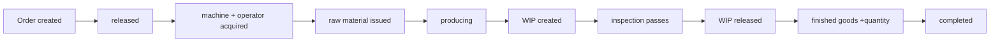

### B. Material shortage

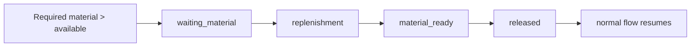

### C. Machine breakdown

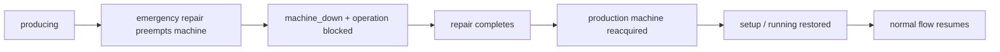

### D. Quality rework

## 13. Executable evidence

| Specification area | Implementation | Tests |
|---|---|---|
| entities / StateCharts | `entities.py`, `statecharts.py` | manufacturing happy-path tests |
| happy path | `run_happy_path`, reconcilers | `test_manufacturing_happy_path.py` |
| machine/operator gating | `reconcile_setup_resources` | `test_manufacturing_resources.py` |
| shortage | `reconcile_material_availability` | `test_manufacturing_material_wip.py` |
| WIP/material effects | material/output reconcilers | `test_manufacturing_material_wip.py` |
| breakdown/preemption | `reconcile_breakdown`, `reconcile_repair` | `test_manufacturing_breakdown.py` |
| scenarios | `scenarios.py` | `test_manufacturing_scenarios.py` |
| happy-path multi-restart | runtime/reconcilers | `test_manufacturing_restart_equivalence.py` |
| quality hold/rework | quality reconcilers | `test_manufacturing_quality_rework.py` |
| rework restart equivalence | quality reconcilers | `test_manufacturing_rework_restart.py` |

## 14. KPI contract

Manufacturing exposes a read-only KPI projection from durable operational truth through
`manufacturing_kpis()`. The KPI layer does not advance the simulation, dispatch
commands, alter inventory, or write entity state.

| KPI | Type | Definition |
|---|---|---|
| `completion` | boolean | true only when `ProductionOrder.state == completed` |
| `lead_time_seconds` | float or null | `ProductionOrder.updated_at - created_at` after completion; null before completion |
| `output_quantity` | float | durable `finished_goods` Container level |
| `yield_ratio` | float | durable finished-goods output divided by planned order quantity |
| `transition_count` | integer | immutable correlated `entity.state_transition` event count |
| `rework_count` | integer | correlated transitions entering/triggering production rework |
| `breakdown_count` | integer | correlated transitions entering/triggering `machine_down` |

These KPIs are descriptive outputs. They are not authoritative process state and they
must not be fed back as exogenous configuration merely because they are observable.

## 15. Projection contract

`manufacturing_projection()` provides the canonical observable projection for the
reference process.

| Field | Source |
|---|---|
| `production_order_id` | persisted ProductionOrder identity |
| `operation_id` | persisted Operation identity |
| `order_state` | persisted ProductionOrder state |
| `operation_state` | persisted Operation state |
| `completed` | derived from persisted order state |
| `planned_quantity` | persisted ProductionOrder attributes |
| `raw_material_quantity` | durable `raw_material` Container |
| `finished_goods_quantity` | durable `finished_goods` Container |
| `wip_item_count` | durable items currently in Store `wip_buffer` |
| `lead_time_seconds` | completed order timestamps; null while incomplete |

Projection rules:

1. projection is **read-only** and idempotent;
2. missing Manufacturing business entities are an error rather than an invented empty row;
3. absent durable Container state projects as quantity zero only for the named reference
   Container fields;
4. terminal metrics remain null until their prerequisites exist;
5. the projection never becomes the source of operational truth;
6. presentation layers, analytical sinks, or experiment reports may consume this
   contract but must not mutate process state through it.

## 16. Configuration contract

The persistent Manufacturing job uses `ManufacturingConfig`.

| Field | Default | Constraint / meaning | Runtime mutable |
|---|---|---|---|
| `start_at` | reference origin | logical start time of the job | no |
| `tick_step` | 1 hour | logical recurring-job step | yes |
| `random_seed` | 84 | deterministic stochastic root seed | yes |
| `quantity` | 10.0 | planned production quantity, strictly positive and within reference capacities | no |
| `auto_seed_material` | true | automatically make reference raw material available during recurring progression | yes |
| `quality_outcome` | `pass` | recurring reference quality branch: `pass` or `hold` | yes |

`start_at` and `quantity` define initial job/world identity for the reference flow and
are not runtime-mutable. The mutable fields are the explicit
`DomainDefinition.runtime_mutable_fields` declared by Manufacturing.

Configuration changes do not bypass StateCharts, resource ownership, inventory
operations, or durable reconciliation. A configuration surface is therefore an input
contract, not an alternative mutation API.
