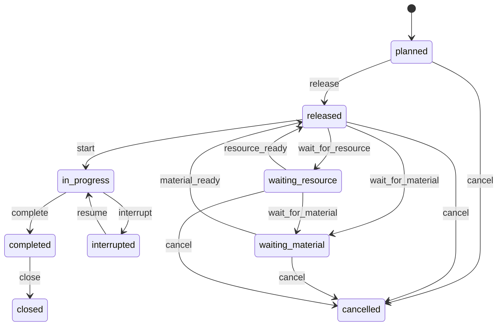
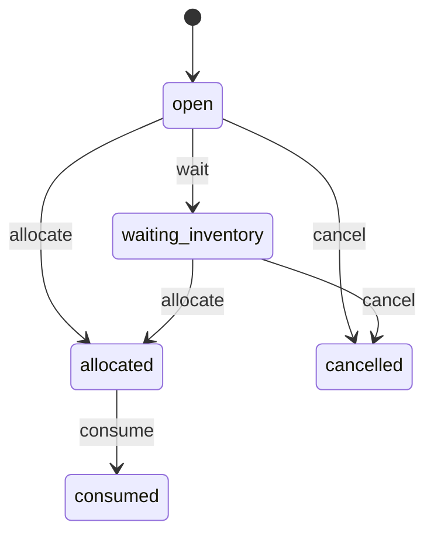

# Maintenance / MRO domain model

## Entities

### WorkOrder

Represents the durable maintenance lifecycle for the reference work order.

### PartDemand

Represents the spare-part requirement associated with the maintenance flow.

## Commands

Work-order commands:

- `release`
- `wait_for_material`
- `material_ready`
- `wait_for_resource`
- `resource_ready`
- `start`
- `interrupt`
- `resume`
- `complete`
- `close`
- `cancel`

Part-demand commands:

- `wait`
- `allocate`
- `consume`
- `cancel`

## Invariants

1. active maintenance requires durable technician and maintenance-bay reservations;
2. spare-part lot and quantity withdrawals must be terminal before `start`;
3. a work order cannot retain constrained capacity while waiting for missing material;
4. emergency displacement must be durable and business-visible;
5. scenario-owned emergency capacity must be released on expiry;
6. cancellation is allowed only before spare-part issue starts;
7. restart must not duplicate part consumption, capacity acquisition, preemption, or lifecycle claims.
