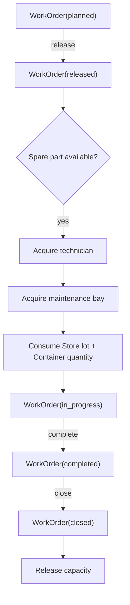
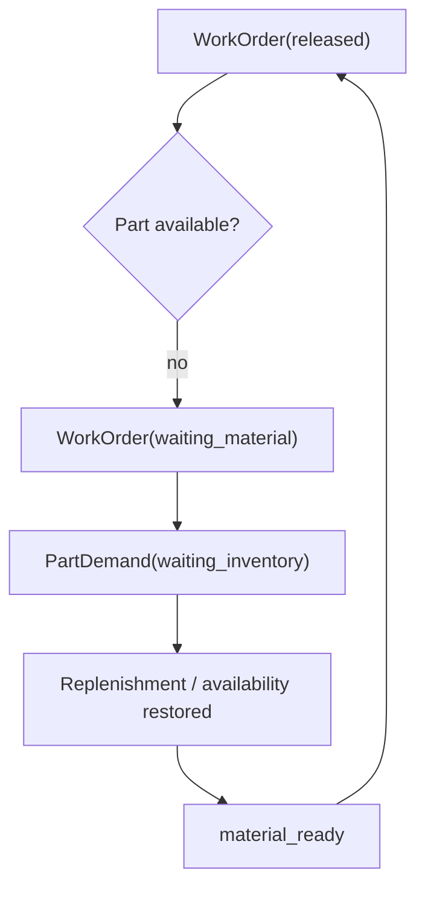
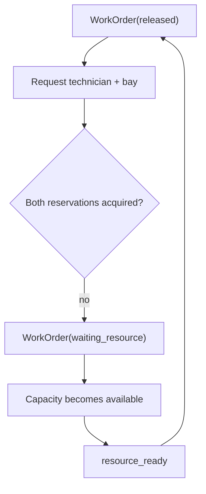
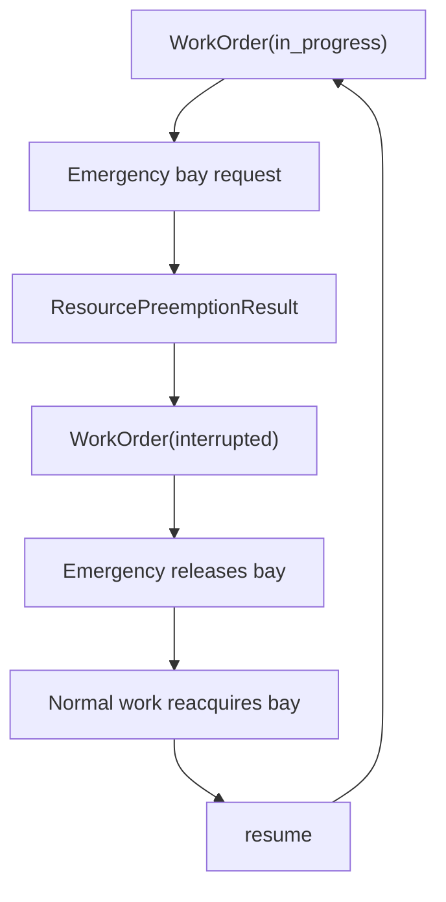

# Maintenance / MRO flow

## Happy path

## Material-shortage path

## Resource-contention path

## Emergency / preemption path

## Recovery boundaries

Restart equivalence is verified across:

- resource queues;
- completed part issue before `start`;
- active maintenance;
- material shortage;
- emergency interruption;
- completion before closure;
- cancellation;
- scenario-owned emergency cleanup.
