# Maintenance / MRO Domain Specification

## Status

**Reference implementation.**

The repository contains a persistent `WorkOrder` entity, an explicit StateChart,
probabilistic transition metadata, durable scheduling, transition events, and tests
showing scheduled execution semantics.

The executable reference now covers technicians, preemptible maintenance-bay
capacity, spare-parts inventory, waiting-material and waiting-resource behavior,
emergency priority/preemption, cancellation, MRO-specific scenarios, and
continuous-versus-restarted equivalence across representative happy and sad paths.

This specification is the canonical human-readable contract for that executable
reference.

## 1. Purpose and scope

The MRO reference domain models maintenance work from planning through execution and
closure under material, technician, and maintenance-bay constraints.

The executable slice includes:

- persistent `WorkOrder` and `PartDemand` entities;
- durable scheduled release;
- technician acquisition and contention;
- preemptible maintenance-bay acquisition;
- spare-parts Store/Container inventory;
- material shortage and replenishment;
- resource wait and recovery;
- cancellation with cleanup/no material consumption;
- emergency interruption and resume through durable preemption;
- MRO-specific scenarios;
- happy-path and representative sad-path restart equivalence.

The original `build_demo()` remains as a compact durable-scheduler demonstration.
`run_happy_path()` and the MRO reconcilers form the complete reference-domain
vertical slice.

Outside this reference slice are multi-asset planning, preventive-maintenance
optimization, multi-operation routings, labor skills matrices, maintenance costing,
and external procurement of missing spare parts.

## 2. Operational story

The process begins with a planned work order.

A planned work order may be released for execution or cancelled. Once released,
the work order may proceed only when both classes of operational prerequisite are
satisfied:

1. the required spare part is durably available and consumed exactly once;
2. a technician and maintenance bay are durably reserved.

If the spare part is unavailable, the work order enters `waiting_material` and the
associated `PartDemand` enters `waiting_inventory`. Capacity is deliberately not
held while the work waits for material.

If material is available but technician or bay capacity is unavailable, the work
order enters `waiting_resource`. It returns to `released` only after capacity can
be acquired.

Once parts and capacity are durable, the work order enters `in_progress`. It may
complete and close normally, or an emergency maintenance request may preempt the
maintenance bay. Preemption produces durable displacement evidence and moves the
normal work order to `interrupted`. The work may resume only after the emergency
reservation is released and the normal work durably reacquires the bay.

Cancellation is terminal and releases/avoids resource and inventory side effects.

MRO-specific scenarios can make spare parts or technicians unavailable, or trigger
emergency maintenance pressure. Scenario effects never bypass the normal durable
business workflow.

## 3. Domain entities

### 3.1 WorkOrder

**Responsibility**

Represents a maintenance job and owns its business lifecycle.

**Relevant attributes**

- `priority`;
- required `part_sku`;
- required `quantity`.

**Owns**

- planning/release state;
- material-wait state;
- resource-wait state;
- active/interrupted execution state;
- completion/closure/cancellation.

**Does not own**

- technician or bay availability;
- spare-parts identity or quantity;
- scenario activation state;
- preemption evidence.

### 3.2 PartDemand

**Responsibility**

Represents the spare-part requirement associated with the work order.

**Relevant attributes**

- `sku`;
- `quantity`.

**Owns**

- open;
- waiting inventory;
- allocation;
- consumption/cancellation.

**Does not own**

- physical Store lot identity;
- Container balance;
- WorkOrder lifecycle state.

## 4. Persistent data model / ERD

The MRO diagrams distinguish business entities from the SOSE primitives that make
their operation durable. WorkOrder and PartDemand participate in the same deterministic
reference flow, but the current entity payloads do not contain a direct foreign-key
field linking them.

### 4.1 Business entities ERD

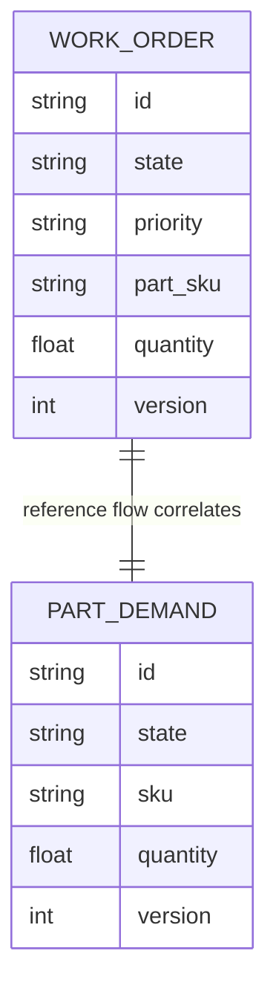

The relationship is the canonical one-work-order/one-part-demand reference process.
Its traceability comes from deterministic flow identity and shared lifecycle
correlation rather than a persisted entity foreign key.

### 4.2 Durable operational ERD

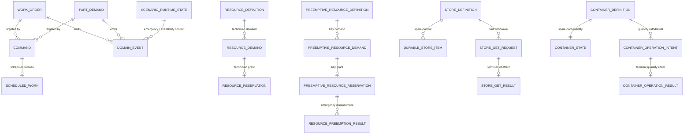

Relevant named durable objects are:

- Resource: `technician`;
- PreemptiveResource: `maintenance_bay`;
- Store: `spare_part_lots`;
- Container: `spare_parts`;
- `ResourcePreemptionResult` for emergency displacement;
- scheduled release and lifecycle commands/events;
- scenario runtime state and simulation position.

Spare-part identity and spare-part quantity are deliberately separate durable facts.
The reconciler requires both to be feasible before beginning the physical issue.

### 4.3 Persistence ownership

| Business fact | Durable owner |
|---|---|
| maintenance lifecycle | `WorkOrder.state` |
| part-demand lifecycle | `PartDemand.state` |
| technician demand/ownership | `ResourceDemand` / `ResourceReservation` |
| bay demand/ownership | `PreemptiveResourceDemand` / `PreemptiveResourceReservation` |
| emergency displacement | `ResourcePreemptionResult` |
| spare-part lot identity | Store `spare_part_lots` |
| spare-part quantity | Container `spare_parts` |
| terminal lot consumption | `StoreGetResult` |
| terminal quantity consumption | `ContainerOperationResult` |
| scheduled release | `Command` + `ScheduledWork` |
| lifecycle history | `DomainEvent` |
| scenario intervention state | `ScenarioRuntimeState` |
| logical recovery boundary | `SimulationPosition` |

The complete runtime vocabulary is documented in
[`docs/architecture/persistent-model.md`](../../architecture/persistent-model.md).

## 5. StateCharts

### 5.1 WorkOrder StateChart

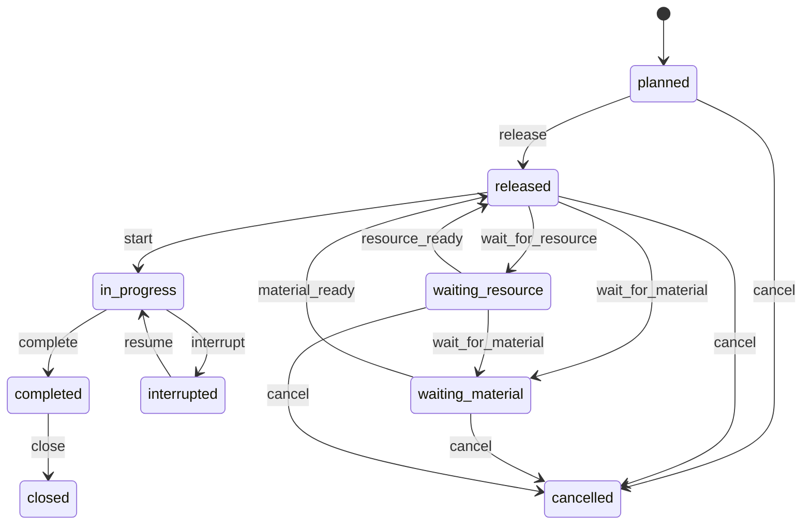

`cancel` is also legal from `released`, `waiting_material`, and
`waiting_resource`.

| Current state | Command | Domain meaning | Next state | Durable evidence required |
|---|---|---|---|---|
| `planned` | `release` | authorize maintenance execution | `released` | scheduled command/event |
| `planned` | `cancel` | cancel before release | `cancelled` | transition event |
| `released` | `wait_for_material` | required spare part unavailable | `waiting_material` | inventory state |
| `waiting_material` | `material_ready` | spare-part quantity available | `released` | Store/Container state |
| `released` | `wait_for_resource` | technician or bay unavailable | `waiting_resource` | resource demand/capacity state |
| `waiting_resource` | `resource_ready` | required capacity can be acquired | `released` | durable reservation capability |
| `released` | `start` | parts consumed and technician + bay reserved | `in_progress` | Store/Container terminal results + reservations |
| `in_progress` | `interrupt` | emergency preempts maintenance bay | `interrupted` | ResourcePreemptionResult |
| `interrupted` | `resume` | normal work reacquires bay | `in_progress` | replacement reservation |
| `in_progress` | `complete` | maintenance work finished | `completed` | transition event |
| `completed` | `close` | administratively close work | `closed` | transition event |
| outstanding states | `cancel` | terminate outstanding work | `cancelled` | transition event |

### 5.2 PartDemand StateChart

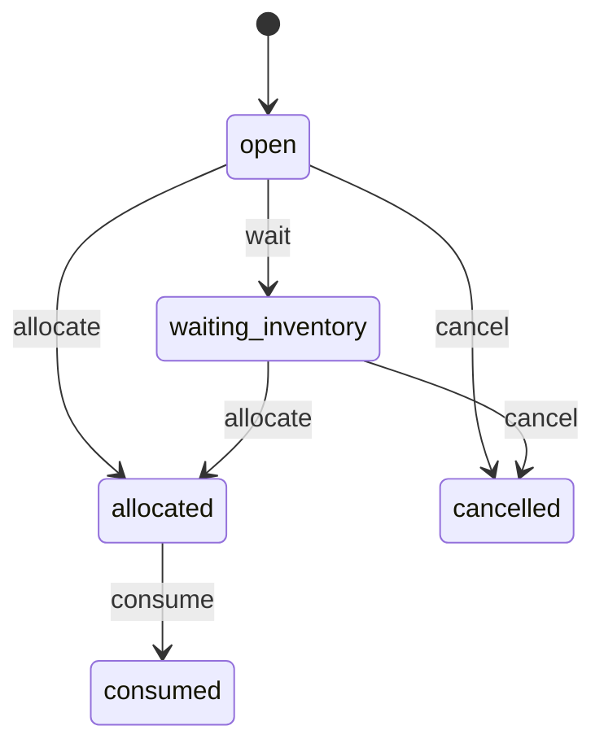

`cancel` is legal from `open` and `waiting_inventory`.

| Current state | Command | Domain meaning | Next state |
|---|---|---|---|
| `open` | `wait` | spare part unavailable | `waiting_inventory` |
| `open` / `waiting_inventory` | `allocate` | durable part withdrawal completed | `allocated` |
| `allocated` | `consume` | part committed to repair | `consumed` |
| `open` / `waiting_inventory` | `cancel` | demand terminated | `cancelled` |

### Probabilistic transition metadata

The WorkOrder model retains probabilistic metadata for lifecycle choices such as
release, waiting, cancellation, completion, and closure.

StateChart legality and direct probabilistic-dispatch eligibility are intentionally
different. The reconciler-only events `start`, `material_ready`,
`resource_ready`, `interrupt`, and `resume` remain legal StateChart transitions
but are excluded from direct stochastic selection because each depends on durable
operational evidence outside the StateChart.

The corresponding reconciler establishes that evidence first and only then dispatches
the transition explicitly.

## 6. Process specifications

### 6.1 Canonical happy path

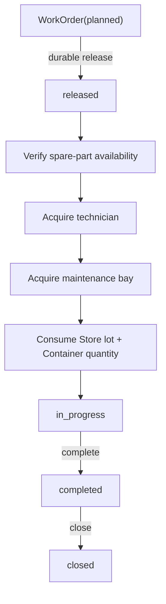

Parts are consumed before `in_progress` is claimed. Technician and maintenance-bay
reservations gate active work. Capacity is released after closure.

### 6.2 Durable scheduling path

The original demo remains a useful focused path:

This path provides focused evidence for scheduler atomicity and stale-callback
idempotence, while the reference happy path provides the full domain vertical slice.

## 7. Sad-path specifications

### 7.1 Spare-part shortage

**Trigger**

Required maintenance material is unavailable or a spare-parts disruption scenario is
active.

**Expected behavior**

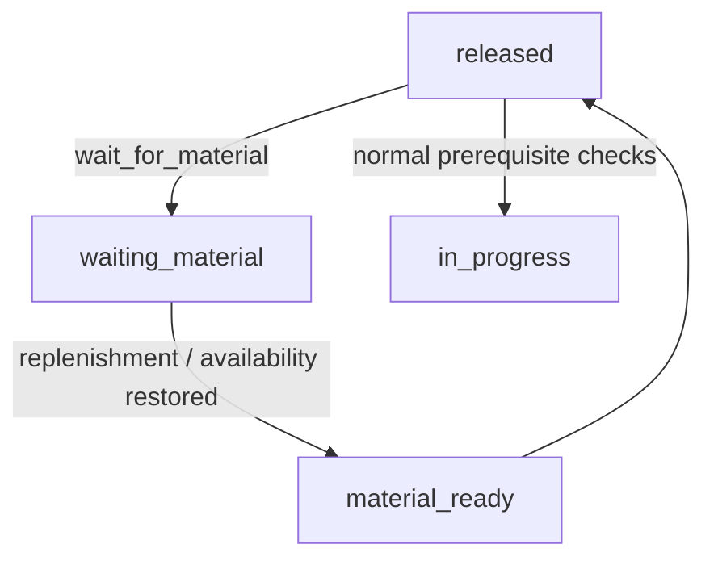

**Durable truth**

- WorkOrder remains `waiting_material`;
- PartDemand remains `waiting_inventory`;
- technician/bay capacity is not held while material is unavailable;
- no Store/Container withdrawal begins until quantity is feasible.

**Recovery**

Replenishment restores durable inventory. The order returns to `released`, then
capacity and part-issue gates are evaluated normally.

### 7.2 Technician or bay contention

**Trigger**

Required maintenance capacity is unavailable, including technician-capacity-loss
scenario context.

**Expected behavior**

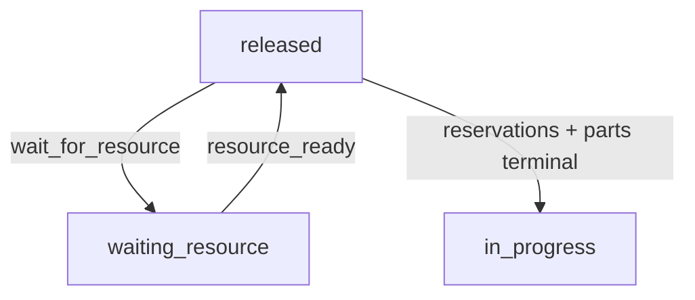

**Durable truth**

Resource demand/reservation state and WorkOrder waiting state survive restart.

### 7.3 Emergency maintenance / priority displacement

**Trigger**

Emergency work requests the preemptible maintenance bay with higher priority.

**Expected behavior**

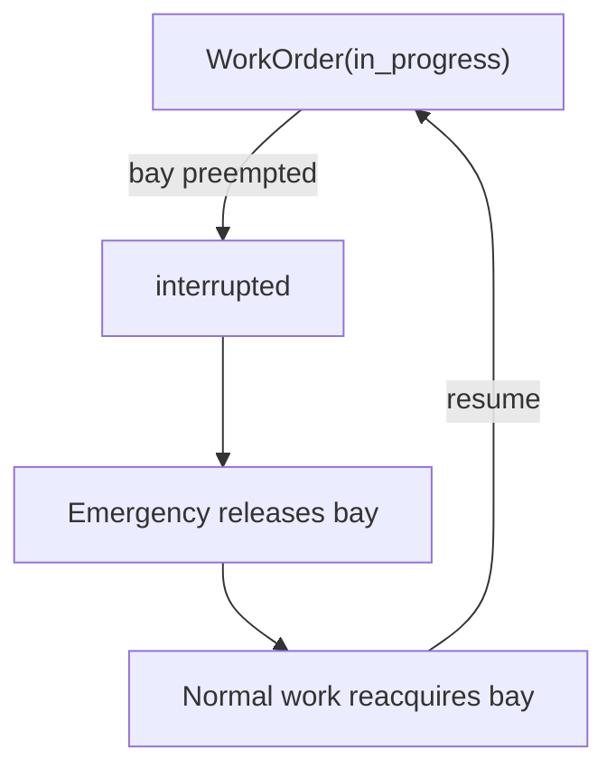

**Durable truth**

`ResourcePreemptionResult` identifies displaced and preempting requests. The
interrupted WorkOrder remains explicit business state.

### 7.4 Cancellation

**Trigger**

Outstanding maintenance work is cancelled while planned, released, or waiting.

**Expected behavior**

Cancellation is terminal only while spare-part issue has not started. It cancels the
associated open/waiting PartDemand, cancels queued technician/bay demands, releases
held capacity, and does not consume spare parts.

Once either physical part-withdrawal operation has started, cancellation is rejected.
At that point the maintenance process must reconcile the already-committed material
effect rather than pretending that a consumed part can be undone.

### 7.5 Scenario-driven disruption

Asset emergency, spare-parts disruption, and technician capacity loss alter
operational context. They must route through the same shortage, resource-wait, or
preemption semantics rather than assigning lifecycle state directly.

## 8. Commands and domain events

| Command | Target | Meaning |
|---|---|---|
| `release` | WorkOrder | authorize maintenance work |
| `wait_for_material` | WorkOrder | expose a spare-part constraint |
| `material_ready` | WorkOrder | return from material wait |
| `wait_for_resource` | WorkOrder | expose technician/bay contention |
| `resource_ready` | WorkOrder | return from resource wait |
| `start` | WorkOrder | begin active maintenance after durable prerequisites |
| `interrupt` | WorkOrder | expose emergency displacement |
| `resume` | WorkOrder | resume after bay reacquisition |
| `complete` | WorkOrder | mark maintenance execution complete |
| `close` | WorkOrder | administratively close completed work |
| `cancel` | WorkOrder | terminate outstanding work |
| `wait` | PartDemand | expose spare-part shortage |
| `allocate` | PartDemand | durable part withdrawal completed |
| `consume` | PartDemand | commit part to maintenance |
| `cancel` | PartDemand | terminate outstanding demand |

Successful commands emit immutable `entity.state_transition` events.

The reference flow uses stable causal/correlation metadata across work-order lifecycle,
part demand, resource acquisition, interruption/resume, and closure. `build_demo()`
proves focused scheduler behavior; the full reference runner and reconcilers prove the
cross-entity operational process.

## 9. Invariants

**MRO-01 — Durable scheduled transition**

Scheduled lifecycle work is persisted before execution and consumed atomically with a
successful transition.

**MRO-02 — Stale callback idempotence**

A stale callback for already-consumed scheduled work cannot execute the same transition
twice.

**MRO-03 — Logical-time consistency**

Executing scheduled work advances durable logical time to the scheduled instant.

**MRO-04 — Failed scheduled dispatch rollback**

A failed scheduled dispatch leaves command/work pending and does not advance durable
logical time.

**MRO-04A — Probabilistic policy cannot bypass operational gates**

StateChart-legal reconciler-only transitions are excluded from direct probabilistic
selection. They may only be dispatched after their durable operational prerequisites
have been reconciled.

**MRO-05 — Resource gating**

A WorkOrder cannot enter `in_progress` before technician and maintenance-bay
reservations exist.

**MRO-06 — Parts before active repair**

A WorkOrder cannot enter `in_progress` until the required Store lot and Container
quantity withdrawals are terminal.

**MRO-07 — Shortage visibility**

Spare-part shortage remains explicit in WorkOrder and PartDemand state, and constrained
capacity is not held while the work waits for material.

**MRO-08 — Exactly-once part effects**

Restart/retry cannot duplicate spare-part consumption; completed withdrawal results
take precedence over the depleted current inventory level.

**MRO-09 — Priority/preemption visibility**

Emergency displacement is represented by `ResourcePreemptionResult` and
`WorkOrder(interrupted)`. Each emergency occurrence has a distinct durable request
identity. Historical preemption results do not suppress later emergency occurrences,
and finite scenario-owned emergencies release their capacity on expiry.

**MRO-10 — Cancellation safety**

Before part issue starts, cancellation invalidates pending scheduled release, durably
cancels queued technician/bay demands, releases held capacity, and consumes no parts.
After part issue starts, cancellation is rejected; committed physical consumption is
never silently reversed.

**MRO-11 — Happy and sad restart equivalence**

Continuous and restarted execution are semantically equivalent across release,
resource queue, parts-consumed, active-maintenance, shortage, emergency interruption,
completion-before-close, and cancellation boundaries.

## 10. Durable truth and ownership

| Concept | Durable owner | Meaning |
|---|---|---|
| WorkOrder lifecycle | `WorkOrder.state` | authoritative maintenance business state |
| spare-part demand lifecycle | `PartDemand.state` | shortage/allocation/consumption truth |
| scheduled release | Command + ScheduledWork | future lifecycle intent |
| technician demand/ownership | ResourceDemand / ResourceReservation | constrained labor truth |
| bay demand/ownership | PreemptiveResourceDemand / Reservation | preemptible capacity truth |
| spare-part identity | Store item/result | discrete part-lot truth |
| spare-part quantity | ContainerState / operation result | quantitative inventory truth |
| emergency displacement | ResourcePreemptionResult | durable interruption evidence |
| scenario activation | ScenarioRuntimeState | intervention truth |
| transition audit | DomainEvent | immutable business history |
| logical recovery position | SimulationPosition | reconstruction boundary |

Backend-native callbacks, SimPy requests/processes, resource handles, queues, and
generator continuation state remain ephemeral and reconstructible.

## 11. Restart semantics

MRO restart equivalence is tested at business-significant durable boundaries:

1. after release/stock seeding before normal execution;
2. while technician and maintenance-bay requests are queued behind blockers;
3. after spare-part Store/Container withdrawals and PartDemand consumption but before
   WorkOrder `start`;
4. while maintenance is actively `in_progress` with technician and bay reservations;
5. while `waiting_material`;
6. while `interrupted` by emergency preemption;
7. after `complete` and before `close`;
8. after terminal cancellation;
9. while resource demands are queued, followed by rebuild and cancellation before
   blockers release.

For each boundary, continuous execution and reconstructed execution must converge to the
same durable semantic snapshot: entity states, events, scheduled work, inventory,
resource demands/reservations, preemption results, terminal operation results, and
recovery position.

Backend-native object identity is intentionally excluded from semantic equivalence.

## 12. Scenario specification

### Asset failure / emergency arrival

- **Trigger:** one-shot scheduled activation;
- **Duration:** finite;
- **Effect:** `mro.asset.emergency = True`;
- **Domain interpretation:** orchestration invokes the same durable emergency
  preemption workflow used by explicit emergency pressure, using a scenario-owned
  emergency request identity;
- **Expiry behavior:** if the scenario owns the interruption, expiry releases the
  scenario emergency reservation, reacquires the normal maintenance bay, and resumes
  the interrupted WorkOrder;
- **Crash recovery:** a durable scenario preemption result is reconciled into the
  missing `interrupted` business state before expiry cleanup proceeds;
- **Does not:** directly mutate WorkOrder state.

### Spare-parts disruption

- **Trigger:** one-shot scheduled activation;
- **Duration:** finite;
- **Effect:** `mro.spare_parts.available = False`;
- **Domain interpretation:** available physical inventory is temporarily considered
  unusable for prerequisite evaluation;
- **Does not:** consume or delete inventory directly.

### Technician capacity loss

- **Trigger:** one-shot scheduled activation;
- **Duration:** finite;
- **Effect:** `mro.technician.available = False`;
- **Domain interpretation:** capacity reconciliation refuses to claim technician
  capacity and routes the order into resource wait;
- **Does not:** directly mutate WorkOrder state.

Finite scenarios expire without implicit retriggering.

## 13. Example runs

### A. Nominal

### B. Material shortage

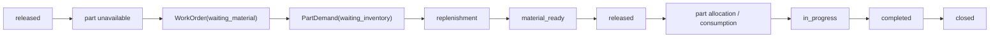

### C. Resource contention

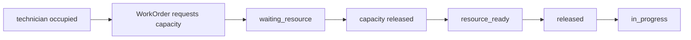

### D. Emergency priority

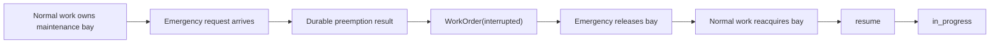

### E. Restarted sad path

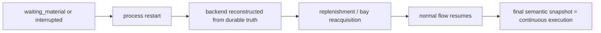

## 14. Executable evidence

| Specification area | Current implementation/evidence | Status |
|---|---|---|
| WorkOrder entity | `entities.py` | implemented |
| PartDemand entity | `entities.py` | implemented |
| WorkOrder / PartDemand StateCharts | `statecharts.py` | implemented |
| durable scheduled release | `simulation.py::seed_reference` / `build_demo` | implemented |
| scheduled transition atomicity | `test_durable_engine.py` | implemented |
| stale callback idempotence | `test_durable_engine.py` | implemented |
| logical-time semantics | `test_durable_engine.py` | implemented |
| complete happy path | `run_happy_path` | implemented |
| technician / maintenance-bay resources | `reconcile_capacity` | implemented |
| spare-parts inventory | Store + Container in `simulation.py` | implemented |
| waiting-material process | `reconcile_material_availability`, `reconcile_start` | implemented |
| waiting-resource / contention | `reconcile_capacity`, `reconcile_start` | implemented |
| cancellation | `reconcile_cancel` | implemented |
| emergency/preemption path | emergency interrupt/resume reconcilers | implemented |
| MRO scenarios | `scenarios.py` | implemented |
| happy-path restart equivalence | `test_mro_restart_equivalence.py` | implemented |
| shortage restart equivalence | `test_mro_restart_equivalence.py` | implemented |
| emergency restart equivalence | `test_mro_restart_equivalence.py` | implemented |
| cancellation restart stability | `test_mro_restart_equivalence.py` | implemented |

## Promotion decision

Under the repository's current reference-domain standard, MRO is promoted to
**Reference implementation**.

The promotion is based on executable evidence for the canonical happy path,
resource and material constraints, cancellation, emergency preemption, scenarios,
and restart equivalence across representative happy and sad paths.
