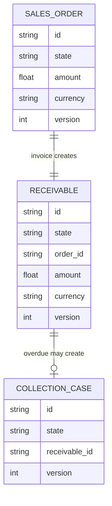
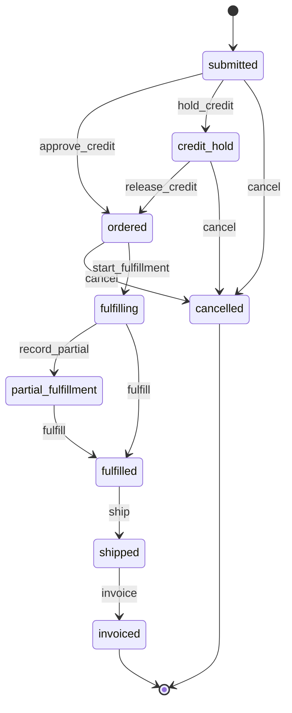
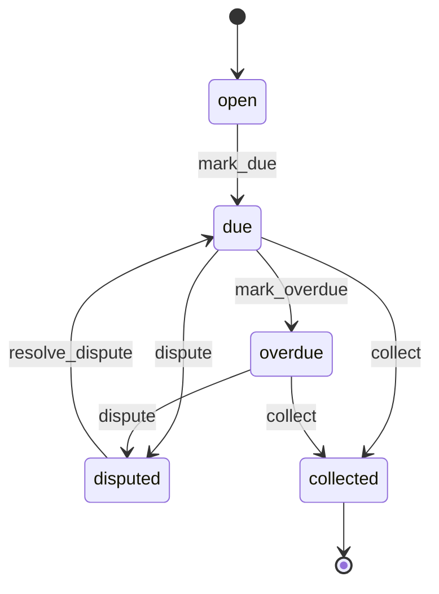
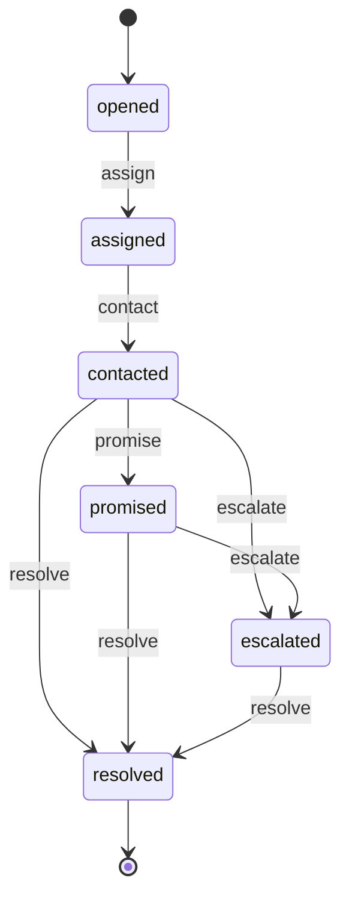
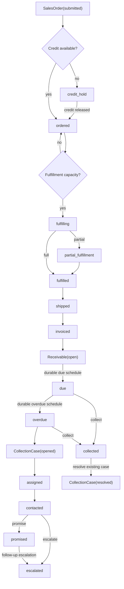

# Order-to-Cash Reference Domain Specification

## 1. Purpose and scope

This example models the commercial-to-cash chain without collapsing it into one giant lifecycle.

The reference domain uses three durable entities:

- `SalesOrder` for credit and fulfillment progression;
- `Receivable` for the financial obligation after invoicing;
- `CollectionCase` for overdue recovery work.

The design goal is to prove cross-entity correlation and causality while preserving entity-local ownership.

## 2. Operational story

A SalesOrder is submitted, credit is either approved or held, fulfillment starts, may be partial, then completes, ships, and is invoiced.

Invoicing creates a correlated Receivable rather than extending the SalesOrder state machine into finance. The Receivable becomes due, may be collected, overdue, or disputed. Overdue recovery creates a separate CollectionCase occurrence. Collection work never rewrites the historical due/overdue facts.

## 3. Domain entities

### SalesOrder

States: submitted, credit_hold, ordered, fulfilling, partial_fulfillment, fulfilled, shipped, invoiced, cancelled.

### Receivable

States: open, due, overdue, disputed, collected.

### CollectionCase

States: opened, assigned, contacted, promised, escalated, resolved.

## 4. Durable operational model

Target reference-grade durable truth:

- SalesOrder, Receivable, CollectionCase entities;
- immutable DomainEvent history and stable correlation/causation;
- ScheduledWork for payment due dates, overdue boundaries, promise-to-pay follow-up, and collection escalation;
- ResourceDemand/Reservation/ReleaseIntent for fulfillment and collection capacity;
- Store/Container or correlated fulfillment evidence where inventory allocation is required;
- ScenarioRuntimeState;
- SimulationPosition.

Relationships are semantic rather than SQL foreign-key declarations.

## 5. StateCharts

Commercial flow:

    submitted
      -> ordered
      -> fulfilling
      -> partial_fulfillment
      -> fulfilled
      -> shipped
      -> invoiced

Credit exception:

    submitted -> credit_hold -> ordered

Financial flow:

    open -> due -> collected
             -> overdue -> collected
             -> disputed -> due

Collection flow:

    opened -> assigned -> contacted -> promised -> resolved
                              \-> escalated -> resolved

All transitions are orchestration-gated.

## 6. Process specifications

### Happy path

1. SalesOrder passes credit.
2. fulfillment capacity is acquired;
3. order is fully fulfilled and shipped;
4. invoice transition creates a correlated Receivable;
5. a durable due-date schedule fires;
6. Receivable becomes due and is collected.

### Sad path — credit hold

Credit unavailability holds the SalesOrder before fulfillment capacity is requested.

### Sad path — partial fulfillment

Partial fulfillment is explicit durable order state. Remaining work must continue from durable fulfillment evidence rather than silently overwriting quantities.

### Sad path — overdue and collection

A due Receivable crosses a durable overdue deadline, transitions to overdue, and creates a correlated CollectionCase. Assignment/contact/promise/escalation belong to that case.

### Sad path — dispute

A disputed Receivable preserves historical due/overdue events. Resolving the dispute returns the financial obligation to the appropriate due-processing flow rather than deleting history.

## 7. Invariants

O2C-01 — Credit before fulfillment: fulfillment capacity is not requested while SalesOrder is on credit hold.

O2C-02 — Fulfillment evidence before shipment: shipment requires durable fulfillment completion.

O2C-03 — Invoice causality: Receivable creation requires durable SalesOrder invoicing evidence and stable correlation.

O2C-04 — Durable due date: due/overdue transitions are driven by ScheduledWork, not backend timers.

O2C-05 — Collection identity: overdue recovery uses a separately durable CollectionCase.

O2C-06 — Collection does not rewrite finance history: collection resolution does not delete Receivable overdue/dispute events.

O2C-07 — Scenario discipline: credit/fulfillment scenarios change prerequisites and never assign lifecycle state directly.

O2C-08 — Restart equivalence: continuous and rebuilt executions converge across credit hold, partial fulfillment, invoice/receivable creation, due/overdue, and collection boundaries.

## 8. Restart semantics

Reference-grade recovery gates will cover:

1. credit hold before fulfillment;
2. fulfillment capacity pending;
3. partial fulfillment;
4. invoiced SalesOrder before Receivable creation;
5. Receivable with due ScheduledWork pending;
6. overdue before CollectionCase creation;
7. CollectionCase assigned/contacted with follow-up pending.

## 9. Executable evidence

| Specification area | Current implementation/evidence | Status |
|---|---|---|
| SalesOrder entity | entities.py | implemented |
| Receivable entity | entities.py | implemented |
| CollectionCase entity | entities.py | implemented |
| SalesOrder StateChart | statecharts.py + topology test | implemented |
| Receivable StateChart | statecharts.py + topology test | implemented |
| CollectionCase StateChart | statecharts.py + topology test | implemented |
| direct probabilistic gating | TransitionPolicy tests | implemented |
| O2C scenarios | scenarios.py | implemented |
| durable credit / fulfillment gating | Resource-backed fulfillment reconciler + credit/fulfillment scenario tests | implemented |
| invoice-to-receivable causality | idempotent Receivable creation after durable SalesOrder(invoiced) | implemented |
| due / overdue scheduling | durable mark_due / mark_overdue ScheduledWork + cancellation on collection | implemented |
| collection assignment / follow-up | CollectionCase + collection_agent Resource + promise follow-up ScheduledWork | implemented |
| partial-fulfillment execution | explicit partial_fulfillment runtime path + tests | implemented |
| finite scenario recovery | credit tightening / fulfillment outage tests | implemented |
| restart equivalence | due schedule, invoice→receivable, overdue→CollectionCase, collection follow-up, fulfillment/collection ResourceDemand rebuild tests | implemented |

## Promotion decision

Current status: **Reference implementation**.

Promotion is based on executable evidence for credit/fulfillment gating, explicit partial fulfillment, idempotent invoice→Receivable causality, durable due/overdue scheduling, overdue→CollectionCase creation, collection-agent ownership and follow-up scheduling, finite scenario recovery, illegal cross-entity prerequisite rejection, and restart equivalence across scheduler, causal-creation, and resource-demand boundaries.

## 10. Normative persistent ERD

The following ERD is the canonical persistent business relationship model for this
reference process. The relationships are semantic/correlational and do not imply that
the current entity payloads store SQL foreign-key columns.

Cross-entity traceability is additionally bound by deterministic identity and stable
correlation/causation metadata.

Durable operational support records include:

- `Command` + `ScheduledWork` for due, overdue, and collection follow-up;
- `ResourceDemand` / `ResourceReservation` for fulfillment and collection capacity;
- immutable `DomainEvent` transition history;
- `ScenarioRuntimeState` for external credit/fulfillment conditions;
- `SimulationPosition` for logical recovery.

## 11. Normative StateCharts

These diagrams mirror the executable charts in
`src/sose/examples/order_to_cash/statecharts.py`.

### 11.1 SalesOrder

### 11.2 Receivable

### 11.3 CollectionCase

## 12. Normative process diagram

The diagram describes business causality. Scheduled deadlines and finite resources are
durable prerequisites; they are not represented as hidden backend timers or direct state
assignment.

## 13. KPI contract

`order_to_cash_kpis()` exposes read-only KPIs derived from persisted entities and
immutable correlated transition events.

| KPI | Type | Definition |
|---|---|---|
| `cash_collection` | boolean | true only when the correlated Receivable is `collected` |
| `order_to_cash_seconds` | float or null | SalesOrder creation to Receivable collection; null before collection |
| `amount` | float | durable SalesOrder commercial amount |
| `transition_count` | integer | correlated immutable transition-event count |
| `credit_hold_count` | integer | transitions entering `credit_hold` |
| `partial_fulfillment_count` | integer | transitions entering `partial_fulfillment` |
| `overdue_count` | integer | Receivable transitions entering `overdue` |
| `collection_case_count` | integer | 1 when the deterministic CollectionCase exists, otherwise 0 |
| `collection_escalation_count` | integer | CollectionCase transitions entering `escalated` |

The KPIs are observations, not operational truth and not automatically valid exogenous
experiment coordinates.

## 14. Projection contract

`order_to_cash_projection()` is the canonical observable projection of the reference
process.

| Field | Source |
|---|---|
| `order_id` | persisted SalesOrder identity |
| `receivable_id` | deterministic/persisted Receivable identity when created |
| `collection_case_id` | deterministic/persisted CollectionCase identity when created |
| `order_state` | persisted SalesOrder state |
| `receivable_state` | persisted Receivable state or null before creation |
| `collection_case_state` | persisted CollectionCase state or null before creation |
| `amount` | persisted SalesOrder amount |
| `currency` | persisted SalesOrder currency |
| `collected` | derived from Receivable state |
| `overdue` | derived from Receivable state |
| `collection_open` | true when a CollectionCase exists and is not resolved |
| `order_to_cash_seconds` | terminal collection timestamps; null before collection |

Projection rules:

1. projection is read-only and idempotent;
2. missing SalesOrder is an error;
3. absence of a Receivable/CollectionCase before its causal creation is represented as
   null, not as an invented entity;
4. terminal cash-cycle duration remains null until collection is durable;
5. historical overdue/collection evidence is never rewritten by a later collection;
6. consumers cannot mutate process state through the projection.

## 15. Configuration contract

The persistent Order-to-Cash job uses `OrderToCashConfig`.

| Field | Default | Constraint / meaning | Runtime mutable |
|---|---|---|---|
| `start_at` | reference origin | logical process start | no |
| `tick_step` | 1 hour | recurring logical step | yes |
| `random_seed` | 336 | deterministic stochastic root seed | yes |
| `amount` | 250.0 | commercial amount, strictly positive | no |
| `currency` | USD | commercial currency code/value for the reference order | no |
| `partial_fulfillment` | false | choose explicit partial-fulfillment path | yes |
| `due_delay` | 2 hours | durable delay to Receivable due state; positive | yes |
| `overdue_delay` | 2 hours | durable delay from due to overdue; positive | yes |
| `auto_collect` | true | collect due/overdue Receivable automatically when reconciled | yes |
| `collection_promise` | false | use promise-to-pay/follow-up branch for collection | yes |

The runtime-mutable fields are exactly those declared by the domain definition:
`tick_step`, `random_seed`, `partial_fulfillment`, `due_delay`,
`overdue_delay`, `auto_collect`, and `collection_promise`.

Configuration never bypasses StateCharts, causal entity creation, durable ScheduledWork,
or finite resource ownership.
