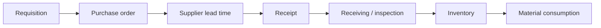
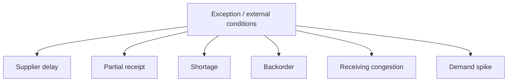

# Procure-to-Pay reference domain

> **Canonical human-readable contract:** [specification.md](specification.md)
>
> The specification defines the executable operational P2P slice, exact StateCharts,
> happy/sad process semantics, invariants, durable ownership and restart contract.
> The remaining documents are supporting implementation notes.

## Status

**Reference implementation candidate for v0.8.**

This directory defines the reference contract for the first domain built on top of the
v0.7 durable runtime.

The implementation goal is not only to make Procure-to-Pay executable. It is to prove
that SOSE can express a real operational flow while preserving its central invariant:

```text
domain semantics are durable
backend execution state is ephemeral and reconstructible
```

## Scope

The reference slice covers the operational path:



and representative exception paths:



Financial invoice approval, three-way matching and payment remain documented extensions
of the Procure-to-Pay domain, but they are intentionally outside the first executable
slice. The initial implementation focuses on the supply-side operational mechanics that
exercise SOSE's durable runtime.

## Acceptance gates

The domain is promoted from **Partial** to **Reference implementation** when the stacked v0.8 implementation and restart-equivalence gate are green. The implementation now targets:

1. persistent domain entities and explicit StateCharts;
2. commands and immutable transition events;
3. durable supplier lead-time scheduling;
4. durable Store and Container usage for inventory semantics;
5. constrained receiving resources;
6. shortage / backorder behavior;
7. at least one Scenario Engine intervention;
8. deterministic continuous-vs-restarted equivalence across representative recovery
   boundaries;
9. documentation that distinguishes durable semantic truth from backend mechanics;
10. tests that make the above contracts observable.

## Implementation sequence

1. domain specification and primitive mapping;
2. executable happy path;
3. receiving resources and contention;
4. shortage and backorder;
5. scenario interventions;
6. multi-restart equivalence gate.

No new runtime primitive should be introduced solely to make the example convenient.
A primitive addition requires a demonstrated semantic gap rather than an ergonomic
preference.


## Happy and sad paths

The reference implementation treats both normal and abnormal procurement as first-class:

- happy: requisition -> PO -> receipt -> stock -> consumption;
- sad: receiving capacity contention;
- sad: shortage -> waiting inventory -> backorder -> replenishment;
- sad: partial receipt -> partial stock -> residual demand remains blocked/backordered;
- sad: rejected receipt -> terminal rejection with no inventory effect;
- external: supplier delay, demand spike and receiving-congestion scenarios.

A domain is not reference-grade if only its golden path is executable.
