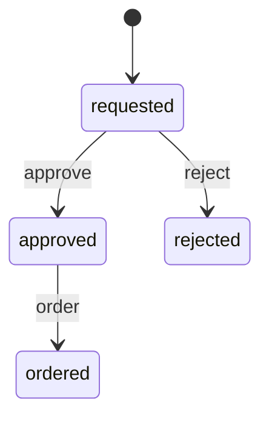
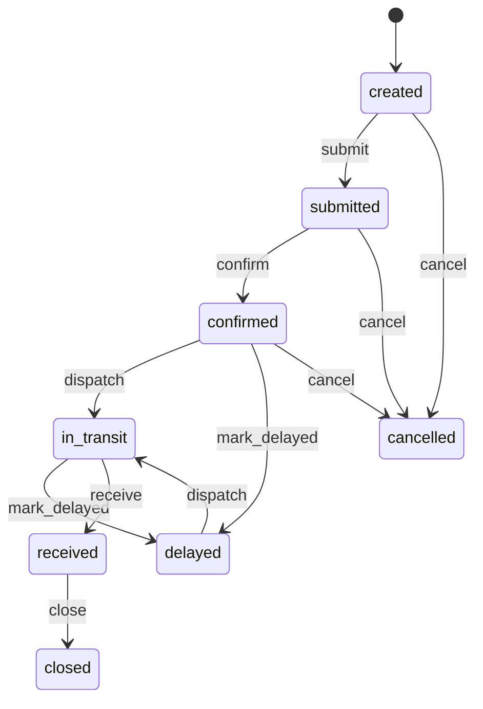
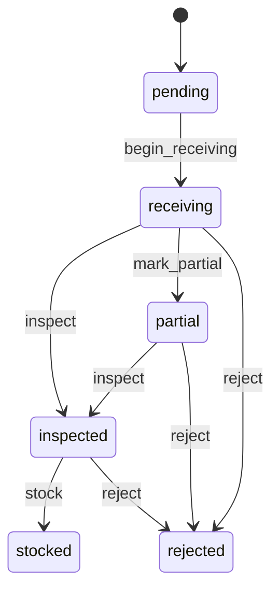
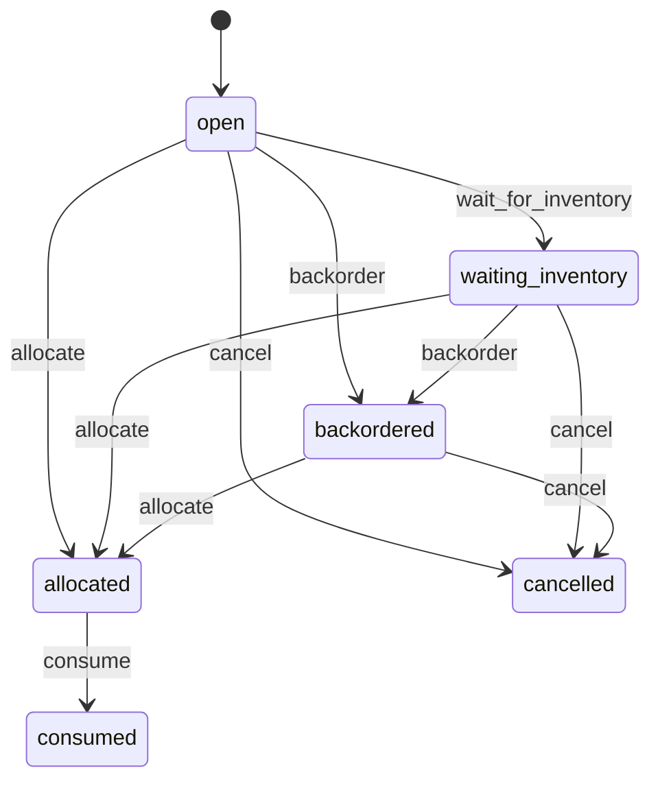

# Procure-to-Pay domain model

## Bounded slice

The executable reference domain models the operational half of Procure-to-Pay, from
material request through physical receipt and consumption.

### Persistent entities

```text
Requisition
PurchaseOrder
Receipt
MaterialDemand
```

Additional business objects such as supplier invoices, match results, payables and
payments remain part of the broader Procure-to-Pay blueprint but are not required to
prove the first runtime slice.

## Canonical lifecycles

### Requisition



### PurchaseOrder



### Receipt



### MaterialDemand



## Commands

Representative explicit intents:

```text
approve
reject
order
submit
confirm
dispatch
mark_delayed
receive
begin_receiving
inspect
stock
wait_for_inventory
allocate
backorder
consume
```

Every lifecycle mutation is dispatched as a command against a registered entity type.
Successful StateChart transitions emit immutable `entity.state_transition` events.

## Invariants

1. A requisition cannot be ordered before approval.
2. A purchase order cannot be received before supplier confirmation / transit.
3. A receipt cannot be stocked before inspection.
4. A material demand cannot be consumed before allocation.
5. Supplier lead time is represented as durable scheduled intent, never as a backend
   timer that exists only in memory.
6. Inventory quantity truth is durable.
7. Pending physical-flow work must remain reconstructible after restart.
8. Completed request identities are terminal and cannot apply the same physical effect
   twice.
9. Cross-entity business flow uses one correlation identity where causal linkage is
   required.
10. Backend-native request, event, process and queue objects never become domain state.

## Semantic truth versus mechanics

Durable truth includes:

- entity lifecycle state;
- commands awaiting future execution;
- scheduled work;
- inventory Store records and pending operations;
- Container levels and pending/results;
- resource definitions, demands and reservations;
- scenario state;
- simulation recovery position;
- immutable events.

Ephemeral mechanics include:

- SimPy Environment;
- SimPy Event / Request / Process;
- backend queue objects;
- backend callbacks and generator state.

A fresh backend must be reconstructible solely from the durable side.
