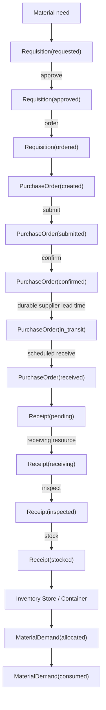
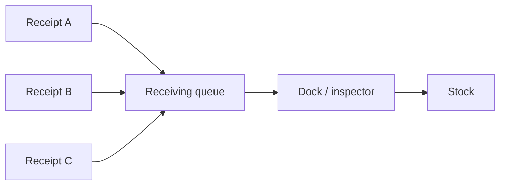
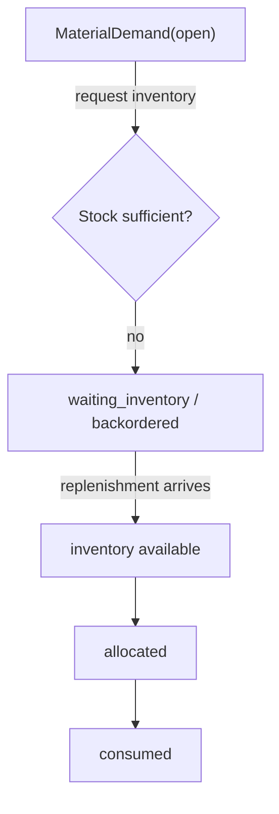

# Procure-to-Pay flow

## Happy path

## Contention path

Receiving capacity is intentionally finite.

The queue and resource mechanics may be backend-driven, but demand and reservation
semantics must survive restart.

## Shortage path

The pending demand must not disappear across restart, and replenishment must satisfy it
exactly once.

## Recovery boundaries to test

At minimum:

1. after requisition approval, before PO execution;
2. while supplier lead-time work is still scheduled;
3. with a receipt waiting for constrained receiving capacity;
4. with a pending Store or Container operation;
5. while material demand is waiting for replenishment;
6. after scenario activation but before its effects have expired.

For each boundary, the final durable snapshot must match continuous execution.
