# Procure-to-Pay Operational Reference Specification

## 1. Purpose and scope

This example models the operational procurement slice that begins with an internal
material request and ends when received inventory is consumed.

It demonstrates how SOSE represents procurement lifecycles, supplier lead time,
receiving capacity, inventory, shortage/backorder behavior, receipt exceptions,
scenario interventions, and restart-safe physical effects.

The example intentionally does **not** claim to implement the full financial
Procure-to-Pay process.

### In scope

- internal requisition;
- purchase order;
- durable supplier lead time;
- physical receipt;
- receiving dock and inspection capacity;
- accepted, partial, and rejected receipts;
- inventory lot identity and quantitative balance;
- material demand;
- shortage and backorder;
- supplier/demand/receiving scenarios;
- continuous-versus-restarted semantic equivalence.

### Outside the executable slice

- supplier invoice;
- three-way match;
- invoice hold;
- accounts payable;
- payment authorization/execution;
- financial settlement.

These remain part of the broader P2P blueprint but are not part of this executable
operational reference.

## 2. Operational story

A material need creates an internal requisition. The requisition is approved and
converted into an ordered state.

A purchase order is submitted to a supplier, confirmed, dispatched, and then waits
through a durable supplier lead time before it can be received.

Physical receipt cannot advance independently of receiving capacity. A receipt must
obtain the receiving dock and inspector resources before it may claim the corresponding
business transitions.

An accepted receipt is stocked only after the discrete received lot and the quantitative
inventory increase are durable.

Material demand consumes inventory only after both the Store lot withdrawal and the
Container quantity withdrawal complete.

If inventory is insufficient, the demand becomes explicitly waiting/backordered before
withdrawal is attempted.

A partial receipt stocks only the quantity actually received; residual demand remains
unsatisfied. A rejected receipt terminates without creating inventory.

## 3. Domain entities

### 3.1 Requisition

**Responsibility**

Represents internal authorization to procure material.

**Relevant attributes**

- `sku`;
- `quantity`.

**Owns**

- requested/approved/ordered/rejected lifecycle.

**Does not own**

- supplier commitment;
- physical receipt;
- inventory;
- material consumption.

### 3.2 PurchaseOrder

**Responsibility**

Represents the supplier-facing procurement commitment and supplier-delivery lifecycle.

**Relevant attributes**

- `sku`;
- `quantity`;
- `supplier`.

**Owns**

- submission;
- supplier confirmation;
- transit/delay;
- receipt/closure/cancellation state.

**Does not own**

- receiving capacity;
- inspection result;
- inventory quantity;
- downstream material-demand state.

### 3.3 Receipt

**Responsibility**

Represents the physical arrival and receiving/inspection lifecycle.

**Relevant attributes**

- `sku`;
- `quantity`.

**Owns**

- pending/receiving/partial/inspected/stocked/rejected lifecycle.

**Does not own**

- dock or inspector availability;
- inventory balance;
- material-demand allocation.

### 3.4 MaterialDemand

**Responsibility**

Represents a need to consume procured material.

**Relevant attributes**

- `sku`;
- `quantity`.

**Owns**

- open;
- waiting inventory;
- backorder;
- allocation;
- consumption/cancellation.

**Does not own**

- physical inventory truth;
- supplier state;
- receipt state.

## 4. Persistent data model / ERD

The diagrams below describe the persistent semantic model of the executable P2P
reference slice. Requisition, PurchaseOrder, Receipt, and MaterialDemand are created
under one deterministic process correlation, but the current entity payloads do not
persist direct foreign-key fields between those entities.

### 4.1 Business entities ERD

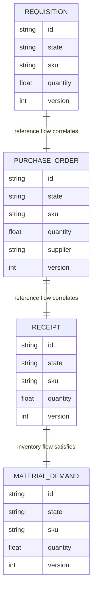

These relationships describe the canonical reference process, not physical
entity-to-entity foreign keys. Cross-entity traceability is provided by deterministic
identity and shared correlation/causation metadata.

### 4.2 Durable operational ERD

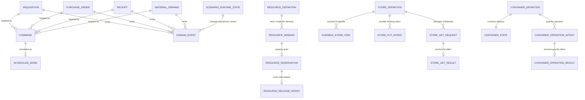

Relevant named durable objects are:

- Resources: `receiving_dock`, `inspector`;
- Store: `received_lots`;
- Container: `inventory`;
- commands/scheduled work for the requisition, purchase-order, and receipt lifecycle;
- durable Store/Container effects for stocking and allocation;
- scenario state and logical simulation position.

The Store preserves lot identity while the Container preserves quantity. Allocation
must establish joint feasibility before withdrawing either representation.
`SimulationPosition` is the singleton logical recovery boundary for this process and
is not given a fabricated entity relationship merely to make it visible in the ERD.

### 4.3 Persistence ownership

| Business fact | Durable owner |
|---|---|
| requisition lifecycle | `Requisition.state` |
| supplier-order lifecycle | `PurchaseOrder.state` |
| receiving lifecycle | `Receipt.state` |
| downstream demand lifecycle | `MaterialDemand.state` |
| receiving-dock ownership | `ResourceDemand` / `ResourceReservation` |
| inspector ownership | `ResourceDemand` / `ResourceReservation` |
| received lot identity | Store `received_lots` |
| available inventory quantity | Container `inventory` |
| terminal lot allocation | `StoreGetResult` |
| terminal quantity allocation | `ContainerOperationResult` |
| lifecycle history | `DomainEvent` |
| future lifecycle work | `Command` + `ScheduledWork` |
| scenario intervention state | `ScenarioRuntimeState` |
| logical recovery boundary | `SimulationPosition` |

The complete runtime vocabulary is documented in
[`docs/architecture/persistent-model.md`](../../architecture/persistent-model.md).

## 5. StateCharts

### 5.1 Requisition StateChart

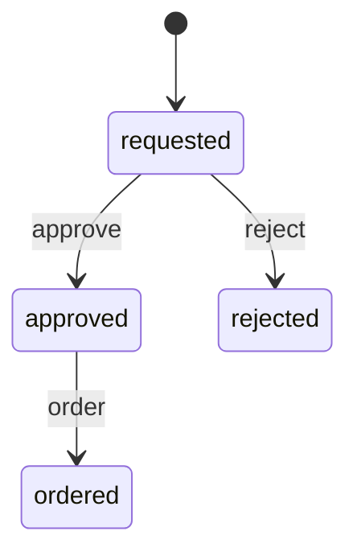

| Current state | Command | Preconditions | Next state |
|---|---|---|---|
| `requested` | `approve` | requisition accepted | `approved` |
| `requested` | `reject` | requisition denied | `rejected` |
| `approved` | `order` | supplier order may be created | `ordered` |

### 5.2 PurchaseOrder StateChart

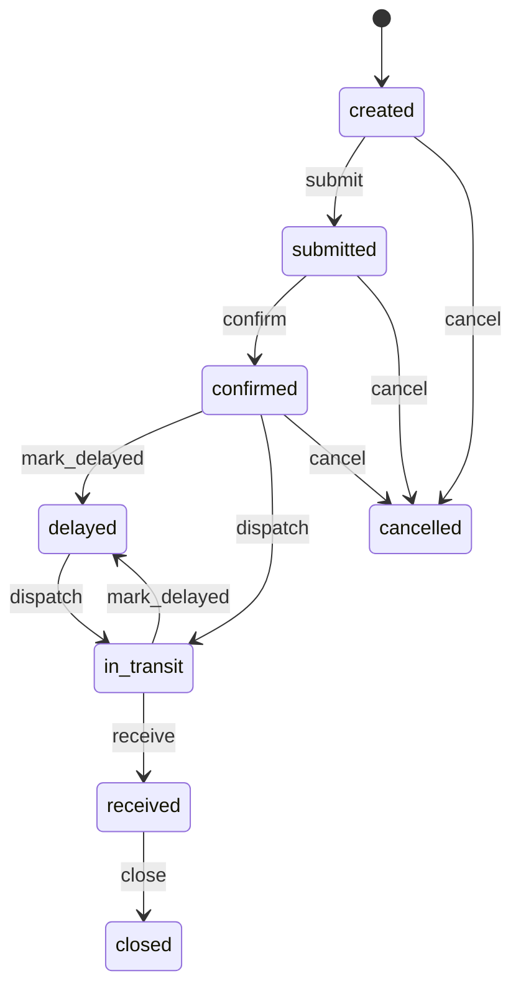

Cancellation is a first-class executable terminal path from `created`, `submitted`,
and `confirmed`.

| Current state | Command | Preconditions | Next state | Durable evidence |
|---|---|---|---|---|
| `created` | `submit` | PO created | `submitted` | command/event |
| `submitted` | `confirm` | supplier confirms | `confirmed` | command/event |
| `confirmed` / `delayed` | `dispatch` | shipment dispatched | `in_transit` | command/event |
| `confirmed` / `in_transit` | `mark_delayed` | supplier delay observed | `delayed` | command/event |
| `in_transit` | `receive` | durable lead-time work reaches delivery | `received` | ScheduledWork execution |
| `received` | `close` | PO receiving obligation satisfied | `closed` | command/event |
| `created` / `submitted` / `confirmed` | `cancel` | procurement commitment cancelled | `cancelled` | command/event |

### 5.3 Receipt StateChart

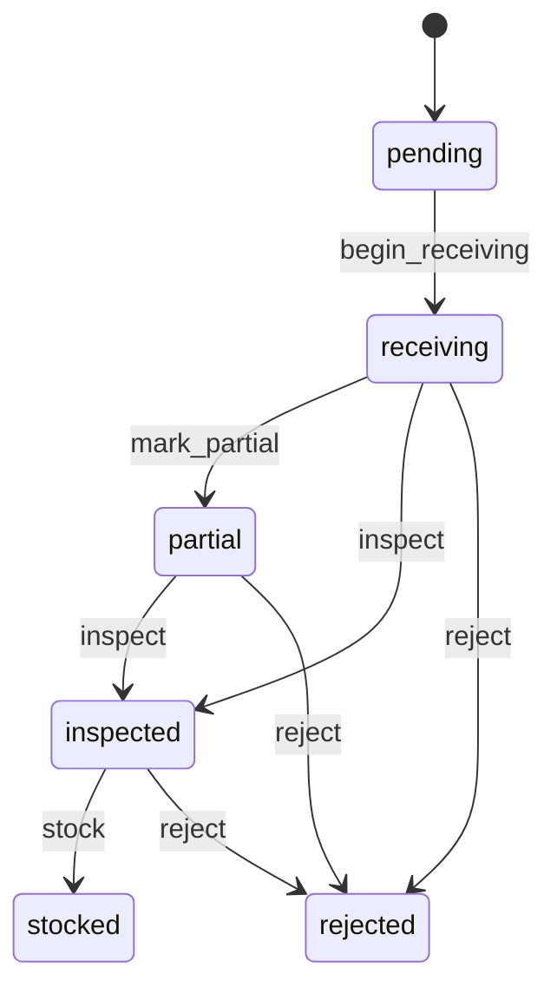

| Current state | Command | Operational precondition | Next state | Durable evidence |
|---|---|---|---|---|
| `pending` | `begin_receiving` | receiving dock held | `receiving` | ResourceReservation |
| `receiving` | `mark_partial` | delivered quantity is partial | `partial` | transition event |
| `receiving` / `partial` | `inspect` | inspector held | `inspected` | ResourceReservation |
| `receiving` / `partial` / `inspected` | `reject` | receipt rejected | `rejected` | transition event |
| `inspected` | `stock` | lot + quantity effects durable | `stocked` | Store + Container results |

### 5.4 MaterialDemand StateChart

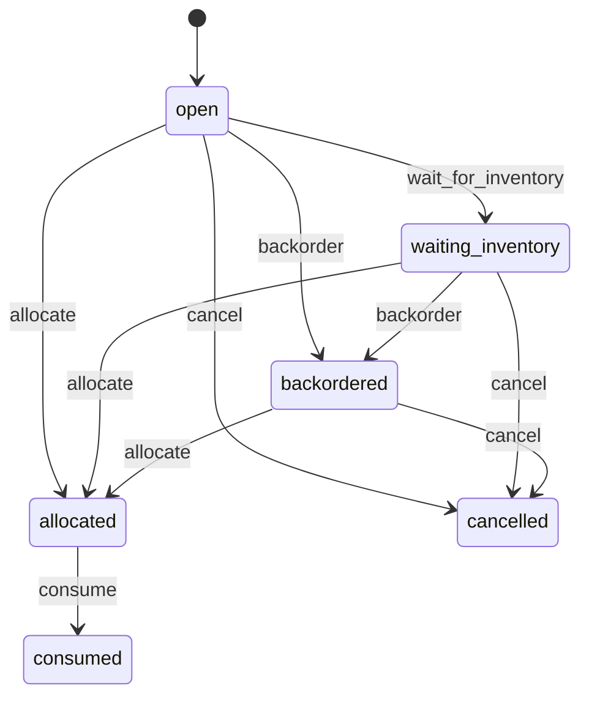

Cancellation is a first-class executable terminal path from `open`,
`waiting_inventory`, and `backordered`.

| Current state | Command | Operational precondition | Next state | Durable evidence |
|---|---|---|---|---|
| `open` | `wait_for_inventory` | insufficient stock | `waiting_inventory` | inventory state |
| `open` / `waiting_inventory` | `backorder` | shortage remains unresolved | `backordered` | transition event |
| `open` / `waiting_inventory` / `backordered` | `allocate` | Store + Container withdrawals terminal | `allocated` | terminal inventory results |
| `allocated` | `consume` | allocation completed | `consumed` | transition event |
| `open` / `waiting_inventory` / `backordered` | `cancel` | material demand withdrawn | `cancelled` | transition event |

## 6. Process specifications

### 6.1 Happy path

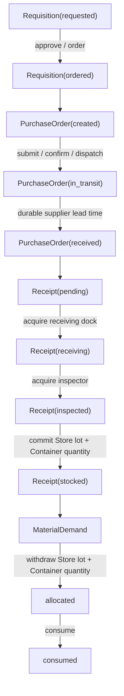

The receipt is not considered stocked before both inventory representations are
durable. Material is not considered allocated before both withdrawals are terminal.

### 6.2 Sad path — receiving contention

**Trigger**

Another receipt holds the receiving dock or inspector.

**Expected behavior**

The new receipt remains queued and cannot advance into the lifecycle state that claims
the unavailable capacity.

**Durable truth**

Resource demand/reservation state survives restart.

**Recovery**

When capacity is released, the pending request is promoted and the lifecycle may advance.

### 6.3 Sad path — shortage and backorder

**Trigger**

Required inventory is unavailable.

**Expected behavior**

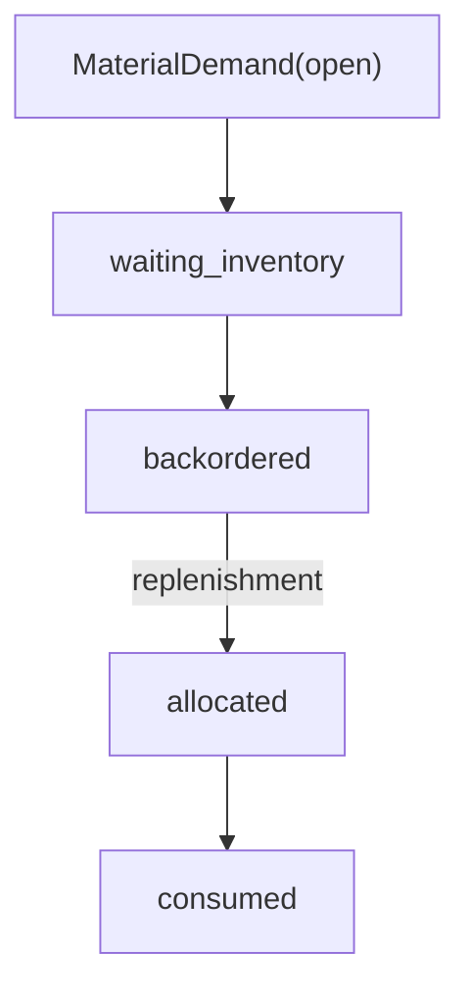

**Durable truth**

The demand state exposes the shortage. Pending operational work cannot disappear across
restart.

**Recovery**

Replenishment makes the inventory operations satisfiable exactly once.

### 6.4 Sad path — partial receipt

**Trigger**

Supplier delivers less than the demanded quantity.

**Expected behavior**

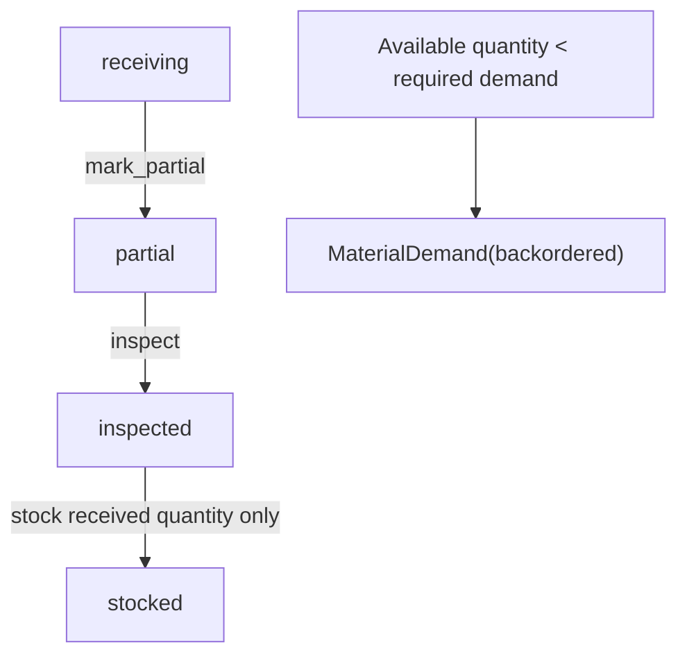

**Durable truth**

The partial lot and received quantity remain intact. Residual demand is explicit.

**Critical rule**

Shortage is detected before withdrawal. A partial Store lot must not be consumed while
the corresponding Container withdrawal remains blocked.

### 6.5 Sad path — rejected receipt

**Trigger**

Receiving/inspection rejects the shipment.

**Expected behavior**

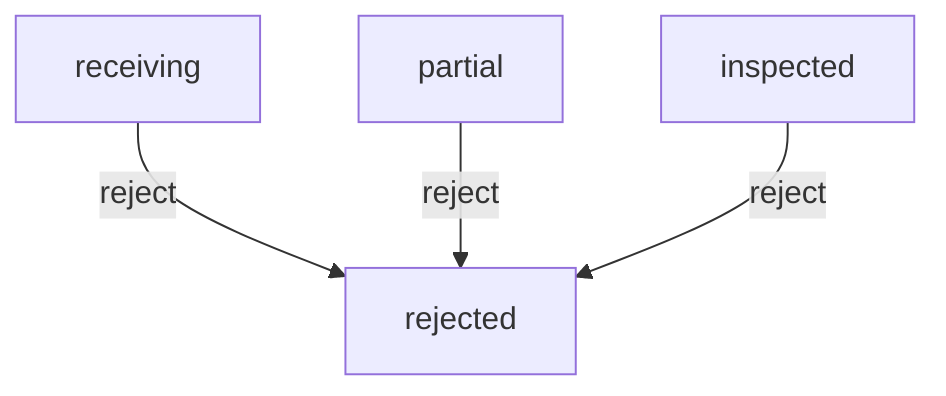

**Durable truth**

- receipt remains terminally rejected;
- no Store inventory item is created;
- no Container inventory quantity is added;
- held resources are released.

### 6.6 External disruptions — scenarios

Representative finite scenarios include:

- supplier delay / lead-time inflation;
- demand spike;
- receiving congestion.

Scenarios affect operational context. They do not bypass lifecycle or inventory
invariants.

## 7. Commands and domain events

| Command | Target | Meaning |
|---|---|---|
| `approve`, `reject`, `order` | Requisition | internal procurement authorization |
| `submit`, `confirm`, `dispatch`, `mark_delayed`, `receive`, `close` | PurchaseOrder | supplier-delivery lifecycle |
| `begin_receiving`, `mark_partial`, `inspect`, `reject`, `stock` | Receipt | physical receipt lifecycle |
| `wait_for_inventory`, `backorder`, `allocate`, `consume`, `cancel` | MaterialDemand | inventory-demand lifecycle |

Successful transitions emit immutable `entity.state_transition` events.

The end-to-end flow uses one stable correlation identity so requisition, PO, receipt,
stocking, and material consumption can be reconstructed as one causal process.

## 8. Invariants

**P2P-01 — Requisition authorization**

A requisition cannot become `ordered` before it becomes `approved`.

**P2P-02 — Supplier lifecycle**

A purchase order cannot become `received` before confirmation, dispatch, and durable
supplier lead-time execution.

**P2P-03 — Receiving capacity**

A receipt cannot claim `receiving` or inspection progress without the required durable
resource reservation.

**P2P-04 — Stocking evidence**

A receipt cannot become `stocked` before both its discrete Store lot and quantitative
Container effect are durable.

**P2P-05 — Allocation evidence**

A material demand cannot become `allocated` before both Store and Container withdrawal
operations are terminal.

**P2P-06 — No split inventory withdrawal**

When Store and Container jointly represent one inventory position, feasibility must be
established before a shortage path can partially execute only one representation.

**P2P-07 — Partial receipt preserves residual shortage**

A partial receipt may stock only the delivered quantity; it must not imply that the full
material demand is satisfied.

**P2P-08 — Rejection is inventory-neutral**

A rejected receipt must create no durable inventory effect.

**P2P-09 — Terminal request identity**

Completed physical operations cannot apply the same effect twice after retry/restart.

**P2P-10 — Correlated business trace**

The operational flow uses stable correlation so related transitions remain one trace.

**P2P-11 — Restart equivalence**

Continuous and restarted executions must produce equivalent semantic outcomes across
representative happy and sad paths.

## 9. Durable truth and ownership

| Concept | Durable owner | Why |
|---|---|---|
| requisition lifecycle | `Requisition.state` | internal authorization truth |
| supplier commitment/delivery | `PurchaseOrder.state` | supplier lifecycle truth |
| physical receiving lifecycle | `Receipt.state` | arrival/inspection truth |
| demand lifecycle | `MaterialDemand.state` | shortage/allocation/consumption truth |
| received lot identity | Store `received_lots` | discrete inventory identity |
| inventory quantity | Container `inventory` | quantitative stock truth |
| receiving capacity | Resource demand/reservation | constrained capacity |
| supplier timing | ScheduledWork | durable lead-time intent |
| scenario activation | ScenarioRuntimeState | intervention truth |
| recovery point | SimulationPosition | logical reconstruction position |

Backend-native SimPy environments, requests, events, callbacks, queues, and generators
are ephemeral and reconstructible.

## 10. Restart semantics

Meaningful crash boundaries include:

1. while supplier lead-time work remains scheduled;
2. while a receipt is queued for receiving capacity;
3. after one inventory intent/result but before the paired effect is complete;
4. while demand is waiting/backordered;
5. after a partial-receipt transition but before stocking;
6. after rejection;
7. after scenario activation.

Semantic equivalence means the same durable entity states, inventory quantities and
items, terminal request results, resource truth, scenario state, and causal event history.

## 11. Scenario specification

### Supplier delay

- one-shot finite activation;
- sets supplier delay context and lead-time multiplier;
- does not directly assign PurchaseOrder state.

### Demand spike

- one-shot finite activation;
- increases demand multiplier;
- may create shortage pressure.

### Receiving congestion

- one-shot finite activation;
- reduces effective receiving capacity context;
- contention remains governed by resource semantics.

## 12. Example runs

### A. Nominal

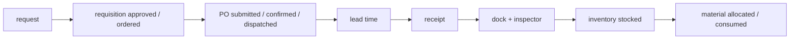

### B. Receiving contention

### C. Partial receipt

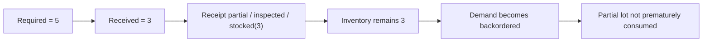

### D. Rejected receipt

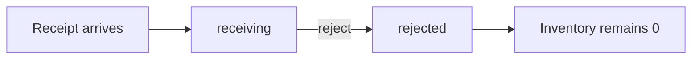

## 13. Executable evidence

| Specification area | Implementation | Tests |
|---|---|---|
| entity StateCharts | `entities.py`, `statecharts.py` | happy-path/state tests |
| happy path | `run_happy_path`, reconcilers | `test_p2p_happy_path.py` |
| receiving contention | receiving-resource reconciler | `test_p2p_receiving_resources.py` |
| shortage/backorder | shortage flow/reconcilers | `test_p2p_shortage_backorder.py` |
| scenarios | `scenarios.py` | `test_p2p_scenarios.py` |
| happy-path restart | runtime/reconcilers | `test_p2p_restart_equivalence.py` |
| partial/rejected receipts | receiving outcome handling | `test_p2p_receipt_exceptions.py` |
| receipt sad-path restart | same | `test_p2p_receipt_exception_restart.py` |

## 14. KPI contract

`p2p_kpis()` exposes read-only KPIs derived from durable entities and immutable
transition events under the reference-flow correlation identity.

| KPI | Type | Definition |
|---|---|---|
| `procure_to_consumption_seconds` | float or null | Requisition creation to terminal MaterialDemand consumption; null before consumption |
| `quantity` | float | requested procurement quantity from the durable Requisition |
| `transition_count` | integer | correlated immutable state-transition event count |
| `supplier_delay_count` | integer | PurchaseOrder transitions entering `delayed` |
| `partial_receipt_count` | integer | Receipt transitions entering `partial` |
| `rejected_receipt_count` | integer | Receipt transitions entering `rejected` |
| `backorder_count` | integer | MaterialDemand transitions entering `backordered` |
| `consumed` | boolean | true only when durable MaterialDemand state is `consumed` |

Historical exception counts are reconstructed from immutable events rather than inferred
from final state. These KPIs are observations and are not automatically valid exogenous
experiment coordinates.

## 15. Projection contract

`p2p_projection()` is the canonical read-only consumer projection of the executable
operational P2P slice.

| Field | Durable source |
|---|---|
| `requisition_id` | persisted Requisition identity |
| `purchase_order_id` | persisted PurchaseOrder identity |
| `receipt_id` | persisted Receipt identity |
| `material_demand_id` | persisted MaterialDemand identity |
| `requisition_state` | Requisition state |
| `purchase_order_state` | PurchaseOrder state |
| `receipt_state` | Receipt state |
| `material_demand_state` | MaterialDemand state |
| `sku` | Requisition attributes |
| `quantity` | Requisition attributes |
| `supplier` | PurchaseOrder attributes |
| `inventory_level` | durable Container `inventory` level |
| `stocked` | Receipt terminal state |
| `consumed` | MaterialDemand terminal state |
| `backordered` | current MaterialDemand state |
| `procure_to_consumption_seconds` | terminal entity timestamps; null before consumption |

Projection rules:

1. projection is read-only and idempotent;
2. required reference entities being absent is an error rather than permission to
   fabricate a replacement;
3. inventory quantity comes from the durable Container, not from a reconstructed sum;
4. terminal cycle time remains null before durable consumption;
5. current `backordered` state and historical `backorder_count` are deliberately
   separate concepts;
6. the projection does not add supplier invoices, AP, payment, or financial settlement
   to this operational reference slice.

## 16. Configuration contract

The recurring P2P reference uses `P2PConfig`.

| Field | Default | Constraint / operational meaning | Runtime mutable |
|---|---|---|---|
| `start_at` | reference `ORIGIN` | logical process start | no |
| `tick_step` | 1 hour | recurring logical step | yes |
| `random_seed` | 42 | deterministic stochastic root seed | yes |
| `quantity` | 10.0 | positive requested quantity; executable reference also bounds it by inventory capacity | no |
| `receipt_outcome` | `accepted` | one of `accepted`, `partial`, `rejected` | yes |
| `auto_consume_inventory` | true | reconcile stocked inventory through allocation/consumption automatically | yes |

The runtime-mutable fields are exactly those declared by the domain definition:
`tick_step`, `random_seed`, `receipt_outcome`, and
`auto_consume_inventory`.

Configuration never bypasses StateCharts, ScheduledWork, finite receiving resources,
or durable Store/Container inventory semantics.

## 17. PC5 promotion boundary

The observable contract consists of executable KPIs/projection plus the normative ERD,
complete StateCharts, Mermaid process diagrams, and configuration table in this
specification.

This qualifies Procure-to-Pay as **PC5 — Observable**. It does not make the process
PC6-composable and does not authorize an Organizational Dynamics experiment. Cross-domain
ingress/egress contracts and execution remain the PC6 gate, while official experiments
additionally require their accepted domain-specific PRD/TRD and frozen preregistration.
