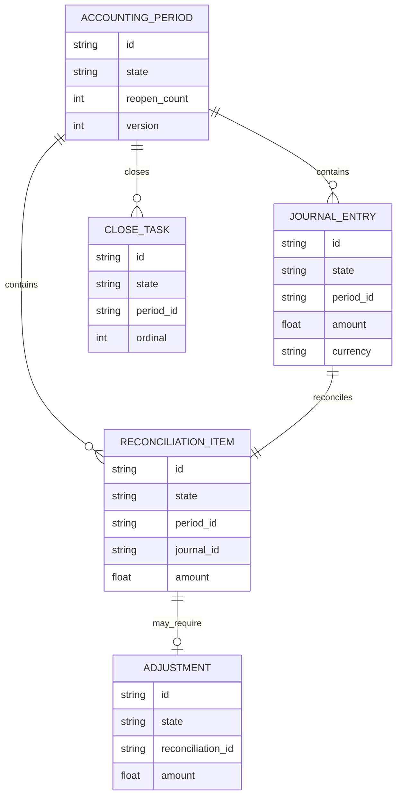
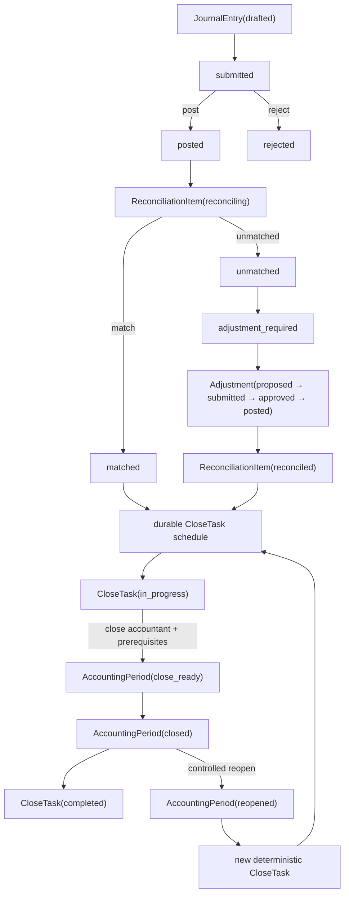

# Record-to-Report Reference Domain Specification

## 1. Purpose and scope

This example models Record-to-Report as a durable accounting-close workflow rather than one monolithic period state machine.

Entities:

- `JournalEntry`: posting outcome;
- `ReconciliationItem`: matching / exception truth;
- `Adjustment`: corrective accounting evidence;
- `CloseTask`: time-dependent close work;
- `AccountingPeriod`: period-level close/reopen state.

The reference proves that the accounting calendar may trigger close work, but cannot itself assert that a period is ready to close.

## 2. Operational story

A JournalEntry is submitted and posted. Its correlated ReconciliationItem is matched or marked unmatched. Unmatched items may require an Adjustment; a posted Adjustment reconciles the item.

A durable ScheduledWork starts the CloseTask at the accounting-calendar deadline. The CloseTask may complete only when posted journal and reconciliation evidence satisfy the close prerequisites and a close accountant owns execution capacity.

A closed AccountingPeriod may be explicitly reopened. Reopening creates a new deterministic CloseTask occurrence; historical close evidence is not overwritten.

## 3. StateCharts

JournalEntry:

    drafted -> submitted -> posted
                         -> rejected

ReconciliationItem:

    pending -> reconciling -> matched
                          -> unmatched
                             -> adjustment_required
                                -> reconciled
                             -> rejected

Adjustment:

    proposed -> submitted -> approved -> posted
                         \-> rejected

CloseTask:

    pending -> in_progress -> completed
                          \-> failed -> in_progress

AccountingPeriod:

    open -> close_ready -> closed -> reopened -> close_ready -> closed

All transitions are orchestration-gated.

## 4. Persistent model and ownership

Durable semantic truth includes:

- entity lifecycle state;
- immutable DomainEvent history;
- Command and ScheduledWork for close deadlines;
- ResourceDemand / ResourceReservation / ResourceReleaseIntent for posting, reconciliation, and close capacity;
- deterministic correlation across period, journal, reconciliation, adjustment, and close task;
- ScenarioRuntimeState;
- SimulationPosition.

Backend-native queues, callbacks, SimPy events, generators, and resource handles are ephemeral and reconstructible.

## 5. Resources and calendars

Resources:

- `posting_processor`;
- `reconciliation_analyst`;
- `close_accountant`.

The accounting calendar is represented by ScheduledWork targeting a CloseTask. The deadline starts close work; it does not bypass accounting prerequisites.

## 6. Happy path

1. journal is submitted and posted;
2. reconciliation starts and matches;
3. close task is durably scheduled;
4. close deadline fires;
5. close-accountant capacity is acquired;
6. period moves open → close_ready → closed;
7. close task completes;
8. capacity is released.

## 7. Representative sad paths

### Rejected posting

A submitted JournalEntry may terminate as rejected and cannot satisfy close prerequisites.

### Unmatched reconciliation / adjustment

An unmatched item becomes adjustment_required. Adjustment identity is deterministic. Posting the adjustment transitions the item to reconciled.

### Posting outage

Posting scenario unavailability prevents processor demand from leaking and recovers when the finite scenario expires.

### Close-team shortage

A CloseTask may already be in_progress while close-team capacity is unavailable. The AccountingPeriod remains open until the prerequisite context recovers.

### Controlled reopening

Only a closed AccountingPeriod can reopen. Reopening creates a new CloseTask occurrence and preserves prior close history.

## 8. Invariants

R2R-01 — Posting before reconciliation: reconciliation requires durable JournalEntry(posted).

R2R-02 — Adjustment causality: Adjustment creation requires ReconciliationItem(adjustment_required).

R2R-03 — Close deadline is not close authority: ScheduledWork may start CloseTask but cannot close AccountingPeriod directly.

R2R-04 — Close prerequisites: period close requires posted journal and matched/reconciled item.

R2R-05 — Capacity before close: close transition requires durable close-accountant ownership.

R2R-06 — Audit preservation: failed/unmatched/rejected outcomes remain durable history and are never silently rewritten.

R2R-07 — Controlled reopen: only AccountingPeriod(closed) may reopen; reclose uses a distinct deterministic CloseTask.

R2R-08 — Scenario discipline: scenarios alter prerequisite availability, not entity lifecycle state directly.

R2R-09 — Restart equivalence: continuous and rebuilt runs converge across pending close schedule, pending close-accountant demand, and unmatched-before-adjustment boundaries.

## 9. Restart semantics

Executable recovery boundaries:

1. close ScheduledWork pending before deadline;
2. CloseTask in_progress with close-accountant demand queued;
3. ReconciliationItem(unmatched) before Adjustment creation;
4. controlled reopen with fresh close task.

The canonical close-schedule restart test compares the complete durable continuation snapshot after the continuous and rebuilt executions converge. This includes entities, events, simulation position, ScheduledWork and commands, scenario state, Resource state, Store/Container state, preemptive-resource state, job state, and sink/domain delivery checkpoints when present. Backend-native object identity is excluded.

## 10. Scenario specification

`posting_outage_scenario` temporarily disables posting availability.

`close_team_shortage_scenario` temporarily disables close-team availability.

Neither scenario mutates business state directly.

## 11. Executable evidence

| Specification area | Evidence | Status |
|---|---|---|
| durable entities | entities.py + tests | implemented |
| StateCharts | statecharts.py + topology tests | implemented |
| explicit commands/events | simulation.py | implemented |
| deterministic identity/correlation | simulation.py | implemented |
| durable close calendar | ScheduledWork close test | implemented |
| happy path | run_happy_path + tests | implemented |
| unmatched/adjustment path | run_adjustment_path + tests | implemented |
| resource capacity | posting/reconciliation/close Resources | implemented |
| legal/illegal prerequisites | invariant tests | implemented |
| posting/close scenarios | scenario tests | implemented |
| restart: close schedule | full operational-snapshot equivalence test | implemented |
| restart: close capacity | ResourceDemand rebuild test | implemented |
| restart: missing adjustment | causal recovery test | implemented |
| reopen / reclose | reopen test | implemented |

## Promotion decision

Current status: **Reference implementation**.

Promotion is based on executable evidence for journal posting, reconciliation and adjustment causality, durable close scheduling, posting/reconciliation/close capacity, controlled reopening, finite scenario recovery, illegal prerequisite rejection, post-commit cleanup recovery, and restart equivalence across ScheduledWork, ResourceDemand, and missing-adjustment boundaries.

## 12. Process-canonical audit

Current audited maturity: **PC5 — Observable**.

The PC0–PC4 chain remains backed by executable provenance: continuous/rebuilt execution
must converge on the complete durable operational snapshot; replay safety is exercised
through deterministic adjustment/close identities and idempotent reconciliation; finite
posting/close-team scenarios recover without leaking ownership.

For process completion, `close_task_completed` remains the terminal occurrence of one
close cycle. `AccountingPeriod(closed)` is deliberately not treated as a globally
terminal state because controlled reopen/reclose is executable behavior.

PC5 is now backed by:

- executable read-only projection and KPIs;
- normative persistent ERD;
- normative StateChart documentation;
- normative end-to-end Mermaid process diagram;
- explicit configuration contract.

PC6 remains unmet: cross-domain accounting ingress/egress contracts and tested composed
execution are separate evidence.

## 13. Normative persistent ERD

The relationships are semantic/correlational. Durable correlation, deterministic
identity, immutable events, ScheduledWork, Resource records, scenario state, and
SimulationPosition remain part of operational truth without being collapsed into the
business ERD.

## 14. Normative end-to-end process diagram

The close calendar starts work but never bypasses accounting prerequisites or
close-accountant ownership.

## 15. KPI contract

`record_to_report_kpis()` exposes read-only KPIs derived from durable state and
immutable transition history.

| KPI | Type | Definition |
|---|---|---|
| `close_cycle_seconds` | float or null | current deterministic CloseTask creation to the first immutable transition into `completed`; null before completion |
| `amount` | float | durable JournalEntry amount |
| `transition_count` | integer | immutable process transitions through the current close-cycle ordinal |
| `rejected_posting_count` | integer | JournalEntry transitions entering `rejected` |
| `unmatched_count` | integer | ReconciliationItem transitions entering `unmatched` |
| `adjustment_count` | integer | 1 when the deterministic Adjustment exists, otherwise 0 |
| `adjustment_posted_count` | integer | Adjustment transitions entering `posted` |
| `close_count` | integer | AccountingPeriod transitions entering `closed` |
| `reopen_count` | integer | AccountingPeriod transitions entering `reopened` |
| `close_task_completed_count` | integer | CloseTask transitions entering `completed` |
| `closed` | boolean | current AccountingPeriod state is `closed` |

A new reopen/reclose cycle adds a new deterministic CloseTask occurrence. Previous close
events remain immutable and continue contributing to historical counts.

## 16. Projection contract

`record_to_report_projection()` is the canonical read-only projection.

| Field | Durable source |
|---|---|
| `period_id` | persisted AccountingPeriod |
| `journal_id` | persisted reference JournalEntry |
| `reconciliation_id` | persisted ReconciliationItem |
| `adjustment_id` | deterministic/persisted Adjustment when created |
| `close_task_id` | deterministic CloseTask for current close-cycle ordinal |
| entity state fields | corresponding persisted entities |
| `amount`, `currency` | JournalEntry attributes |
| `closed` | current AccountingPeriod state |
| `close_cycle_ordinal` | persisted `reopen_count + 1` |
| `close_cycle_seconds` | current CloseTask creation time to its first immutable transition into `completed` |

Projection rules:

1. projection is read-only and idempotent;
2. required seeded entities missing from durable state are errors;
3. Adjustment absence before causal creation is null, never fabricated state;
4. controlled reopen selects a new deterministic CloseTask rather than rewriting the old one;
5. historical closes/reopens remain observable in immutable event history;
6. consumers cannot mutate process state through the projection.

## 17. Configuration contract

The recurring R2R reference uses `RecordToReportConfig`.

| Field | Default | Constraint / operational meaning | Runtime mutable |
|---|---|---|---|
| `start_at` | reference `ORIGIN` | logical process start | no |
| `tick_step` | 1 hour | recurring logical step | yes |
| `random_seed` | 420 | deterministic stochastic root seed | yes |
| `amount` | 1000.0 | journal amount, strictly positive | no |
| `currency` | USD | journal/reconciliation currency | no |
| `reconciliation_outcome` | `match` | `match` or `unmatched` branch | yes |
| `close_delay` | 2 hours | positive durable delay before close work starts | yes |

The runtime-mutable fields are exactly `tick_step`, `random_seed`,
`reconciliation_outcome`, and `close_delay`.

Configuration does not bypass StateCharts, accounting prerequisites, ScheduledWork,
resource ownership, or scenario semantics.

## 18. PC5 promotion boundary

This qualifies Record-to-Report as **PC5 — Observable**. It does not define the
cross-domain accounting outputs required for PC6 Trading Company composition, and it
does not authorize an Organizational Dynamics experiment.
