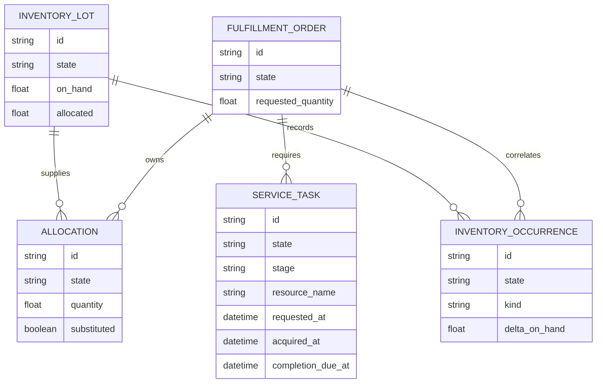
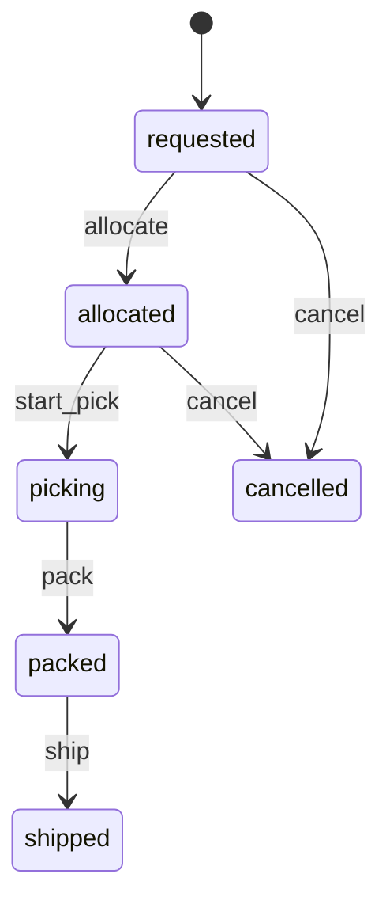
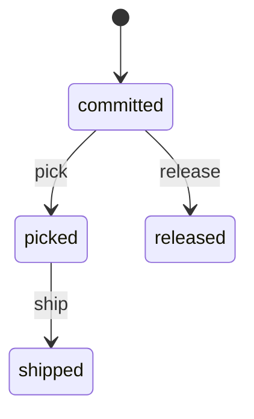
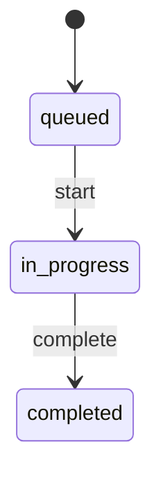
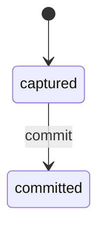
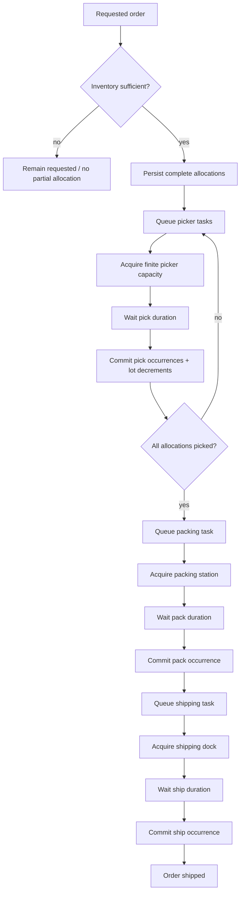

# Warehouse / Fulfillment — Executable Specification

## 1. Purpose

Test whether SOSE can distinguish inventory ownership, current physical
projection, and immutable movement evidence without introducing a generic
inventory ledger primitive prematurely.

## 2. Durable entities

FulfillmentOrder lifecycle:
requested -> allocated -> picking -> packed -> shipped.

Allocation lifecycle:
committed -> picked -> shipped, with committed -> released available for future
cancellation breadth.

InventoryLot stores SKU, on_hand, allocated, and occurrence IDs. It is a
mutable projection rather than historical evidence.

InventoryOccurrence lifecycle:
captured -> committed.

## 3. Allocation semantics

Allocation computes a complete plan before persistence. If eligible inventory
cannot satisfy the order, no partial allocations or allocated balances are
committed.

Primary SKU inventory is preferred. Explicitly acceptable substitute SKUs may
satisfy the remainder. Allocation increments lot allocated quantity but does not
change physical on_hand.

## 4. Picking semantics

Each Allocation has one deterministic pick occurrence. The first execution:

1. decrements lot on_hand;
2. decrements lot allocated;
3. persists captured immutable occurrence in the same transaction;
4. commits occurrence;
5. moves Allocation to picked.

If execution stops after step 3, retry/restart observes the existing occurrence
and resumes state transitions without applying the physical decrement again.

## 5. Corrections

A correction has deterministic identity (lot, sequence), delta, and resulting
on-hand quantity. Reusing its identity with a different delta is illegal.

A correction may not drive on-hand below already allocated stock.

## 6. Invariants

WH-01 — Allocation ownership and physical on-hand are distinct durable truths.

WH-02 — Insufficient inventory cannot leave partial allocation ownership.

WH-03 — Substitute use is explicit on Allocation evidence.

WH-04 — Physical on-hand changes only when picking or correction evidence is
persisted.

WH-05 — Pick occurrence identity prevents duplicate decrement on retry/restart.

WH-06 — Corrections append evidence; prior occurrences remain immutable.

WH-07 — Packing requires every Allocation to be picked.

WH-08 — Restart after a partial pick continues remaining work without replaying
committed movement.

## 7. Happy path

Allocate 10 units across primary and substitute lots, pick both allocations,
pack, ship, and verify final lot projections plus immutable occurrence indexes.

## 8. Representative sad paths

- insufficient total inventory;
- pack before every allocation is picked;
- conflicting replay of a correction identity;
- correction below already allocated quantity.

## 9. Restart recovery

Commit the first pick, rebuild the backend/runtime, finish the second pick,
pack and ship. This proves that the interrupted path can resume without losing
its durable lifecycle state.

This is not yet the stronger process-canonical `RESTART_EQUIVALENCE` claim. The
current test does not execute a continuous baseline and compare the complete
final durable state against the rebuilt execution.

## 10. Executable evidence

| Requirement | Evidence |
| --- | --- |
| statecharts | test_warehouse_fulfillment_statecharts.py |
| happy path / substitution | test_warehouse_fulfillment_happy_path.py |
| sad paths / corrections | test_warehouse_fulfillment_sad_paths.py |
| restart recovery | test_warehouse_fulfillment_restart_equivalence.py |
| immutable occurrences / replay safety | happy/sad/restart suites |

## 11. Promotion decision

Current status: **Reference implementation**.

Do not extract a generic inventory-ledger abstraction until another materially
different domain repeats the same ownership/projection/occurrence contract.

## 12. Process-canonical audit

Current audited maturity: **PC5 — Observable**.

Warehouse Fulfillment now satisfies the complete standalone process-canonical contract:

- PC3: finite picker, packing-station, and shipping-dock resources; capacity contention; explicit service durations and queue wait;
- PC4: durable resource/service state, replay idempotence, recurring reconciliation, fault recovery, and continuous-vs-rebuild restart equivalence;
- PC5: KPI projection, persistent ERD, full StateChart documentation, normative process diagram, projection boundary, and configuration contract.

Inventory remains material/business state. Picker/packing/shipping resources are the finite operational capacities.

## 13. Persistent ERD

Durable ownership remains split deliberately: inventory lots own material projection; allocations own reservation/fulfillment claims; immutable occurrences own movement evidence; resource reservations own finite service capacity.

## 14. StateCharts

### FulfillmentOrder

### Allocation

### FulfillmentServiceTask

### InventoryOccurrence

## 15. Normative process flow

Service completion never creates an early business effect: the durable service task completes first, then reconciliation applies the idempotent business transition and releases capacity.

## 16. KPI contract

`warehouse_fulfillment_kpis()` is a read-only projection over persisted facts.

| KPI | Definition |
|---|---|
| `completion` | true only when the durable order state is `shipped` |
| `lead_time_seconds` | shipped order `updated_at - created_at`; null before shipment |
| `fulfilled_quantity` | picked quantity for a shipped order; otherwise zero |
| `fill_rate` | fulfilled quantity / requested quantity |
| `transition_count` | correlated immutable lifecycle transition events |
| `substitution_count` | durable allocations marked as substitutions |
| `correction_count` | durable correction occurrences |

KPIs are descriptive outputs. They do not advance logical time, mutate inventory, dispatch commands, or become operational truth.

## 17. Projection contract

`warehouse_fulfillment_projection()` exposes:

- order identity/state/completion;
- requested quantity;
- allocation count and allocated quantity;
- picked quantity;
- substitution allocation count;
- immutable occurrence count;
- terminal lead time.

Rules:

1. projection is read-only and idempotent;
2. a missing referenced order/allocation is an error, not an invented row;
3. values are derived only from persisted entities/evidence;
4. terminal lead time remains null before `shipped`;
5. projection never becomes a mutation API or source of truth.

## 18. Configuration contract

The recurring job uses `WarehouseFulfillmentConfig`.

| Field | Default | Meaning | Runtime mutable |
|---|---|---|---|
| `start_at` | reference origin | logical job origin | no |
| `tick_step` | 1 hour | recurring logical step | yes |
| `random_seed` | 1429 | deterministic root seed | yes |
| `requested_quantity` | 10 | requested order quantity | no |
| `primary_on_hand` | 6 | initial primary inventory | no |
| `substitute_on_hand` | 5 | initial substitute inventory | no |
| `allow_substitute` | true | substitution policy | no |
| `picker_capacity` | 1 | finite picker capacity | no |
| `packing_station_capacity` | 1 | finite packing capacity | no |
| `shipping_dock_capacity` | 1 | finite shipping capacity | no |
| `pick_duration` | 1 hour | configured pick service time | no |
| `pack_duration` | 1 hour | configured pack service time | no |
| `ship_duration` | 1 hour | configured ship service time | no |
| `auto_progress_fulfillment` | true | recurring progression toggle | yes |

Configuration is an input contract and cannot bypass StateCharts, durable occurrences, resource ownership, or inventory invariants.

## 19. Promotion decision

Warehouse Fulfillment is promoted to **PC5 — Observable**.

PC6 remains intentionally unclaimed. Promotion to PC6 requires stable cross-domain ingress/egress contracts and tested execution as part of the Trading Company composition.
