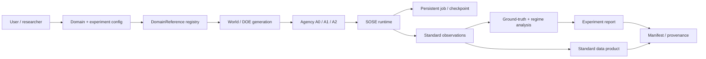

# PRD-0001 — SOSE 1.0 Multi-Domain Synthetic Organizational Experiment Platform

- **Status:** Draft
- **Owner:** SOSE maintainers
- **Created:** 2026-10-07
- **Last updated:** 2026-10-07
- **Related TRDs:** `TRD-0001`
- **Related ADRs:** `ADR-0002`, `ADR-0003`, `ADR-0004`, `ADR-0005`
- **Related issues/PRs:** TBD

## 1. Problem

SOSE already contains a durable simulation engine, configurable business-process references, persistence/restart semantics, deterministic randomness, process-canonical evidence, and a verified synthetic organizational experiment for A0/A1 agency.

However, the current organizational experiment is still encoded around a specific queueing reference process. Adding a new organization would require repeating substantial experiment orchestration, regime classification, result shaping, and scientific reporting logic.

That is incompatible with the intended end state: a user should be able to select an organization/domain, configure exogenous parameters and agency, run a reproducible experiment on a supported backend, and obtain a standard synthetic data product plus an auditable scientific report without writing experiment-specific orchestration code.

## 2. Users and use cases

### Primary users

- simulation/domain authors building synthetic operational systems;
- data/analytics engineers generating realistic operational datasets;
- researchers testing organizational mechanisms and interventions;
- process-mining practitioners generating controlled event logs;
- platform operators running persistent simulation jobs.

### Primary workflows

1. Select a built-in domain/reference organization.
2. Inspect and override its exposed parameters.
3. Select agency levels and interventions.
4. Select DOE/replication configuration and deterministic seeds.
5. Select an execution/persistence backend.
6. Run or resume a persistent experiment.
7. Obtain standard data products, regime classifications, intervention effects, ground-truth comparison, and provenance.
8. Re-run the same experiment and reproduce the same semantic result.
9. Add a new domain by implementing the domain-reference contract rather than rebuilding experiment infrastructure.

## 3. Goals

- Provide one domain-neutral experiment contract shared by materially different organizations.
- Make Manufacturing, Order-to-Cash, and MRO the first cross-domain conformance set.
- Support A0 and A1 through the common contract and define the extension boundary for A2.
- Keep DOE coordinates exogenous and prevent endogenous outputs from becoming regime inputs.
- Support multiple ground-truth classes without pretending every domain has a closed-form analytical solution.
- Preserve deterministic CRN pairing, provenance, hash-addressed experiment identity, and falsification boundaries.
- Produce one standard result/data-product contract across domains.
- Allow experiments to run persistently and survive process/worker restart using the existing SOSE persistence/job semantics.
- Expose the eventual workflow through configuration/CLI/API rather than domain-specific Python editing.

## 4. Non-goals

- Empirically validating every built-in domain against real organizations before 1.0.
- Treating empirical validation as a prerequisite for synthetic verification.
- Modeling A3 institutional/objective change in SOSE 1.0.
- Replacing each domain's business-process specification with a generic meta-model.
- Forcing every domain into M/G/1, Jackson, or any single analytical family.
- Supporting every persistence technology before stabilizing the SQLite/PostgreSQL contract.
- Hiding domain semantics behind an abstraction that erases meaningful differences.
- Automatically discovering domain mechanisms from data.

## 5. Requirements

### Functional

- **FR-1 — Domain reference catalog:** SOSE shall expose experiment-capable domain references through a common registry connected to the existing built-in domain/process catalog.
- **FR-2 — Parameter exposure:** every experiment-capable domain shall explicitly declare configurable exogenous parameters, ranges, units/meaning, defaults, and evidence class.
- **FR-3 — Intervention exposure:** every domain shall declare supported interventions and their mechanism, operating cost, transition cost/time, and structural scope.
- **FR-4 — Agency exposure:** every experiment-capable domain shall expose typed agency capabilities, including level, policy/controller identifiers, configurable parameter schemas/defaults/bounds, and any required observation/action contract; the framework shall validate these before world execution without acquiring domain-specific knowledge.
- **FR-5 — DOE:** users shall be able to define or select a deterministic sampling design and replication policy over declared exogenous inputs.
- **FR-6 — CRN:** paired comparisons shall use explicit common-random-number groups when the comparison claims paired stochastic control.
- **FR-7 — Ground truth:** each claim shall identify its ground-truth class and eligibility conditions.
- **FR-8 — Regimes:** domains shall be able to provide mechanistic/analytical regime classification without consuming realized experiment outcomes as inputs.
- **FR-9 — Standard observations:** all domain runs shall project into a common experiment-observation contract while retaining domain-specific raw evidence.
- **FR-10 — Standard reports:** experiment outputs shall include regimes, intervention contrasts, agency contrasts, eligibility, costs, uncertainty, provenance, and falsification status without a mandatory composite score.
- **FR-11 — Persistent jobs:** experiments shall be executable through persistent SOSE jobs with checkpoint/restart semantics.
- **FR-12 — Standard data product:** results shall be exportable through a stable schema for runs, worlds, events/ledgers, metrics, regimes, interventions, agency actions, ground truth, and experiment metadata.
- **FR-13 — Configuration-first execution:** the 1.0 product shall support selecting a domain and experiment through configuration plus CLI/API without modifying experiment framework code.
- **FR-14 — Cross-domain conformance:** Manufacturing, Order-to-Cash, and MRO shall pass the same domain-experiment conformance suite before the framework is considered general.
- **FR-15 — Process maturity prerequisite:** a built-in business domain shall not be promoted as an organizational experiment reference until its process evidence audit is complete and it reaches at least PC5; architectural-reference promotion also requires at least one credible PC6 composition.
- **FR-16 — Pilot preregistration:** every promoted domain experiment shall have an accepted domain-specific PRD/TRD and a frozen preregistration protocol before official experiment execution/evidence, defining the scientific question, permissible claims, exogenous axes, interventions, agency configurations, ground truth/eligibility, DOE, replication/seeds/CRN, metrics, exclusions, falsification criteria, and provenance.

### Quality / operational

- **QR-1 — Determinism:** identical canonical configuration, seed, initial state, and external inputs shall reproduce the same semantic result.
- **QR-2 — Restart equivalence:** continuous and persisted-restart execution shall be equivalent under the experiment contract.
- **QR-3 — Traceability:** every result shall bind to protocol/configuration, ModelSpec/domain reference, seed policy, code/version provenance, and evidence hashes.
- **QR-4 — Scientific boundary:** reports shall distinguish synthetic verification from empirical validation.
- **QR-5 — Eligibility:** stationary/analytical claims shall not be emitted for worlds outside the assumptions of the relevant reference.
- **QR-6 — Extensibility:** onboarding a conforming domain shall not require edits to generic DOE, CRN, replication, provenance, persistence-job, or report orchestration.
- **QR-7 — Failure safety:** a crash shall not produce a partially committed logical experiment checkpoint.
- **QR-8 — Compatibility:** public 1.0 experiment/configuration/data-product contracts shall follow the release compatibility policy.

## 6. Success metrics

| Metric | Baseline | Target | Measurement |
|---|---:|---:|---|
| Domains using one experiment contract | 1 queue reference | ≥3 materially different domains | cross-domain conformance |
| Reference domains | queue reference | PC5 Manufacturing + PC5 O2C + PC5 MRO | process manifest + conformance matrix |
| Composable process prerequisite | not an experiment prerequisite today | ≥1 credible PC6 composition before framework promotion | process manifest/composition tests |
| A0/A1 shared orchestration | partial/specific | 100% common orchestration | code/conformance audit |
| Paired CRN correctness | verified in current A0/A1 reference | 100% conforming paired comparisons | deterministic latent-stream tests |
| Restart equivalence | engine-level available | required for persistent experiment jobs | continuous-vs-rebuild test |
| Result provenance | experiment-specific | 100% hash-addressed standard manifest | evidence tests |
| Framework-specific code needed per new domain | substantial | domain adapter/reference only | onboarding review |
| Standard result schema | experiment-specific | one versioned schema | schema/conformance test |
| Pilot preregistration | ad hoc per prior experiment | 100% official pilot experiments frozen before execution | document/protocol hash audit |

## 7. Constraints

- Existing deterministic randomness and durable-truth semantics remain authoritative.
- Process canonicals remain domain-owned; the experiment framework consumes them and does not replace them.
- Organizational Dynamics experiments are downstream of process-canonical maturity: pilot domains must reach PC5 before experiment promotion, and framework architectural-reference promotion requires a credible PC6 composition.
- Manufacturing/MRO experiment rollout must respect the existing Trading Company → W6 dependency rather than bypassing the Process Canonical Roadmap.
- Framework extraction must respect the existing architecture rule: do not erase domain meaning to obtain superficial reuse.
- Ground-truth claims must state assumptions and eligibility.
- The existing A0/A1 synthetic evidence remains valid historical evidence and becomes a compatibility/reference fixture where practical.
- SQLite and PostgreSQL are the primary authoritative execution targets until the persistence contract is stable enough for additional warehouses.

## 8. User / system workflow



Target CLI experience:

```text
sose init manufacturing
sose experiment run --config sose.toml
sose experiment resume <job-id>
sose experiment report <job-id>
```

The exact CLI shape is a technical-design concern and may evolve before 1.0.

## 9. Acceptance criteria

- [ ] One domain-neutral experiment contract exists and contains no queue-specific concepts.
- [ ] Existing A0/A1 reference experiment is expressible through the common contract without losing current scientific boundaries.
- [ ] Order-to-Cash, Manufacturing, and MRO each have a complete evidence audit and reach at least PC5 before their experiment reference is promoted.
- [ ] Each pilot has an accepted domain-specific PRD/TRD and a frozen preregistration protocol before official runs/evidence are generated.
- [ ] At least one credible PC6 composition exists before the experiment framework is promoted as the architectural reference.
- [ ] Manufacturing passes the common experiment conformance suite without framework special-casing.
- [ ] Order-to-Cash passes the same suite without framework special-casing.
- [ ] MRO passes the same suite without framework special-casing.
- [ ] All three domains expose exogenous parameter spaces, interventions, ground truth, regimes, A0/A1 execution, and standard observations.
- [ ] A2 can be added through the documented agency extension boundary without changing domain reference identity semantics.
- [ ] Standard data-product schemas are documented and versioned.
- [ ] A persistent experiment can be interrupted and resumed with restart-equivalent semantic output.
- [ ] SQLite and PostgreSQL pass experiment persistence conformance.
- [ ] A user can select a built-in conforming domain and run an experiment from configuration without editing Python experiment orchestration.
- [ ] Evidence/report artifacts are hash-addressed and reproducible.
- [ ] Documentation clearly distinguishes L0–L4 synthetic verification from L5/L6 empirical validation/prediction.

## 10. Rollout expectations

The capability will be delivered in gates rather than one large release:

1. provisional domain-neutral experiment framework around the verified synthetic reference;
2. process-canonical prerequisites from the existing roadmap (pilot PC5 and credible PC6 composition);
3. qualified O2C / Manufacturing / MRO experiment references;
4. three-domain conformance and framework promotion;
5. A2 extension;
6. standard data product;
7. persistent job integration;
8. configuration/CLI/API product surface;
9. broader domain catalog promotion.

Each gate must preserve the previous gates' conformance suites.

## 11. Risks and open questions

| Item | Impact | Resolution / owner |
|---|---|---|
| Over-generalizing after one reference experiment | framework can erase domain semantics | require Manufacturing/O2C/MRO conformance before stable promotion |
| Ground truth differs radically by domain | misleading common scores | ADR-0003 taxonomy + per-claim eligibility |
| A1/A2 ownership becomes ambiguous | causal attribution breaks | ADR-0004 |
| Domain process maturity varies | experiments may rest on weak canonicals | require complete evidence audit + PC5 per pilot; require credible PC6 composition before framework promotion |
| Large experiment datasets | storage/CI pressure | standard compact report + external/persistent dataset artifact |
| Warehouse proliferation | operational complexity | stabilize SQLite/PostgreSQL first |
| A2 policies inspect hidden state | unrealistic managerial claims | observation contract, noise/delay/cooldown restrictions |
| Config surface becomes domain-specific chaos | poor UX | versioned common schema plus domain parameter namespaces |

## 12. Change history

| Date | Change | Rationale |
|---|---|---|
| 2026-10-07 | Initial draft | Establish the product/scientific contract for the SOSE 1.0 multi-domain experiment platform. |
