# PRD-0001 — SOSE 1.0 Multi-Domain Synthetic Organizational Experiment Platform

- **Status:** Draft
- **Owner:** SOSE maintainers
- **Created:** 2026-10-07
- **Last updated:** 2026-10-07
- **Related TRDs:** TRD-0001
- **Related ADRs:** ADR-0002, ADR-0003, ADR-0004, ADR-0005
- **Related issues/PRs:** TBD

## 1. Problem

SOSE can already execute durable simulations and has demonstrated a reproducible synthetic organizational experiment with A0/A1 agency. However, the experiment pipeline is still encoded around one reference process rather than offered as a domain-neutral product capability.

Adding another organization today risks duplicating DOE construction, CRN semantics, regime analysis, report generation, persistence conventions, and experiment-specific glue.

SOSE 1.0 needs one reusable platform where users choose a domain, configure exogenous parameters and agency, select a persistence backend, execute a reproducible experiment, and receive synthetic operational data plus scientific evidence without writing experiment-specific orchestration code.

## 2. Users and use cases

Primary users:

- domain/model authors defining organizations;
- data/ML engineers consuming synthetic operational datasets;
- researchers testing intervention and agency hypotheses;
- platform operators running persistent simulation jobs.

Primary workflows:

1. select a registered organizational domain;
2. inspect/configure its exogenous parameter space;
3. choose agency level and interventions;
4. configure DOE, seeds, replications, horizon, and backend;
5. run/resume a persistent experiment;
6. receive canonical datasets, regime classifications, intervention effects, provenance, and reports;
7. compare results across domains using common contracts.

## 3. Goals

- one domain-neutral experiment framework;
- domain packs contribute mechanics, not orchestration;
- Manufacturing, Order-to-Cash, and MRO pass the same experiment conformance suite;
- A0, A1, and A2 share one experiment contract;
- all experiment coordinates are exogenous by construction;
- deterministic/reproducible execution with explicit seed and CRN policy;
- canonical multi-domain data product;
- restart-safe persistent experiment jobs;
- configuration-driven execution through CLI/API and `sose.toml`;
- auditable scientific claims with explicit ground-truth class and eligibility rules.

## 4. Non-goals

- A3 institutional/objective change in SOSE 1.0;
- claiming empirical validity for real organizations by default;
- forcing every domain into queueing-theory closed forms;
- supporting every existing domain before the framework is proven on three structurally different domains;
- making warehouse/backend choice part of domain semantics;
- hiding domain assumptions behind generic metrics or composite scores.

## 5. Requirements

### Functional

- **FR-1:** A domain shall implement one canonical `DomainReference` contract.
- **FR-2:** The platform shall generate DOE worlds from domain-declared exogenous parameter spaces.
- **FR-3:** The platform shall execute A0/A1/A2 through one experiment interface.
- **FR-4:** The platform shall support domain-declared interventions and paired CRN comparisons.
- **FR-5:** Every world shall expose an explicit ground-truth class and regime-classification mechanism.
- **FR-6:** Experiment results shall include worlds, runs, ledgers, interventions, agency actions, metrics, regimes, ground truth, and provenance.
- **FR-7:** Experiments shall be resumable from durable persistence.
- **FR-8:** Users shall configure domain/backend/experiment without modifying Python source.
- **FR-9:** The same protocol/spec/seeds/inputs shall reproduce the same experiment identities and stochastic draws.
- **FR-10:** Cross-domain reports shall preserve domain-specific semantics while exposing common comparable fields.

### Quality / operational

- **QR-1:** Domain adapters shall pass a common conformance matrix.
- **QR-2:** Restart shall not duplicate or lose experiment work.
- **QR-3:** Scientific reports shall separate stationary-eligible, mechanistic, invariant, reference-simulation, and empirical claims.
- **QR-4:** Backend choice shall not change simulation semantics.
- **QR-5:** Every persisted result shall be hash-addressed and provenance-linked.
- **QR-6:** New substantial domain/experiment work shall follow PRD/TRD/ADR governance.

## 6. Success metrics

| Metric | Baseline | Target | Measurement |
|---|---:|---:|---|
| Domains on common experiment contract | 1 reference process | 3 initial domains | conformance matrix |
| Agency levels on common contract | A0/A1 | A0/A1/A2 | conformance matrix |
| Experiment-specific orchestration duplicated per domain | high | none in core flow | code audit |
| Reproducible experiment identity | partial | 100% | repeated-run hash tests |
| Restart-safe experiment jobs | partial runtime capability | 100% reference jobs | restart/chaos suite |
| Config-only reference execution | no | yes | CLI/API acceptance test |
| Canonical data-product tables | ad hoc | all required surfaces | schema conformance |

## 7. Constraints

- SOSE remains deterministic for equal initial state, seed, configuration, and inputs.
- SimPy remains an execution backend, not durable truth.
- persistence semantics remain backend-neutral.
- endogenous outputs such as realized WIP, lead time, and coordination fractions cannot be DOE coordinates.
- A1 changes local policy inside fixed organizational structure.
- A2 changes managerial policy/actions under explicit observation/noise/delay/cooldown semantics.
- validation against empirical data is separate from synthetic verification.

## 8. User / system workflow

```mermaid
flowchart LR
  A[Choose domain] --> B[Load domain reference]
  B --> C[Configure exogenous parameters]
  C --> D[Choose A0/A1/A2 + interventions]
  D --> E[Build DOE + CRN plan]
  E --> F[Create persistent experiment job]
  F --> G[Execute / checkpoint / resume]
  G --> H[Canonical data product]
  H --> I[Regime + intervention analysis]
  I --> J[Scientific report + provenance]
```

## 9. Acceptance criteria

- [ ] Domain-neutral experiment framework exists with no domain-specific branches in orchestration.
- [ ] Manufacturing, O2C, and MRO pass the same conformance suite.
- [ ] A0/A1/A2 execute through the same experiment contract.
- [ ] Cross-domain scientific report can be generated without custom report code per domain.
- [ ] Persistent experiment job survives worker/process failure and resumes without duplication.
- [ ] SQLite and PostgreSQL reference paths satisfy the same persistence contract.
- [ ] A user can run a reference experiment from config/CLI without source changes.
- [ ] Output conforms to the canonical experiment data product.
- [ ] Documentation clearly separates synthetic verification from empirical validation.

## 10. Rollout expectations

Rollout is gated:

1. framework extraction;
2. three-domain proof;
3. A2;
4. persistence/data-product integration;
5. persistent jobs;
6. configuration/CLI/API;
7. broader domain catalog;
8. 1.0 release readiness.

## 11. Risks and open questions

| Item | Impact | Resolution / owner |
|---|---|---|
| Abstraction leaks from first reference process | high | prove against Manufacturing/O2C/MRO before broader rollout |
| Domain-specific ground truth cannot be unified | high | use typed ground-truth taxonomy, not one formula |
| A2 semantics become domain-specific | high | separate generic manager loop from domain action catalog |
| Data product becomes lowest-common-denominator | medium | common envelope + domain extension tables |
| Persistence constrains semantics | high | enforce backend-neutral conformance |
| Excessive framework generality | medium | require concrete three-domain evidence before expanding interfaces |

## 12. Change history

| Date | Change | Rationale |
|---|---|---|
| 2026-10-07 | Initial draft | Establish SOSE 1.0 multi-domain end-game |
