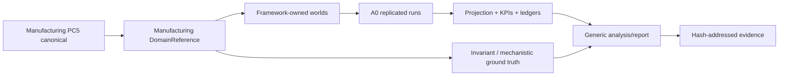

# PRD-0004 — Manufacturing Organizational Experiment v1

- **Status:** Accepted
- **Owner:** SOSE maintainers
- **Created:** 2026-10-08
- **Last updated:** 2026-10-08
- **Related TRDs:** TRD-0004
- **Related ADRs:** ADR-0002, ADR-0003, ADR-0004, ADR-0005
- **Related issues/PRs:** TBD

## 1. Problem

Manufacturing is now a PC5 process canonical with durable lifecycle, resources, inventory, WIP, quality/rework, breakdown/preemption, scenarios, observability, and restart semantics.

The multi-domain experiment framework is also available, but Manufacturing has not yet been exercised as an official preregistered Organizational Dynamics experiment.

The first Manufacturing experiment must verify only mechanics the reference domain actually implements today. It must not invent configurable capacity, demand intensity, or adaptive agency parameters that are not yet part of the executable domain contract.

## 2. Users and use cases

Primary users are SOSE maintainers, domain authors, and researchers validating that a non-queue, resource/inventory-heavy domain can participate in the common experiment framework.

Primary use cases:

1. construct Manufacturing worlds from declared exogenous inputs;
2. run deterministic replicated A0 experiments through the generic framework;
3. apply implemented finite scenarios as explicit intervention arms;
4. verify invariant/mechanistic claims without using realized outputs as regime inputs;
5. publish a hash-addressed scientific report and canonical experiment data product;
6. use the result as a prerequisite for later Manufacturing A1 work.

## 3. Goals

- establish the first official Manufacturing experiment on the domain-neutral framework;
- keep the experiment strictly within the current executable Manufacturing surface;
- verify durable material/WIP/finished-goods invariants under nominal and disruption arms;
- verify expected mechanistic effects of yield degradation and machine downtime;
- prove restart-safe reproducibility of experiment results;
- produce a reusable Manufacturing experiment adapter without framework special-casing.

## 4. Non-goals

- no A1/A2 claims in v1;
- no finite-capacity scheduling optimization;
- no multi-work-center or multi-operation routing;
- no BOM explosion or setup-matrix experiment;
- no empirical manufacturing validation;
- no claim that demand-surge magnitude is meaningful unless the executable domain actually creates additional work/pressure from that scenario;
- no hidden use of KPI outputs as DOE coordinates.

## 5. Requirements

### Functional

- **FR-1:** Manufacturing v1 shall run through the generic DomainReference experiment framework.
- **FR-2:** v1 shall support A0 only.
- **FR-3:** the v1 DOE shall use only numeric exogenous parameters supported by both Manufacturing and the generic framework; the initial axis is `quantity`.
- **FR-4:** nominal, machine-downtime, and yield-degradation arms shall be supported if their executable semantics pass preflight tests.
- **FR-5:** demand-surge is excluded from v1 because the current single-order reference does not convert its scenario context into demonstrated durable additional workload/pressure.
- **FR-6:** experiment outputs shall include Manufacturing projection/KPIs plus canonical worlds/runs/metrics/regimes/ground-truth/provenance.
- **FR-7:** restart/rebuild execution shall reproduce the same semantic experiment result.
- **FR-8:** scientific claims shall use only typed ground truth from ADR-0003.

### Quality / scientific

- **QR-1:** all DOE inputs are exogenous configuration or intervention choices;
- **QR-2:** no stationary queueing formula is required;
- **QR-3:** invariant claims remain valid across all eligible arms;
- **QR-4:** mechanistic claims are declared before execution;
- **QR-5:** preregistration is frozen before official evidence generation;
- **QR-6:** implementation defects discovered after freeze require explicit deviation documentation and a complete rerun.

## 6. Success metrics

| Metric | Target |
|---|---:|
| Generic framework execution | 100% of official runs |
| Restart-equivalent semantic hashes | 100% |
| Ground-truth claims with explicit kind/eligibility | 100% |
| Invariant violations in valid runs | 0 |
| Framework domain-name special cases introduced | 0 |
| Official result bound to frozen preregistration hash | 100% |

## 7. Constraints

Manufacturing v1 is constrained by the current executable domain contract:

- one ProductionOrder;
- one Operation;
- one machine;
- one operator;
- quantity-based raw material/WIP/finished goods;
- quality pass/hold branch;
- finite one-shot scenarios;
- restart-safe durable semantics.

The current configuration exposes:

- `quantity`;
- `auto_seed_material`;
- `quality_outcome`;
- `random_seed`;
- `tick_step`.

Machine/operator capacity and demand intensity are not yet user-configurable experiment axes and must not be preregistered as such.

## 8. User / system workflow

## 9. Acceptance criteria

- [ ] Manufacturing-specific PRD/TRD accepted.
- [ ] preregistration frozen before official result execution.
- [ ] Manufacturing adapter passes DomainReferenceConformance.
- [ ] official worlds use only supported exogenous inputs.
- [ ] nominal/downtime/yield arms pass preflight semantic checks.
- [ ] demand-surge remains excluded from v1.
- [ ] restart-equivalence test passes for official experiment execution.
- [ ] report separates INVARIANT and MECHANISTIC claims.
- [ ] canonical experiment evidence is persisted with hashes and provenance.
- [ ] no A1/A2 claim is emitted.

## 10. Rollout expectations

1. accept PRD/TRD;
2. implement the Manufacturing DomainReference adapter;
3. run semantic preflight and generic conformance;
4. generate the real framework `ExperimentProtocol` payload from the accepted adapter/default ModelSpec;
5. finalize and hash-freeze preregistration + protocol + code/document provenance;
6. execute official v1;
7. persist report/evidence;
8. only then plan Manufacturing A1.

## 11. Risks and open questions

| Item | Impact | Resolution |
|---|---|---|
| demand surge may not materially affect current single-order slice | high | preflight; exclude if no durable effect |
| one-order slice limits load/regime claims | high | do not claim congestion/load regimes |
| yield degradation may alter quantity but not lifecycle timing | medium | restrict claim to output/yield semantics |
| machine downtime semantics may be timing-sensitive | medium | preregister exact eligible metrics and invariants |
| A1 temptation before domain policy exists | high | explicitly out of scope |

## 12. Change history

| Date | Change | Rationale |
|---|---|---|
| 2026-10-08 | Initial draft | Plan first official Manufacturing experiment |
