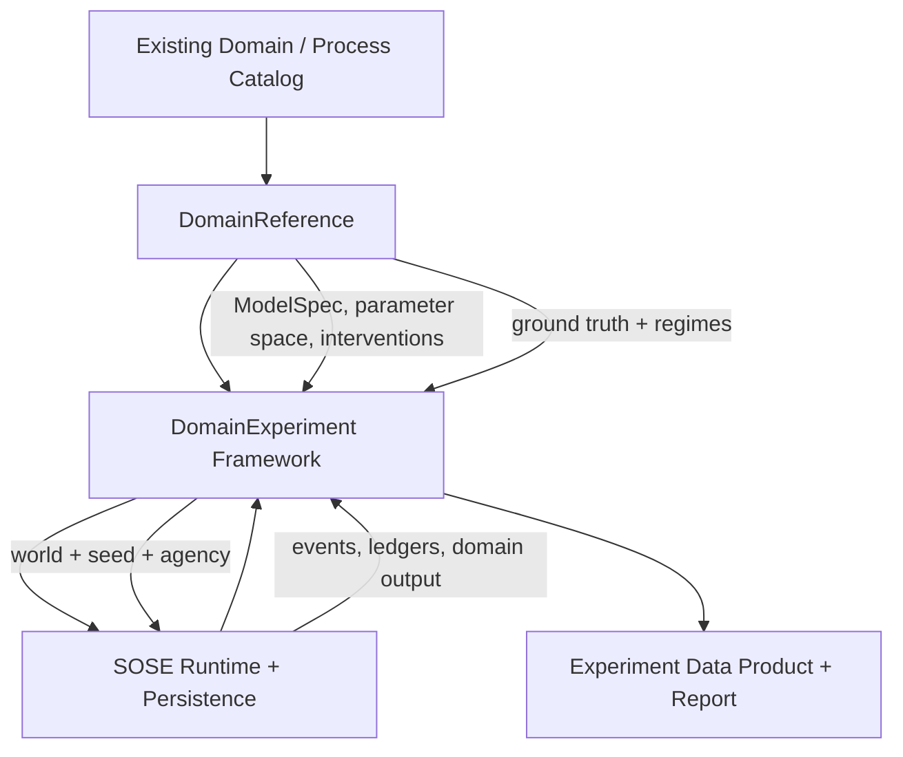

# TRD-0001 — Domain-Neutral Reference Experiment Framework

- **Status:** Draft
- **Owner:** SOSE maintainers
- **Created:** 2026-10-07
- **Last updated:** 2026-10-07
- **Satisfies PRD(s):** `PRD-0001`
- **Related ADRs:** `ADR-0002`, `ADR-0003`, `ADR-0004`, `ADR-0005`
- **Implementation PRs:** TBD

## 1. Technical context

SOSE currently has two verified synthetic organizational experiment paths:

- A0 reference experiment with exogenous Latin-hypercube worlds, CRN, replicated execution, analytical M/G/1 comparison, regime recovery, intervention effects, and persisted evidence;
- A0×A1 experiment with local adaptive batching, explicit ADAPTATION actor ledgers, mechanistic A1 regime classification, paired CRN, stationary-eligibility filtering, and a hash-addressed scientific report.

The scientific contracts are sound, but the implementation is reference-process-specific:

- `synthetic_reference_experiment.py` owns one particular baseline ModelSpec and intervention set;
- `synthetic_runner.py` owns one queue-oriented A0 execution model;
- `synthetic_a1.py` owns one A1 policy execution path;
- `synthetic_analysis.py` assumes a particular analytical reference;
- `synthetic_a1_experiment.py` contains specific A0/A1 pairing and regime logic;
- report types are tied to the present experiment shape.

At the same time, SOSE already contains a separate business-process canonical system through the built-in catalog and `ProcessManifest` evidence/maturity model. The experiment framework must consume those domain references rather than create a parallel domain registry.

## 2. Requirements mapping

| Requirement | Design response | Verification |
|---|---|---|
| PRD FR-1 | experiment capability descriptor layered onto existing built-in domain/process catalog | catalog conformance |
| FR-2 | `ParameterSpaceSpec` derived/declared by DomainReference | schema + domain tests |
| FR-3 | domain-owned intervention catalog | intervention conformance |
| FR-4 | domain-owned typed `AgencyCapabilitySpec` descriptors plus explicit A0/A1/A2 execution boundary | schema validation + agency conformance |
| FR-5 | generic `ExperimentProtocol` + deterministic sampler | existing sampling tests + cross-domain tests |
| FR-6 | explicit comparison/CRN grouping contract | latent-stream equality tests |
| FR-7 | typed GroundTruth records and eligibility | ground-truth conformance |
| FR-8 | domain-owned regime classifier over configured mechanics | no-endogenous-input tests |
| FR-9 | standard `ExperimentObservation` projection | schema/conformance |
| FR-10 | generic report assembler over typed claims | report conformance |
| FR-11 | persistent experiment job coordinator | restart/lease/fencing tests |
| FR-12 | versioned standard data-product schema | schema tests |
| FR-13 | config resolver + CLI/API orchestration | CLI/API integration |
| FR-14 | Manufacturing/O2C/MRO same-suite gate | cross-domain matrix |
| FR-15 | process-maturity prerequisite before domain/framework promotion | `ProcessManifest` maturity/provenance + PC6 composition tests |
| FR-16 | accepted domain-specific PRD/TRD plus frozen experiment preregistration before official pilot execution | document links + preregistration/protocol hash audit |
| QR-1/2 | canonical hashes + deterministic RNG + restart equivalence | continuous-vs-rebuild |
| QR-3 | manifest binds protocol/domain/model/seed/evidence/result | evidence integrity |
| QR-4/5 | GroundTruthKind + eligibility/falsification | report tests |
| QR-6 | framework owns orchestration; domain owns mechanisms | onboarding diff/conformance |
| QR-7 | engine UnitOfWork/checkpoint boundary | chaos/restart |
| QR-8 | versioned public schemas | compatibility tests |

## 3. Proposed design

The framework is split into five ownership layers.



### 3.1 DomainReference

A domain reference owns semantic material that cannot be generic without erasing the domain:

- baseline/configured `ModelSpec`;
- exposed exogenous parameter definitions;
- supported interventions;
- supported agency policies/adapters;
- ground-truth providers;
- regime classifier;
- projection from domain execution into standard observations;
- links to process canonical/specification/evidence.

Conceptual contract:

```python
class DomainReference(Protocol):
    identity: DomainReferenceIdentity

    def parameter_space(self) -> ParameterSpaceSpec: ...
    def build_model(self, point: ParameterPoint) -> ModelSpec: ...
    def interventions(self) -> tuple[ModelIntervention, ...]: ...
    def agency_capabilities(self) -> tuple[AgencyCapabilitySpec, ...]: ...
    def execute(
        self,
        execution: DomainExecutionRequest,
    ) -> DomainExecutionResult: ...

    def observation(
        self,
        result: DomainExecutionResult,
    ) -> ExperimentObservation: ...

    def ground_truth(
        self,
        world: ExperimentWorld,
    ) -> tuple[GroundTruthClaim, ...]: ...

    def classify_regime(
        self,
        world: ExperimentWorld,
    ) -> RegimeReference: ...
```

This is a target contract, not permission to move domain behavior into a generic base class. World expansion, DOE sampling, design indices, comparison groups, and CRN assignment remain framework-owned; the domain supplies the semantic ingredients from which those worlds are constructed.

`AgencyCapabilitySpec` is domain-owned metadata sufficient for configuration-first validation. At minimum it identifies the agency level plus allowed policy/controller identifiers and their parameter schema, defaults, bounds, and compatibility constraints. A2 capabilities additionally reference the supported observation/action contracts. The generic framework validates a selected agency configuration against this descriptor before constructing/executing worlds; it must not learn domain policy semantics by hard-coding them.

### 3.2 DomainExperiment framework

Generic framework responsibilities:

- validate protocol against domain capabilities;
- sample parameter space;
- construct canonical worlds;
- assign deterministic identities;
- define comparison groups and CRN scopes;
- execute replications;
- persist/resume progress;
- collect standard observations;
- request ground-truth claims;
- calculate eligible comparisons;
- assemble uncertainty/effect summaries;
- persist provenance;
- build standard report/data-product outputs.

The framework must not:

- know what a work order, invoice, machine, claim, aircraft, or order is;
- implement domain state transitions;
- invent analytical formulas;
- infer agency semantics from metrics;
- silently coerce an unsupported intervention/agency into a domain.

### 3.3 Experiment world identity

A world is immutable configuration, not realized output.

Canonical identity contains at minimum:

- domain reference id/version;
- process/model specification hash;
- experiment protocol hash;
- design index;
- exogenous parameter point;
- arm/intervention;
- agency level/policy configuration;
- deterministic comparison/CRN group;
- structural configuration hash.

It explicitly excludes realized:

- WIP;
- throughput;
- lead time;
- utilization measured during execution;
- coordination fraction;
- observed backlog;
- any post-run metric.

### 3.4 Ground truth and claims

The framework stores ground truth as typed claims rather than one scalar truth.

Example:

```text
GroundTruthClaim
  kind
  claim_id
  target_metric / regime / invariant
  expected value/bound/class
  assumptions
  eligibility
  provenance
```

ADR-0003 defines the taxonomy.

### 3.5 Agency execution

Agency is part of world configuration and execution semantics.

- A0: fixed configured policy.
- A1: local adaptive behavior within a fixed structural envelope.
- A2: managerial controller acting through an observation/action contract.
- A3: outside the 1.0 experiment contract.

ADR-0004 defines ownership constraints.

### 3.6 Standard result model

The generic experiment result is separated into:

1. raw domain evidence;
2. standard observations;
3. ground-truth claims;
4. comparisons/effects;
5. regimes;
6. provenance/manifest.

No single composite quality score is required.

## 4. Interfaces and contracts

### 4.1 Core public/advanced types

Target types:

```text
DomainReferenceIdentity
ParameterDefinition
ParameterSpaceSpec
AgencyCapabilitySpec
ExperimentWorld
DomainExecutionRequest
DomainExecutionResult
ExperimentObservation
GroundTruthKind
GroundTruthClaim
RegimeReference
ComparisonEligibility
ExperimentEffect
ExperimentResultManifest
DomainExperimentResult
```

Initial placement remains under the organizational/experiment layer rather than the kernel until Manufacturing, Order-to-Cash, and MRO all satisfy the process-maturity prerequisites and pass the common experiment conformance suite. The current queue reference plus one additional domain is not sufficient for promotion.

### 4.2 Existing catalog integration

The existing built-in catalog remains the authority for available domains.

Experiment capability is additive metadata:

```text
built-in domain
  ├─ DomainDefinition
  ├─ ProcessManifest
  └─ optional DomainReference
```

A domain may exist operationally without being experiment-conformant.

### 4.3 Capability gating

A domain is promoted to experiment-capable only when it provides the required evidence.

Proposed capability dimensions:

```text
EXPERIMENT_PARAMETERS
EXPERIMENT_INTERVENTIONS
EXPERIMENT_GROUND_TRUTH
EXPERIMENT_REGIMES
EXPERIMENT_A0
EXPERIMENT_A1
EXPERIMENT_A2
EXPERIMENT_STANDARD_OBSERVATION
EXPERIMENT_RESTART_EQUIVALENCE
```

These should not be added to `ProcessEvidence` unless they genuinely describe process-canonical maturity; a separate experiment-capability record is preferred to avoid conflating process maturity with scientific experiment readiness.

## 5. Data model and ownership

### Domain-owned

- business entities/events/statecharts;
- resources/routing/calendars;
- domain parameters and meaning;
- interventions and semantic consequences;
- agency policies that are domain-specific;
- ground-truth formulas/invariants/reference simulators;
- regime semantics;
- projection of raw execution into standard observations.

### Framework-owned

- experiment protocol;
- DOE;
- replication lifecycle;
- world identity/hash;
- CRN comparison grouping;
- execution orchestration;
- standard observation schema;
- generic effect/uncertainty calculations;
- eligibility enforcement;
- manifest/provenance;
- data-product materialization.

### Engine-owned

- logical time;
- deterministic scheduling/randomness/identity;
- commands/events;
- resources;
- UnitOfWork;
- persistence;
- job leases/fencing/recovery.

## 6. Determinism and reproducibility

### Seeds

The framework distinguishes:

- design seed;
- root execution seed;
- domain/reference-simulation seed when independently required;
- bootstrap/statistical seed where applicable.

### CRN

CRN is explicit rather than inferred.

A comparison group determines which worlds share stochastic latent streams. A claim of paired comparison is invalid unless the domain execution proves shared stream semantics for the compared mechanisms.

### Hashes

At minimum persist:

- protocol hash;
- domain reference/version hash;
- ModelSpec/world hash;
- parameter-space hash;
- intervention hash(es);
- agency policy hash;
- dataset/result hash;
- report hash;
- code/release provenance.

### Replay

Changing any semantic input must change an identity/hash. Re-running unchanged inputs must reproduce semantic output, subject only to explicitly non-semantic serialization metadata.

## 7. Failure, recovery, and concurrency semantics

Experiment execution uses existing persistent job/engine boundaries.

### Checkpoint unit

A checkpoint must make authoritative operational truth durable together:

- experiment/job position;
- completed world/replication identities;
- domain durable truth for active executions;
- emitted events/ledgers or their authoritative operational records;
- durable analytical-delivery/outbox intent for newly committed result evidence;
- fencing/lease version.

The external analytical sink checkpoint is deliberately **not** part of this atomic transaction. SOSE preserves the existing asynchronous sink boundary: operational progress and the durable delivery record commit first; sink publication/acknowledgement advances independently and idempotently.

### Idempotency

A restarted worker may re-attempt a unit of work but must not publish a duplicate committed world/replication result.

Canonical result identity:

```text
(experiment_id, world_id, replication)
```

### Fencing

Only the current fenced worker may advance the persistent experiment position or commit result ownership.

### Failure policy

- domain execution failure is recorded with typed failure/provenance;
- infrastructure failure is retryable according to job policy;
- invalid scientific configuration fails before execution;
- analytical sink unavailability cannot roll back already committed operational experiment progress; pending delivery remains durable and retryable;
- if sink publication succeeds before a crash but acknowledgement does not, retry uses the same deterministic batch/result identity and must be idempotent.

## 8. Performance and scalability

Initial target sizes:

- CI/reference: tens of worlds × tens of replications;
- workstation: hundreds/thousands of world replications;
- persistent/distributed mode: larger experiments partitioned by world/replication.

Requirements:

- world/replication execution must be independently claimable;
- result aggregation must be incremental;
- full raw domain state need not be loaded to calculate every standard metric;
- large datasets live in analytical sinks/artifacts rather than Git;
- compact manifests/reports remain Git-auditable where appropriate.

Performance gates will be established after the first three domains expose representative workloads.

## 9. Security and privacy

Synthetic reference experiments contain no required personal data.

Persistent backends still follow ordinary credential/authorization boundaries.

Empirical L5/L6 connectors, if later introduced, are outside this TRD and require explicit data-governance/security design.

## 10. Observability

Every persistent experiment job exposes:

- job id/status;
- current experiment/world/replication progress;
- logical execution position;
- retries/failures;
- worker/lease/fencing identity;
- committed result count;
- output sink checkpoint;
- protocol/domain hashes;
- timing/resource diagnostics.

Scientific reports expose exclusions/ineligibility explicitly rather than hiding them.

## 11. Testing and conformance

### Framework unit/property tests

- canonical hashes independent of insertion order;
- no endogenous value accepted as exogenous coordinate;
- duplicate/missing world detection;
- CRN group validation;
- comparison eligibility;
- seed/case-order independence;
- idempotent aggregation.

### Domain experiment conformance

Every experiment-capable domain must pass the same suite:

1. deterministic world construction;
2. valid exogenous parameter binding;
3. baseline/intervention structural consistency;
4. deterministic execution;
5. CRN latent preservation for declared pairs;
6. standard observation completeness;
7. ground-truth eligibility consistency;
8. regime classification without realized-output inputs;
9. happy and sad execution evidence;
10. continuous-vs-restart equivalence.

### Process-maturity prerequisite

Organizational Dynamics consumes mature process canonicals; it does not substitute for them.

Before a built-in business domain is promoted as an experiment reference:

1. its process evidence audit must be complete for the relevant code snapshot;
2. the standalone process must be at least **PC5 Observable**;
3. experiment claims must cite the process-manifest/specification provenance supporting the mechanics they exercise.

Before the multi-domain experiment framework is promoted as the architectural reference, the repository must also contain at least one credible **PC6 Composable** process composition, consistent with the existing process dependency graph.

Manufacturing and MRO follow the normative process roadmap: their experiment promotion cannot bypass the Trading Company composition prerequisite and their W6 promotion to PC5.

### Cross-domain promotion gate

Manufacturing, O2C, and MRO must each satisfy the process-maturity prerequisite and pass the same experiment conformance suite before the generic contract is promoted as stable/public.

### A0/A1 compatibility

The existing A0/A1 reference results remain regression fixtures for semantic compatibility. Exact finite-horizon numbers need not remain fixed if a correctness bug is found, but any intentional semantic change requires an ADR/TRD update and regenerated evidence.

## 12. Migration and compatibility

The current synthetic modules remain working compatibility/reference implementations during extraction.

Migration sequence:

1. define provisional generic types/contracts around the already verified synthetic reference;
2. adapt the current queue reference without changing its evidence claim;
3. keep the abstraction in the organizational/experiment layer while process-canonical prerequisites advance independently;
4. onboard O2C only after its process reference reaches the required PC5 gate;
5. onboard Manufacturing and MRO only after the normative process roadmap permits W6 promotion and each reaches PC5;
6. require at least one credible PC6 composition before architectural-reference promotion;
7. remove experiment-specific orchestration duplication only after all three pilot domains prove equivalence under the common suite;
8. mark stable public surfaces before 1.0.

No existing persisted domain state is migrated solely to introduce the experiment framework.

## 13. Alternatives considered

### Generic simulator meta-domain

Rejected. It would erase domain semantics and duplicate SOSE's process/domain model.

### One experiment implementation per domain

Rejected. It preserves semantics but duplicates DOE, CRN, provenance, persistence, and reporting machinery.

### Make ProcessManifest itself the experiment contract

Rejected. Process maturity and scientific experiment readiness are related but different concerns.

### Require analytical closed-form truth

Rejected. Many target organizations have no useful closed form; ADR-0003 permits multiple evidence classes.

## 14. Implementation plan

### Gate A — provisional framework extraction

1. generic experiment identity/result/ground-truth types;
2. generic orchestration around the already verified synthetic A0 reference;
3. generic A0/A1 comparison hooks;
4. conformance toolkit.

Exit: current synthetic reference runs through generic orchestration. The framework remains provisional in the organizational layer.

### Gate P — process-canonical prerequisites

This gate is governed by the existing Process Canonical Roadmap rather than by the experiment implementation.

Required before pilot-domain experiment promotion:

- complete evidence audit for the selected domain;
- PC5 standalone process maturity for each experiment reference;
- at least one credible PC6 composition before the experiment framework becomes an architectural reference;
- Trading Company composition prerequisite satisfied before Manufacturing/MRO W6 promotion.

Design/prototyping may occur earlier, but immature process references must not be promoted as scientific organizational-dynamics references.

### Gate B — O2C experiment reference

After O2C reaches PC5:

5. author and accept an O2C-specific experiment PRD/TRD;
6. freeze a hash-addressed O2C preregistration protocol **before official execution**, including question/claims/non-claims, exogenous axes, interventions, agency capabilities, ground truth and eligibility, DOE, replication/seeds/CRN, warmup/horizon where relevant, metrics, exclusions, falsification criteria, and artifact provenance;
7. implement the O2C adapter and workflow-specific ground truth;
8. implement O2C A0/A1 execution/observation;
9. execute only the frozen protocol and persist evidence/report.

Exit: administrative/information workflow passes the common suite under its preregistered protocol.

### Gate C — Manufacturing experiment reference

After the normative W5/W6 prerequisite and Manufacturing PC5:

10. author and accept a Manufacturing-specific experiment PRD/TRD;
11. freeze the Manufacturing preregistration protocol before official execution, with the same required scientific fields as Gate B;
12. implement Manufacturing parameter/intervention/ground-truth adapter;
13. implement Manufacturing A0/A1 execution/observation;
14. execute only the frozen protocol and persist evidence/report.

Exit: physical-flow/bottleneck workflow passes the same suite under its preregistered protocol.

### Gate D — MRO experiment reference

After the normative W5/W6 prerequisite and MRO PC5:

15. author and accept an MRO-specific experiment PRD/TRD;
16. freeze the MRO preregistration protocol before official execution, with the same required scientific fields as Gate B;
17. implement MRO adapter for resources/inventory/precedence;
18. implement MRO A0/A1 execution;
19. execute only the frozen protocol and persist evidence/report.

Exit: resource/availability-rich workflow passes the same suite under its preregistered protocol.

### Gate E — generality promotion

20. verify the required PC6 composition exists;
21. run the cross-domain experiment conformance matrix;
22. remove accidental domain-specific assumptions;
23. promote the contract from provisional organizational code to its stable/public location only if all three pilots pass.

### Gate F — A2

24. dedicated child TRD for observation/action controller semantics;
25. generic observation/action controller contract;
26. noise/delay/cooldown/transition-cost semantics;
27. preregister A2 scientific experiments before official execution;
28. A2 execution across the three qualified reference domains.

### Gate G — productization

29. child TRDs for standard data product, persistent/distributed experiment jobs, and configuration/CLI/API;
30. standard data product;
31. persistent distributed experiment job using the authoritative operational + durable-outbox sink boundary;
32. configuration schema;
33. CLI/API;
34. SQLite/PostgreSQL conformance;
35. 1.0 documentation/release gate.

PR boundaries may be refined, but dependency/gate ordering is normative.

## 15. Risks and open questions

| Item | Impact | Mitigation / owner |
|---|---|---|
| DomainReference becomes a god interface | poor maintainability | split protocols only after repeated need is demonstrated |
| Observation schema too narrow | domain-specific hacks | preserve typed raw evidence + extensible metric namespace |
| Ground-truth claims incomparable | misleading cross-domain aggregation | compare claim types/eligibility, not one universal score |
| A1 policy semantics vary | agency effect not comparable | common ownership boundary, domain-specific policy allowed |
| A2 changes structure | causal identity ambiguity | ADR-0004 action/intervention boundary |
| Process maturity below experiment needs | weak reference | experiment capability gate tied to explicit evidence |
| Long experiments exceed one worker | poor operability | durable partitioning by world/replication |
| Existing A0/A1 code ossifies framework | abstraction biased to queue | require three-domain gate before stable promotion |

## 16. Acceptance / exit criteria

- [ ] PRD-0001 requirements are traceably mapped.
- [ ] ADR-0002/0003/0004 accepted.
- [ ] Current A0/A1 reference executes through generic framework.
- [ ] Manufacturing, O2C, and MRO each have complete evidence audits, reach at least PC5, and pass one experiment conformance suite.
- [ ] Every official pilot result is bound to an accepted domain-specific PRD/TRD and a preregistration hash frozen before execution.
- [ ] At least one credible PC6 composition exists before framework architectural-reference promotion.
- [ ] No generic framework type contains domain-specific business nouns.
- [ ] Exogenous/endogenous separation is enforced in tests.
- [ ] Ground-truth claims are typed and eligibility-aware.
- [ ] CRN pairing is explicit and tested.
- [ ] Continuous-vs-restart equivalence passes for experiment jobs.
- [ ] Standard data product and provenance manifest are versioned.
- [ ] SQLite/PostgreSQL authoritative execution passes conformance.
- [ ] Configuration/CLI/API can run a built-in conforming domain without framework code edits.
- [ ] Documentation/evidence persists every promoted scientific claim.

## 17. Follow-on technical requirements

TRD-0001 is the umbrella technical contract for the domain-neutral experiment architecture. It intentionally does not freeze every productization detail.

Before implementation of the corresponding gates, dedicated child TRDs are required for:

- each pilot domain experiment (domain-specific scientific question, permissible claims, DOE/replication/seed/CRN/metrics/falsification and provenance), paired with its domain-specific PRD and frozen preregistration protocol;
- A2 observation/action controller semantics and persistence;
- standard analytical data-product schemas/materialization;
- persistent/distributed experiment-job coordination if existing job contracts require extension;
- configuration schema and CLI/API product surfaces;
- additional authoritative persistence adapters beyond the stabilized SQLite/PostgreSQL boundary.

Child TRDs must satisfy PRD-0001, preserve ADR-0002/0003/0004, and map their own narrower acceptance criteria. They may refine implementation details but may not silently alter the ownership or scientific boundaries defined here.

## 18. Change history

| Date | Change | Rationale |
|---|---|---|
| 2026-10-07 | Initial draft | Define the technical path from the verified A0/A1 reference to a domain-neutral 1.0 platform. |
