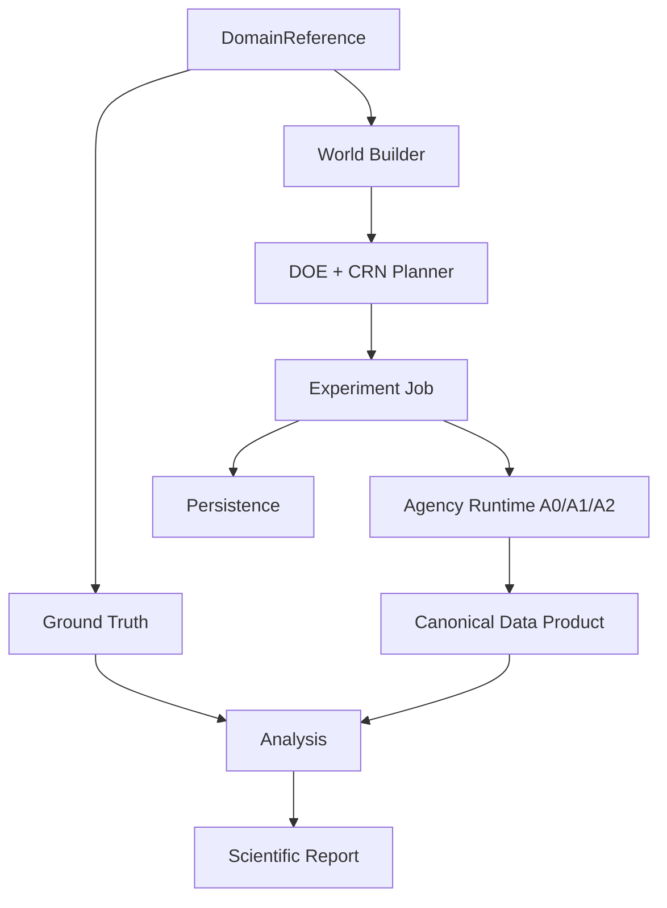

# TRD-0001 — Domain-Neutral Reference Experiment Framework

- **Status:** Draft
- **Owner:** SOSE maintainers
- **Created:** 2026-10-07
- **Last updated:** 2026-10-07
- **Satisfies PRD(s):** PRD-0001
- **Related ADRs:** ADR-0002, ADR-0003, ADR-0004, ADR-0005
- **Implementation PRs:** TBD

## 1. Technical context

The current synthetic reference stack already contains the pieces that should become framework services: exogenous world generation, CRN execution, A0/A1 mechanics, regime analysis, intervention comparison, deterministic reports, and evidence persistence.

The technical problem is to extract those capabilities without encoding queue-specific assumptions in the framework.

## 2. Requirements mapping

| Requirement | Design response | Verification |
|---|---|---|
| FR-1 | `DomainReference` protocol | domain conformance |
| FR-2 | generic parameter-space + world builder | DOE tests |
| FR-3 | agency-neutral run contract | A0/A1/A2 matrix |
| FR-4 | intervention catalog + CRN grouping | paired-draw tests |
| FR-5 | typed `GroundTruth` | ground-truth conformance |
| FR-6 | canonical experiment data product | schema tests |
| FR-7 | durable `ExperimentJob` | restart/chaos |
| FR-8 | config loader + CLI/API | e2e |
| FR-9 | canonical hashes + scoped RNG | reproducibility |
| FR-10 | common report envelope + domain extensions | cross-domain report test |

## 3. Proposed design



Core modules own orchestration. Domain modules own mechanics and domain semantics.

## 4. Interfaces and contracts

Conceptual domain contract:

```python
class DomainReference(Protocol):
    domain_id: str

    def baseline(self) -> ModelSpec: ...
    def parameter_space(self) -> ParameterSpace: ...
    def interventions(self) -> tuple[ModelIntervention, ...]: ...
    def agency_support(self) -> tuple[AgencyLevel, ...]: ...
    def build_world(self, context: WorldContext) -> DomainWorld: ...
    def run(self, request: DomainRunRequest) -> DomainRunResult: ...
    def ground_truth(self, world: DomainWorld) -> GroundTruth: ...
    def classify_regime(self, world: DomainWorld) -> RegimeReference: ...
```

Core code must not switch on domain names.

## 5. Data model and ownership

Canonical product surfaces:

- `experiments`
- `worlds`
- `runs`
- `entities`
- `events`
- `item_ledger`
- `actor_ledger`
- `resources`
- `interventions`
- `agency_actions`
- `metrics`
- `regimes`
- `ground_truth`
- `experiment_provenance`

Domain-specific extensions may add tables/columns but may not redefine canonical field meaning.

Durable truth remains owned by SOSE persistence, not SimPy objects.

## 6. Determinism and reproducibility

Canonical identity inputs include:

- protocol hash;
- domain/version hash;
- world identity;
- root seed;
- replication;
- agency level;
- intervention identity.

CRN streams use semantic counter keys, never mutable RNG consumption order.

Experiment reports include protocol, domain, dataset, and report hashes.

## 7. Failure, recovery, and concurrency semantics

`ExperimentJob` lifecycle:

```text
CREATED -> RUNNING -> CHECKPOINTED -> RUNNING -> COMPLETED
                    \-> FAILED
RUNNING --lease expiry--> CLAIMABLE -> RUNNING
```

Checkpoint must atomically bind:

- completed world/replication identities;
- pending work;
- simulation position where applicable;
- sink checkpoints;
- experiment/protocol hashes;
- fencing token.

Recovery must be idempotent.

## 8. Performance and scalability

Framework must allow:

- independent world/replication parallelism;
- bounded memory per run;
- artifact streaming rather than whole-experiment in-memory accumulation;
- deterministic aggregation independent of worker completion order.

Reference performance tests will cover 10, 100, 1k, and larger run counts where practical.

## 9. Security and privacy

Synthetic reference experiments contain no real personal data by default.

External empirical-validation adapters are separate and must declare data sensitivity and retention.

Credential handling for persistence backends remains outside domain configuration and uses existing secret mechanisms.

## 10. Observability

Emit:

- experiment/job state;
- world/replication identity;
- claim/lease/fencing diagnostics;
- checkpoint position;
- run duration;
- domain/agency/intervention identifiers;
- failures and retry reason;
- output/provenance hashes.

## 11. Testing and conformance

Required suites:

1. `DomainReferenceConformance`
2. `GroundTruthConformance`
3. `AgencyConformance`
4. `ExperimentReproducibilityConformance`
5. `DataProductConformance`
6. `PersistenceRestartConformance`
7. `CrossBackendConformance`
8. scientific falsification/verification tests declared by each domain.

The initial cross-domain gate requires Manufacturing, O2C, and MRO.

## 12. Migration and compatibility

Existing synthetic A0/A1 APIs remain supported during extraction.

Migration proceeds by moving logic behind the common contracts before deprecating old reference-specific entry points.

Existing domain specifications remain source material and are not rewritten solely for framework adoption.

## 13. Alternatives considered

### One experiment implementation per domain

Rejected because it duplicates correctness-sensitive DOE/CRN/provenance behavior.

### Generic framework with no domain ground-truth contract

Rejected because reports would silently mix incomparable claim classes.

### Make persistence backend part of each domain

Rejected because storage technology must not define business/simulation semantics.

## 14. Implementation plan

1. core contracts and compatibility adapters;
2. generic DOE/world/execution/report orchestration;
3. Manufacturing adapter;
4. O2C adapter;
5. MRO adapter;
6. cross-domain conformance matrix;
7. generic A2 manager loop;
8. A0/A1/A2 cross-domain run;
9. canonical data product;
10. persistent experiment job integration;
11. configuration/CLI/API.

## 15. Risks and open questions

| Item | Impact | Mitigation / owner |
|---|---|---|
| Generic run result loses domain semantics | high | common envelope + typed extension payload |
| Ground-truth taxonomy is too weak | high | conformance + explicit eligibility metadata |
| A2 actions cannot be generic | medium | generic observation/control loop + domain action catalog |
| Cross-domain metrics invite false comparison | medium | metric namespaces and applicability metadata |

## 16. Acceptance / exit criteria

- [ ] Core orchestration contains no domain-name conditionals.
- [ ] Three pilot domains pass all applicable conformance suites.
- [ ] A0/A1/A2 share execution/provenance contracts.
- [ ] Same experiment produces identical hashes across supported backends.
- [ ] Restart/worker-death tests prove no lost/duplicated work.
- [ ] Canonical data product is materialized and queryable.
- [ ] Config-driven e2e example passes.

## 17. Change history

| Date | Change | Rationale |
|---|---|---|
| 2026-10-07 | Initial draft | Technical design for PRD-0001 |
