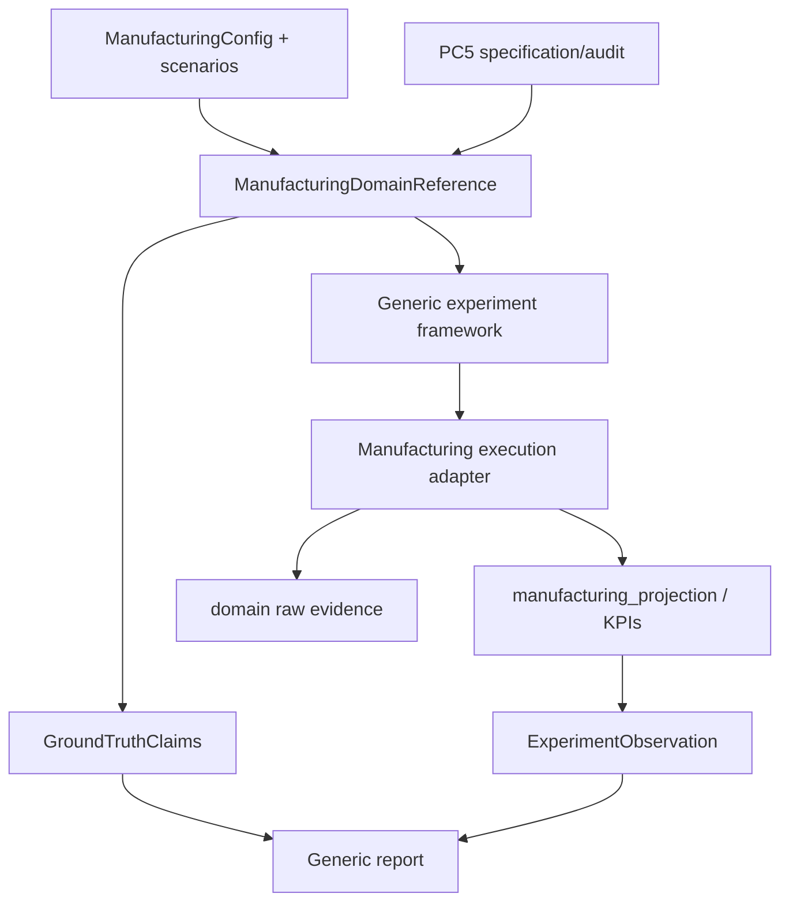

# TRD-0004 — Manufacturing Experiment Adapter and Preregistered A0 Study

- **Status:** Draft
- **Owner:** SOSE maintainers
- **Created:** 2026-10-08
- **Last updated:** 2026-10-08
- **Satisfies PRD(s):** PRD-0004
- **Related ADRs:** ADR-0002, ADR-0003, ADR-0004, ADR-0005
- **Implementation PRs:** TBD

## 1. Technical context

Manufacturing is a PC5 reference process with durable resources, stores, containers, preemption, scenarios, projections, KPIs, and restart tests.

The generic experiment framework already owns world construction, DOE/CRN grouping, fixed-replication execution, comparisons, reports, typed ground truth, and provenance.

The Manufacturing adapter must contribute semantic ingredients only. It must not own DOE sampling, world identity, CRN grouping, report orchestration, or physical data-product materialization.

## 2. Requirements mapping

| Requirement | Design response | Verification |
|---|---|---|
| PRD FR-1 | Manufacturing DomainReference adapter | domain conformance |
| FR-2 | A0-only capability descriptor | agency capability validation |
| FR-3 | parameter definitions from executable config only | bounds/schema tests |
| FR-4 | explicit scenario intervention catalog | preflight scenario tests |
| FR-5 | demand-surge eligibility preflight | durable-effect test |
| FR-6 | projection/KPI -> canonical observation adapter | schema tests |
| FR-7 | continuous-vs-rebuild experiment equivalence | restart test |
| FR-8 | typed GroundTruthClaim records | ground-truth conformance |
| QR-1 | framework-owned world builder | world construction tests |
| QR-5 | frozen preregistration hash | evidence audit |

## 3. Proposed design

### DomainReference responsibilities

The adapter shall expose:

- identity/provenance binding to the Manufacturing PC5 canonical;
- parameter definitions;
- intervention definitions;
- A0 agency capability;
- build_model / configuration projection;
- execute;
- observation;
- ground_truth;
- regime/reference metadata where applicable;
- comparison eligibility.

It shall not expose unsupported generic capacity/load knobs.

## 4. Interfaces and contracts

### Exogenous parameter space

The v1 DOE uses one numeric exogenous axis:

- `quantity`, with executable domain bound `0 < quantity <= 1000` and preregistered range `[1, 1000]`.

`quality_outcome` is intentionally **not** a DOE axis because the generic framework parameter contract is numeric and the domain expresses quality branch categorically. Quality-hold/rework remains process/invariant evidence and may become a later experiment only through an explicit compatible contract rather than numeric encoding.

`auto_seed_material` is treated as a setup/environment flag, not a continuous scientific axis.

`random_seed` is experiment infrastructure and is not a DOE axis.

`tick_step` is execution configuration and is not a scientific treatment.

### Interventions

Candidate intervention arms:

- nominal;
- machine downtime scenario;
- yield degradation scenario;
- demand surge excluded from v1.

### Outcomes

Eligible canonical outcomes derive from durable projection/KPI surfaces:

- completion;
- lead time, only when completed;
- output quantity;
- yield ratio, only when completed;
- transition count;
- rework count;
- breakdown count.

Additional invariant evidence may use durable resource/inventory/ledger truth directly.

## 5. Data model and ownership

Operational truth remains in Manufacturing entities/resources/stores/containers/events.

Experiment observations are read-only projections.

Framework-owned canonical experiment records reference:

- domain identity/version;
- protocol hash;
- world identity;
- arm;
- replication;
- result/evidence hash;
- observation;
- ground-truth assessments;
- report/provenance.

No experiment projection may write domain state.

## 6. Determinism and reproducibility

Official v1 freezes:

- domain/code provenance;
- protocol hash;
- parameter bounds/levels;
- intervention catalog;
- replication count;
- root seed;
- comparison/eligibility rules;
- ground-truth claims;
- metrics;
- exclusions/falsification criteria.

Equal world/replication identities must reproduce equal stochastic draws and semantic results.

## 7. Failure, recovery, and concurrency semantics

Official execution shall support continuous-vs-rebuild equivalence at durable boundaries already supported by Manufacturing.

The experiment layer must not duplicate completed world/replication identities after restart.

Analytical sink/materialization failure does not roll back committed operational experiment progress; durable delivery intent follows ADR-0005/analytical-sink semantics.

## 8. Performance and scalability

v1 is intentionally small enough to run in CI/reference evidence.

The initial preregistered sample should prioritize mechanistic coverage over large DOE cardinality.

No performance claim is made from v1.

## 9. Security and privacy

Not applicable beyond normal repository/runtime secret handling. The experiment is fully synthetic.

## 10. Observability

Each official run records:

- world/replication identity;
- arm;
- domain/model/protocol hashes;
- seed/CRN metadata;
- completion/failure;
- projection/KPIs;
- raw evidence hash;
- ground-truth assessments;
- restart/provenance metadata.

## 11. Testing and conformance

Required before official execution:

1. DomainReferenceConformance;
2. GroundTruthConformance;
3. ExperimentReproducibilityConformance;
4. restart equivalence;
5. invariant tests MFG-01 through MFG-10 as applicable;
6. scenario preflight tests proving intervention semantics;
7. preregistration hash audit;
8. no-endogenous-DOE-coordinate test.

## 12. Migration and compatibility

No current Manufacturing runtime behavior is changed by planning alone.

The adapter is additive. Existing Manufacturing APIs remain supported.

If a missing experiment control requires new domain configuration, that change must be implemented and reviewed before preregistration is frozen, or the control is excluded from v1.

## 13. Alternatives considered

### Add machine/operator capacity as synthetic-only experiment parameters

Rejected for v1 because they are not currently part of the executable Manufacturing configuration contract.

### Use KPI outputs as regime coordinates

Rejected because they are endogenous.

### Include A1 immediately

Rejected because no Manufacturing-specific local adaptive policy has yet been defined and validated.

## 14. Implementation plan

1. preflight downtime/yield scenario semantics against the generic adapter;
2. finalize and freeze preregistration;
3. add Manufacturing DomainReference adapter;
4. pass generic conformance;
5. add restart-equivalent experiment execution;
6. execute official evidence;
7. persist report/manifest;
8. plan A1 separately.

## 15. Risks and open questions

| Item | Impact | Mitigation |
|---|---|---|
| quantity range exceeds reference capacities | medium | preflight bounded range |
| downtime starts at ORIGIN and may dominate setup | medium | freeze exact timing semantics |
| yield arm may have no timing effect | low | claim quantity/yield effect only |
| demand surge may be semantically inert | high | exclude unless preflight proves durable effect |

## 16. Acceptance / exit criteria

- [ ] PRD-0004 accepted.
- [ ] preregistration frozen.
- [ ] candidate controls pass preflight.
- [ ] Manufacturing adapter passes common conformance.
- [ ] official run is restart-equivalent.
- [ ] evidence/report hashes bind to frozen protocol.
- [ ] result makes no unsupported A1/A2, congestion, or empirical claims.

## 17. Change history

| Date | Change | Rationale |
|---|---|---|
| 2026-10-08 | Initial draft | Technical plan for Manufacturing v1 |
