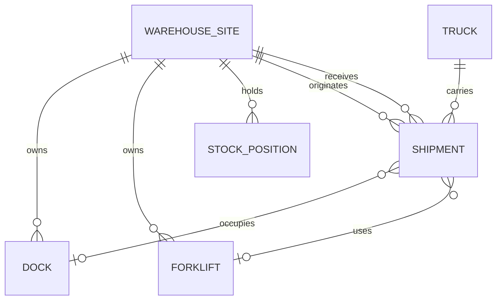
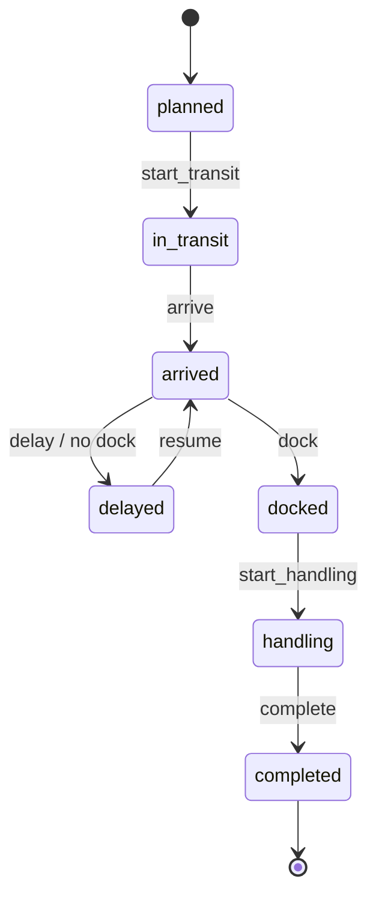
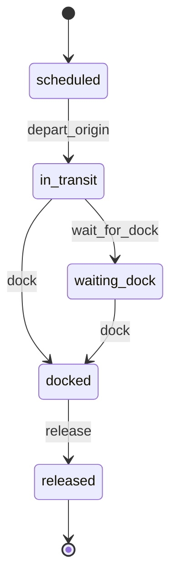
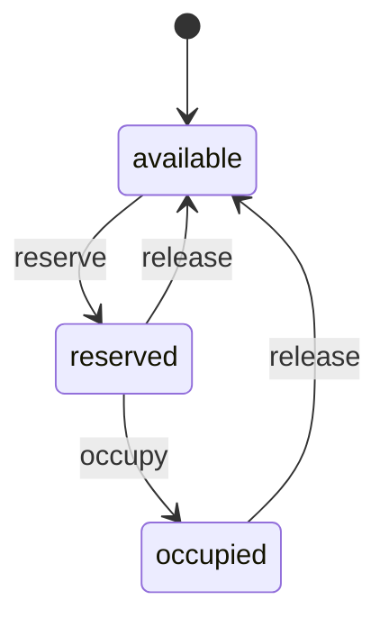
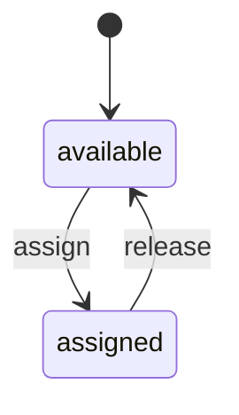
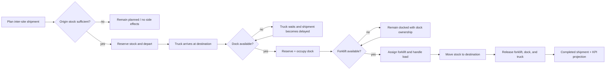

# Warehouse Management reference domain

## Purpose

This example models the operational state behind a modern warehouse-management UI. A 2D dashboard, spreadsheet, 3D scene, digital-twin viewer, or game-like React Three Fiber frontend can all project the same durable model; presentation is intentionally outside the domain contract.

The example is broader than `warehouse_fulfillment`. `warehouse_fulfillment` models order allocation, picking, packing, and shipping. `warehouse_management` models multi-site material movement and physical handling capacity: sites, stock positions, trucks, docks, forklifts, shipment timelines, and on-time completion.

## Persistent entities

- `warehouse_management_site` — warehouse/DC operational status.
- `warehouse_management_dock` — destination dock availability and occupancy.
- `warehouse_management_truck` — vehicle progress from scheduled departure through dock release.
- `warehouse_management_forklift` — material-handling capacity at the destination site.
- `warehouse_management_stock` — SKU quantity by site, including transfer reservation.
- `warehouse_management_shipment` — inter-site transfer lifecycle and timestamps.

## Entity relationships

## State charts

### Shipment

### Truck

### Dock

### Forklift

## Reference process

## Happy path

1. Origin and destination sites are operational.
2. Origin stock is sufficient for the transfer quantity.
3. The shipment reserves the quantity and the truck enters transit.
4. An available destination dock is reserved and occupied on arrival.
5. An available forklift is assigned.
6. Completion decrements origin on-hand/reserved stock, increments destination on-hand stock, and releases physical capacity.
7. `shipment_kpis()` derives completion, lead time, lateness, and on-time status from persisted timestamps.

## Sad paths and recovery boundaries

- **Insufficient stock** — transfer does not start; stock, shipment, and truck states remain unchanged.
- **No dock capacity** — truck moves to `waiting_dock`; shipment moves to `delayed`; no forklift is consumed.
- **No forklift capacity** — truck and shipment retain dock ownership while the shipment remains `docked`.
- **Corrupt handling ownership** — completing a `handling` shipment without both dock and forklift ownership raises rather than silently moving stock.
- **Inconsistent reserved stock** — completion rejects a quantity larger than durable reserved/on-hand stock.
- **Replay** — terminal completion and already-advanced lifecycle calls are side-effect safe where supported by the public operations.

### Durable phase markers

The transfer intentionally persists phase ownership separately from lifecycle state so a process crash between durable writes can be reconciled without duplicating business effects:

- `stock_reserved` records that origin stock has already been reserved. If a crash occurs before the shipment or truck transition commits, retry finishes the missing lifecycle transition without reserving the quantity again.
- `stock_moved` records that the inter-site quantity has already moved. If a crash occurs before the shipment reaches `completed`, retry performs only the missing terminal transition and does not decrement/increment stock twice.
- `resources_released` records that forklift, dock, and truck cleanup has completed. A `completed` shipment remains reconcilable until all physical capacity is durably released.

The recurring reconciler therefore treats partial combinations such as `shipment=in_transit` with `truck=scheduled` as recovery states rather than ordinary forward-progress states.

## KPIs and projection boundary

The canonical KPI projection currently exposes:

- shipment state;
- completed flag;
- on-time flag;
- lead time in seconds;
- lateness in seconds;
- assigned dock;
- assigned forklift.

These values are intended to feed any presentation layer. A 3D warehouse scene may render each site, dock, truck, forklift, stock position, and shipment as a clickable object, but it must not become the source of business truth.

## Configuration

The reference job exposes:

- origin on-hand stock;
- transfer quantity;
- number of docks;
- number of forklifts;
- planned completion horizon;
- tick step;
- random seed;
- automatic recurring progression.

This keeps the example suitable for parameter sweeps and persistent jobs rather than only a one-shot end-to-end demo.

## Deliberate gaps for follow-up PRs

The first canonical does not yet model yard slots, appointment scheduling, dock calendars, cross-docking, put-away/slotting, replenishment, picking waves, battery charging, forklift travel distance, labor shifts, trailer detention, multiple simultaneous shipments, or routing between more than two sites. Those should be added as explicit capacity/process semantics rather than UI-specific fields.
